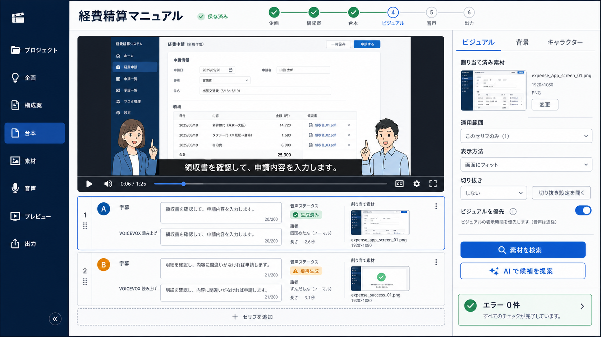

# Remotion 社内マニュアル動画制作システム 実装仕様書

文書版: 0.4
作成日: 2026-07-28  
更新日: 2026-08-21<br>
上位仕様: [`doc.md`](./doc.md)

現在の正本は `doc/doc.md` と本書の 2 文書に固定する。要求、目的、機能、ユーザー体験は `doc/doc.md` を優先し、データモデル、API、保存、validation、アーキテクチャ、実装詳細は本書を正本とする。実装詳細が要求と矛盾する場合は、本書を更新して `doc/doc.md` と整合させる。`doc/legacy/` 配下は履歴資料であり、新規実装の仕様根拠または実装順序の根拠には使用しない。legacy 文書と現在の正本が矛盾する場合は、現在の正本を採用する。

本書は MVP 完了後の現行実装仕様を記述する。本文中の MVP は完了済みの現行ベースラインまたは、その範囲に対する将来拡張を指し、未実装の施工計画を意味しない。

## 1. 目的

本書は `doc.md` の方針を、実装担当者がモジュール、データ型、API、保存処理、検証、テストへ落とし込める粒度まで具体化するための文書である。

本書では次の状態を区別する。

- **確定**: 現時点で実装仕様として採用する。
- **TBD**: 判断材料または利用素材が不足しており、値や挙動を確定しない。
- **現在対象外・将来拡張**: 拡張点は確保するが、現行仕様では実装しない。

`doc.md` と本書が矛盾する場合は、要求と目的については `doc.md` を優先し、実装の具体的詳細については本書を正本として更新し、両者を整合させる。

### 1.1 Issue #87 による台本工程の更新

Issue #87 以降、`/projects/{projectId}/script` を台本・ビジュアル・音声の一体型台本画面とし、3 つのデータを引き続き同じ `project.json` に保存する。台本工程中の承認操作を後工程の開始条件にはしない。

- `outline.status === "approved"` かつ `outline.sourceHash === source.sha256` であることは、台本の初期化と現在の制作コンテキストの前提として維持する。この文書の対象範囲では、構成案の承認が唯一の明示的な工程境界である。
- `script/approve` と `visuals/approve` は新しい通常台本フローから外す。既存データ、旧クライアント、レビュー履歴との互換性のため API や `approved` status を残す場合でも、台本画面、音声操作、候補利用、素材割り当て、`RenderManifest` 生成の前提に使用しない。
- `Script.status` と `VisualPlan.status` の `draft`、`needs_review`、`approved` は、互換性、レビュー結果、stale、再生成要否の表示に使える。ただし `approved` は出力可能を意味せず、`draft` や `needs_review` だけを理由に編集や候補利用を拒否しない。
- プレビュー、`RenderManifest` 生成、MP4 レンダリングのゲートは、保存済み正本に対する validation とする。Zod、台本構造、話者・発話、`outlineHash`、音声の current/stale/missing、ビジュアル参照・適用範囲・checksum、revision、Manifest の整合性を機械検証し、失敗時は該当する操作だけを無効化して理由を表示する。
- revision 管理、自動保存、expected revision による競合拒否、安全な一時ファイル保存、生成物の stale 保持は変更しない。

### 1.2 Issue #97 / CV-04 による現在仕様の更新

Issue #97 を本書の正本となる設計判断として扱い、キャラクタービジュアルの標準選択経路を人間の明示選択へ変更した。この方針は CV-05（Issue #98）で実装済みである。`/projects/{projectId}/script` はセクションとセリフカードを中心とする 1 ペイン構成とし、現在の右ペインにあった「現在の編集対象」「制作 ビジュアル候補」「AI によるビジュアル候補 UI」「手順3-3 素材検索」「素材検索結果」「素材制作・表示設定カード」は標準台本画面に置かない。

除去するのは制作画面の主要 UI であり、機能・データの削除ではない。AI visual suggestion の backend、visual suggestion API / service / schema / log、現場動画・写真・帳票用 Asset Search、generic `VisualAssignment` と Asset Service は維持する。これらはキャラクタービジュアルの標準選択経路とは別の補助機能・別ドメインとして扱う。

`CharacterVisualSet` の登録済み visual / variant / file metadata の正本は workspace SQLite に置く。一方、プロジェクトで VOICEVOX 話者へどの visual を割り当て、どの idle variant を使うか、各 line でどの physical variant を選んだかは project-specific な `project.json` の正本に保存する。SQLite に project ID や `mentor` / `learner` の紐づけを追加せず、`visualId === characterId` も前提にしない。

CV-04 はこの3文書の更新だけを行い、schema、schema version bump、migration、API、React UI、`ScriptPage`、`CharacterAssetsPage`、compiler、RenderManifest、Remotion の変更は CV-05（Issue #98）で実装済みである。

### 1.3 Issue #107 / ED-00 による編集フェーズの追加

ED-00 は docs-only の仕様改訂であり、この Issue の作業ではコード、Zod schema、migration、API、React UI、compiler、Remotion を変更しない。ED-00 で定めた編集フェーズの当時の実装基準は `VideoProject 1.2.0` と `RenderManifest 2.3.0` であり、現在の基準は 1.6 で更新する。

ワークフローは次の順序とする。

```text
企画
  → 構成案
  → 台本（/projects/{projectId}/script）
  → 編集（/projects/{projectId}/edit）
  → 出力 validation
  → RenderManifest
  → プレビュー / MP4
```

既存の `VideoProject 1.1.0` / `RenderManifest 2.2.0`、および ED-08 完了時点の `VideoProject 1.2.0` / `RenderManifest 2.3.0` は legacy compatibility boundary として保持する。ST-03 / ST-06 完了時点の履歴上の基準は `VideoProject 1.3.0` / `RenderManifest 2.4.0` であり、line override の削除は #148 の `1.3.0 → 1.4.0` migration で完了している。

- 編集素材は workspace SQLite に登録済みで、選択・差し替え時点に `active` な Asset だけを使用する。
- intro / outro / cutin は MP4 の `video` Asset、BGM は MP3 の `bgm` Asset に限定する。
- project data には Asset の currentVersion が示す AssetVersion の `version` / `checksum` を `assetVersion` / `assetChecksum` として、`assetId`、`projectMediaPath` とともに snapshot 固定する。OS path や任意ファイルを保存しない。
- snapshot 作成後の Asset の差し替え・利用停止は既存 project の出力エラーにしない。出力時は project 内 `projectMediaPath` の存在、`assetChecksum`、MP4 / MP3 の実ファイル形式だけを検証し、live な Asset `status` や Asset Service の SQLite を必須入力にしない。
- 動画と BGM は `0 <= volume <= 1` を持つ。generic `VideoDisplay.muted` の `true → 0`、`false → 1` 変換は ED-01 の `1.1.0 → 1.2.0` schema migration が担当する。ED-01 は既存 `RenderManifest 2.2.0` の `muted` legacy schema と project schema の分離、および 0 / 1 の compatibility adapter まで担当する。ED-08 を ED-07 より先に完了させて `RenderManifest 2.3.0` の任意 volume 経路を用意し、その後の ED-07 が変換後の `volume` の UI / API / compiler / Remotion 側対応を公開する。

### 1.4 Issue #129 / ST-00 による ScreenTemplate 仕様（履歴）

ST-00 は `doc/doc.md` と本書だけを更新した docs-only Issue であり、当時の main の version は `VideoProject 1.2.0` / `RenderManifest 2.3.0`、後続の ST-03 / ST-06 で `VideoProject 1.3.0` / `RenderManifest 2.4.0` を導入する計画だった。この節は #129〜#145 で確定した履歴であり、当時の line-level override を現在の正本へ持ち込まない。現在の selection / preview 契約は 1.6 と 7.10、8.1.2 を参照する。

`ScreenTemplate` は workspace 共通資産であり、構造データの正本は workspace SQLite とする。template の実在一覧を TypeScript の静的配列と SQLite に二重管理しない。project-specific な section / line の適用参照だけを `project.json` に保存し、SQLite に project ID、section ID、line ID の紐づけを追加しない。

初期 element type は `dialogue-window`、`section-title`、`character-visual` × 2、`content-slot` に限定する。cardinality は dialogue window 1、section title 1、character visual 2（`speaker-1` / `speaker-2` を重複なく持つ）、content slot 1（slot `primary`）とする。geometry は 1920 × 1080 の 16:9 canvas に対する element type 別の正規化 rect と rotation を正本とする。`dialogue-window` / `section-title` / `content-slot` は finite、0..1、canvas-contained、回転後の外接範囲も canvas-contained として validation し、`character-visual` は finite な x / y（負値・1 超を許可）、finite positive な width / height（1 超を許可）とし、回転後 bounds が canvas と交差することだけを要求する。

`screen-template-standard` は既存 layer について現行 Remotion / CSS / layout constants から実値を調査して作る stable ID の standard template であり、workspace SQLite へ idempotent に seed / migration する。ただし現行 composition には section-title layer がないため、section-title だけは例外として、doc.md の「画面上端」という要件から ST-01 が新しい canonical geometry を確定する。ST-01 は section-title の rect、rotation、font size、決定理由、参照元を seed / migration と仕様へ記録し、これを現行実値の抽出結果や目測値として扱わない。既存 project の migration では section ごとにこの ID を明示保存し、mutable な workspace default だけへ依存しない。section は template を必ず持つ。なお、line の `screenTemplateId: string | null` を継承に使う記述は ST-03 当時の履歴であり、`VideoProject 1.3.0` compatibility input ではその field を保持するが、#148 の `1.4.0` では削除済みである。明示参照が missing / inactive になっても自動代替せず、編集中は修正対象、出力時は validation error とする。

template editor は `/screen-templates` と `/screen-templates/{templateId}` に置く。drag、resize、rotation、font size、character `flipX`、数値入力、keyboard 操作を提供する。active な CharacterVisualSet / variant と generic Asset は preview 素材として一時選択できるが、`visualId`、`variantId`、`assetId` を ScreenTemplate に保存しない。固定要素の追加・削除、任意 React component、custom CSS、animation / keyframe editor は対象外とする。

ST-08 では character の drag、resize、keyboard 移動、数値入力に対して canvas edge による clamp を適用しない。character の selection outline、resize / rotation handle、pointer hit area は render preview の clip layer と分離し、部分 overflow 中も numeric properties または interaction layer から回収できるようにする。`dialogue-window`、`section-title`、`content-slot` は既存の contained clamp / validation を維持する。template-level の「デフォルトに戻す」は 1 個だけ提供し、個別 parameter / element reset は提供しない。

line-card preview は line ごとの適用 template、section title（`ScriptSection.name`）、背景、実際の subtitle、speaker / character variant、generic visual assignment を解決し、card 左側へ静的代表 frame を表示する。preview と Remotion は同じ geometry resolver / layout component を使う。ScreenTemplate の outer geometry と generic `VisualAssignment.display` の crop / fit / scale / position である inner transform を分離し、`prioritizeVisual` は template 解決後の互換的な character 縮小 policy としてのみ適用する。初期版では character element の非表示を表現せず、将来導入する場合は `visible` などを持つ manifest 契約を別途追加する。template 結果を無視して別の固定座標へ戻してはならない。
line-card preview は line ごとの適用 template、section title（`ScriptSection.name`）、背景、実際の subtitle、speaker / character variant、generic visual assignment を解決し、card 左側へ静的代表 frame を表示する。preview と Remotion は同じ geometry resolver / layout component を使う。ScreenTemplate の outer geometry と generic `VisualAssignment.display` の crop / fit / scale / position である inner transform を分離し、`prioritizeVisual` は template 解決後の互換的な character 縮小 policy としてのみ適用する。初期版では character element の非表示を表現せず、将来導入する場合は `visible` などを持つ manifest 契約を別途追加する。template 結果を無視して別の固定座標へ戻してはならない。valid な character overflow は preview と production の両方で composition 境界により clip し、resolver や compiler が 0..1 に clamp してはならない。

`RenderManifest 2.4.0` は template ID だけでなく、template revision / deterministic hash、resolved geometry / transform、font size、`flipX`、content slot を section / line ごとに固定する。generic visual segment も `RenderVisualV24.display` へ override し、最終 canvas-relative `outerFrame`、content slot の `contentClip`、`fit`、`crop`、annotation を保存する。`section-title` の文字列は ScreenTemplate に保存せず、compiler が `ScriptSection.name` を `RenderSectionLayout.sectionTitle` として固定する。Remotion の section-title layer はこの `sectionTitle` と section layout の geometry を使用し、template catalog や project JSON を描画時に再検索しない。template revision / hash、section title、resolved input を `compilerInputHash` に含め、template または section name 更新後の古い manifest を current と誤認しない。Remotion は SQLite を直接参照せず、resolved manifest だけを描画入力とする。
`RenderManifest 2.4.0` は template ID だけでなく、template revision / deterministic hash、resolved geometry / transform、font size、`flipX`、content slot を section / line ごとに固定する。generic visual segment も `RenderVisualV24.display` へ override し、最終 canvas-relative `outerFrame`、content slot の `contentClip`、`fit`、`crop`、annotation を保存する。`section-title` の文字列は ScreenTemplate に保存せず、compiler が `ScriptSection.name` を `RenderSectionLayout.sectionTitle` として固定する。Remotion の section-title layer はこの `sectionTitle` と section layout の geometry を使用し、template catalog や project JSON を描画時に再検索しない。template revision / hash、section title、resolved input を `compilerInputHash` に含め、template または section name 更新後の古い manifest を current と誤認しない。Remotion は SQLite を直接参照せず、resolved manifest だけを描画入力とする。character の valid overflow geometry は resolved layout と manifest にそのまま保持し、Remotion の 1920 × 1080 composition frame が最終 clipping boundary になる。

### 1.5 Issue #145 / ST-08 の canonical default と bounds policy

ST-08 は ST-00〜ST-07 の ScreenTemplate 契約を置き換えず、geometry validation と editor UX を拡張する。保存 payload、DB numeric columns、`VideoProject 1.3.0`、`RenderManifest 2.4.0` の version は変更しない。現行 SQLite の `REAL` columns は overflow を保持できるが、既存 `screen_template_elements_geometry_check` が全 element に canvas containment を要求するため、character-visual の保存にはこの constraint semantics を変更する database migration を ST-08 のスコープ内で追加する。

実装順は、最初に本書と `doc/doc.md` へ SQLite constraint semantics、migration の既存データ扱い、非 character 要素の互換制約、version 非変更を反映し、その後に SQLite schema / migration、Zod / domain、editor、compiler、preview / render の順で進める。新しい serialized field や project / manifest の version boundary は追加しない。

ScreenTemplate の rect validation は element type ごとに分離する。

```text
dialogue-window  -> canvas-contained
section-title    -> canvas-contained
content-slot     -> canvas-contained
character-visual -> partial overflow allowed / fully off-canvas forbidden
```

`character-visual` は finite x / y、finite positive width / height、finite rotation を受け付ける。rect または中心回転後の AABB の一部が canvas 外へ出ても保存可能だが、回転後の AABB と `[0, 1] × [0, 1]` の交差が空なら validation error とする。その他 3 element の rect と回転後 AABB は従来どおり canvas 内を要求する。任意の最低表示率は設けない。

SQLite の `screen_template_elements_geometry_check` は、全 element に対して finite な x / y / width / height / rotation と正の width / height を残し、`character-visual` の branch だけは x / y の負値・1 超と width / height の 1 超を許可する。`dialogue-window`、`section-title`、`content-slot` の branch には従来の `x >= 0`、`y >= 0`、`x + width <= 1`、`y + height <= 1` を残す。回転後 AABB の交差判定と完全 off-canvas 判定は DB constraint ではなく application validation の責務とする。既存 rows は numeric values、order、config、metadata を変更せずに新 constraint へ移行し、migration の標準 backup / atomicity 手順を使用する。targeted test では既存 DB の migration、character overflow の保存・再読込、非 character overflow の拒否を検証する。

「デフォルトに戻す」は template-level に 1 個だけ実装する。reset は template を削除して seed し直す操作ではなく、immutable な `screen-template-seed.ts` の canonical default definition を使って既存の complete-template update mutation を呼び出す。対象は全 5 element の編集可能な rect、rotation、dialogue / section-title の font size、character の `flipX` であり、template metadata、status、ID、preview の一時 state、sample text は保持する。UI と backend に default 数値を複製せず、mutable な SQLite の `screen-template-standard` row を default source にしない。`expectedRevision`、revision、content hash、stale 判定、失敗時の atomicity は通常 update と同じ契約とする。

### 1.6 Issue #147 / SW-00 の version boundary と target

SW-00 は `doc/doc.md` と本書だけを更新する docs-only の仕様改訂である。コード、Zod schema、migration、API、React UI、compiler、Remotion、テストコードはこの Issue では変更しない。#148 migration 後に main が保持する project baseline は `VideoProject 1.4.0` であり、現行の serialized manifest baseline は `RenderManifest 2.4.0` である。`ScriptLine.screenTemplateId` は 1.3.0 compatibility input にだけ存在し、2.4.0 の既存 line / visual resolved shape はこの Issue で変更しない。

SW-00 で定めた product target は section-only ScreenTemplate である。`VideoProject 1.3.0` の line override は #148 の `1.3.0 → 1.4.0` migration で削除し、`ScriptSection.screenTemplateId` を唯一の正本とする。現行 compiler / cache は `RenderManifest 2.4.0` の意味を維持し、pause / resume を含む新しい resolved render contract の `RenderManifest 2.5.0` boundary は #151 の VP-02 で扱う。2.4.0 cache / run log を 2.5.0 として暗黙に解釈し直さない。

SW-02 の `1.4.0` target `/projects/{projectId}/script` の通常表示は、本文 3 行 + 操作 1 行の 4 行 compact line card とする。1 行目は line ID、speaker selector、character physical variant、音声再生、音声再生成、音声調整、2 行目は `subtitleText`、3 行目は `spokenText` / よみがな、4 行目は上へ移動・下へ移動・複製・削除を置く。subtitle / 読み上げ用表示は通常時に compact な 1 行とし、選択・編集時だけ入力領域へ expand する。音声調整の詳細パラメータは card 内へ常時展開せず modal / dialog で扱う。

SW-03 の target preview mode は pure helper / read model で決定する。section の先頭 line、section template または background の境界、generic visual の show / hide / play / pause / resume / end など persistent canvas state が変化する line、およびその表示設定が境界から変化する line は full screen preview とする。persistent canvas state が前 line と同じ通常 line は dialogue / subtitle 領域だけの compact preview とする。subtitleText、spokenText / よみがな、speaker、character physical variant、voice parameter、音声 current / stale state だけの変化は full preview trigger にしない。

full / compact preview は同じ ScreenTemplate resolver / renderer の解決結果を使用し、compact preview 専用の geometry や CSS 座標を実装しない。概念的な判定は `persistentScreenState(line N - 1) != persistentScreenState(line N)` とし、最初の section line は常に full preview とする。generic `VisualAssignment` 自体は維持し、`VideoProject 1.4.0` では line-level template override の廃止を理由に同一 section 内の line 境界で segment 化しない。表示素材 cue の state boundary は #151 の read model へ統合する。

後続の SW-01 は `VideoProject 1.3.0 → 1.4.0` の migration、SW-02 は compact ScriptPage / section-only selector / voice adjustment modal、SW-03 は change-only full preview / dialogue-only compact preview を担当した。1.4.0 migration は section の `screenTemplateId` を authority として維持し、section を分割したり line override の多数決で template を変更したりせず、削除した override を migration log へ記録する。`RenderManifest 2.4.0` の意味を変更する表示素材 cue は #151 の VP-01 / VP-02 で扱う。

### 1.7 Issue #151 / VP-00 の表示素材 playback cue 仕様

Issue #151（VP-00）は `doc/doc.md` と本書だけを更新する docs-only の仕様改訂である。コード、Zod schema、migration、API、React UI、compiler、Remotion、テストコードはこの Issue では変更しない。#148 完了後の基準は `VideoProject 1.4.0` / `RenderManifest 2.4.0` とし、2.4.0 の parser / cache / run log の意味を変更せずに、後続 VP-01 / VP-02 のデータ・UI・render contract を定義する。

既存 generic `VisualAssignment`、Asset Search、asset snapshot、`startLineId` / `endLineId`、display transform、検索・割り当て・snapshot・compiler の pipeline は削除・置換しない。表示範囲の authority は既存 assignment range のまま維持し、video にだけ line-boundary pause / resume cue を追加する。

```ts
type VisualPlaybackCue = {
  lineId: string;
  edge: "before" | "after";
  action: "pause" | "resume";
};

type VideoDisplayV15 = VideoDisplayV13 & {
  kind: "video";
  playbackCues: VisualPlaybackCue[];
};
```

上記は概念型であり、実装時の field 名は既存 schema の命名規則に合わせて調整してよい。ただし cue の意味、video-only の適用、validation invariant は変更しない。

VP-02 の resolved video display は `playbackState: "playing" | "paused" | "ended"` を discriminant とする。`playing` branch は既存の `sourceTrimBeforeFrame` / `sourceTrimAfterFrame` を持ち、`sourceTrimAfterFrame > sourceTrimBeforeFrame` を検証する。`paused` branch は一点の `sourceFrame` だけを持ち、source trim の before / after pair を持たない。`ended` branch も一点の `sourceFrame` を持つが、`sourceEndFrame` は `sourceTrimAfterFrame` と同じ exclusive endpoint なので、最終描画可能 frame を表す `lastDrawableSourceFrame = sourceEndFrame - 1`（整数 frame 契約）を保持する。assignment の presentation duration が source duration を超えること自体は validation error にせず、playing source position が `sourceEndFrame` に到達または超過した最初の presentation frame boundary で、cue より先に implicit source-end → ended へ遷移し、`lastDrawableSourceFrame` を assignment の end AFTER まで保持する。ended state では pause / resume cue を無効とする。`RenderVisualV25` は start BEFORE から end AFTER までの visible interval だけを segment として保存し、video の `hidden` は serialized segment state にしない。`static-visible` は photo / `document_scan` branch にだけ許可し、ScriptPage / `PersistentScreenState` の lifecycle read model が `hidden` / `ended` / `static-visible` を扱うこととは分ける。

- `startLineId` / `endLineId` は同一 section 内の inclusive line range。`startLineId` の line 開始境界 BEFORE で素材を表示し video を `startMs` から再生し、`endLineId` の line 終了境界 AFTER で素材を隠して video を終了する。end line の発話と `pauseAfterMs` は区間に含める。
- cue の `lineId` は assignment range 内でなければならず、range 外は validation error。`pause` は playing state、`resume` は paused state でだけ有効であり、ended state ではどちらも無効。同じ line / edge に相反する cue を複数保存しない。
- cue order は project array の順序へ依存せず、line order と BEFORE / AFTER の edge order で決定論的に解決する。同じ boundary の event は、`startLineId` BEFORE では implicit play → cue、source end 到達 boundary では implicit source-end → ended → cue validation、`endLineId` AFTER では cue → implicit hide / end の順に適用する。したがって start BEFORE の pause は play 後の pause として有効であり、source end 到達後の pause / resume は invalid になり、state 不一致または no-op / redundant cue は validation error とする。initial play と final hide / end は cue として保存せず、range boundary から implicit に導出する。
- 標準操作は「再生開始 = selected line BEFORE」「再開 = selected line BEFORE」「一時停止 = selected line BEFORE」「終了 = selected line AFTER」。UI の再生開始（再起動）は `startLineId` を更新し、終了は `endLineId` を更新する。再開 / 一時停止は `VisualPlaybackCue` の resume / pause だけで表し、cue に play / end action は追加しない。line 内任意 millisecond cue は対象外。
- paused presentation interval は pause 境界の source frame を保持し、source media time と video 内音声を進めない。line speech、BGM、sound effect 等の別 audio layer は通常どおり進める。resume は同じ source position から継続し、`playbackRate` は playing interval のみへ適用する。
- source position は composition の経過時間ではなく、assignment 開始後の playing presentation frames の累積で解決する。`sourcePosition = sourceStart + sum(playingPresentationFrames) * playbackRate` とし、paused frames は加算しない。`sourceEndFrame` は exclusive endpoint として比較・trim 上限にだけ使い、assignment の表示時間が source duration を超える場合も表示区間自体は validation error にしない。source end 到達後は `ended` + `sourceFrame = lastDrawableSourceFrame` を保持し、`sourceFrame < sourceEndFrame` を満たす。playing / paused の fractional source position と ended の frozen final frame を同じ endpoint として扱わない。既存 `startMs` / `endMs`、fractional frame、source end 到達時の generic behavior は変更しない。
- photo / `document_scan` は playback cue を持たず、start BEFORE で表示、end AFTER で非表示、表示中は同じ static media を保持する。slide は existing photo / document kind で表現できる範囲を使い、dedicated slide kind / parser は追加しない。
- generic overlap / priority semantics は変更しない。cue を理由に compositing、z-order editor、複数 video の同時表示を追加しない。

VP-01 は `VideoProject 1.4.0 → 1.5.0` を導入し、既存 video assignment を `playbackCues: []` として migration する。VP-02 は pause / resume と natural source end を解決済み render contract へ追加するため `RenderManifest 2.5.0` を導入し、2.4.0 の意味を変更しない。2.5.0 は cue を resolved media state へ固定し、playing branch は source trim pair、paused / ended branch は一点の `sourceFrame` を持つ。WebUI preview と Remotion は同じ結果を描画する。

後続 ScriptPage では #149 の compact line card の右側へ media pane を追加し、assignment / asset title / kind、lifecycle state（hidden / playing / paused / ended / static-visible）、表示・再生開始、一時停止、再開、終了、asset 選択・差し替え導線を表示する。これは UI の lifecycle read model であり、V25 の serialized video segment state は playing / paused / ended に限定する。source end 到達後は ended と `lastDrawableSourceFrame` を表示し、pause / resume button を disabled にする。操作可否は resolved state から決定し、不正な cue sequence を UI から作らせない。#150 の `PersistentScreenState` へは action 名ではなく cue と source-end を解決した media state を渡し、前 line と state が異なる場合だけ full preview とする。

対象外は line 内任意 millisecond cue、waveform / NLE timeline、reverse playback、scrubbing keyframe、video transition effects、speed keyframe、automatic / AI slide generation、dedicated presentation parser である。Asset library CRUD UI は VP-00〜VP-02 の ScriptPage media pane に含めず、1.8 と 27 の AL-00 境界で定義する。

### 1.8 Issue #155 / AL-00 の Asset library 管理仕様

Issue #155（AL-00）は `doc/doc.md` と本書だけを更新する docs-only の仕様改訂である。この Issue ではコード、Zod schema、SQLite migration、API、React UI、worker、compiler、Remotion、テストコードを変更しない。現行実装の `GET /api/assets`、`POST /api/assets`、`GET /api/assets/{assetId}`、managed media / thumbnail read を後続の管理機能が拡張する。

`/assets` は workspace 共通の Asset 管理画面とし、`video`、`bgm`、`photo`、`document_scan`、`sound_effect` を同じ管理境界で扱う。kind ごとの extension、MIME、実ファイル形式、upload limit、technical metadata validation は維持し、kind を metadata mutation で変更しない。`AssetsPage` は一覧専用から、追加、一覧 / search / filter / paging、detail、metadata 編集、file 差し替え、利用停止、再有効化、processing / error 表示を扱う画面へ拡張する。`bgm` と `sound_effect` を表示・filter・label から除外しない。

通常の削除は物理削除ではなく `inactive` 化とする。`active → inactive`、`inactive → active` の status mutation を提供し、DB row、managed media、thumbnail、version history は通常 UI から削除しない。inactive Asset は新規 picker / search candidate から除外するが、既存 project snapshot の `assetId`、`assetVersion`、`assetChecksum`、`projectMediaPath` を書き換えず、既存 project の出力を壊さない。physical purge、orphan file GC、storage cleanup は別の destructive maintenance scope とする。

Asset 本体には `revision` を持たせ、metadata update、activate / deactivate、successful current version activation の全 mutation で `expectedRevision` を検証する。検証成功時だけ revision を増やし、stale mutation は conflict として変更なしで拒否する。current version は version number 最大値や latest row join から推測せず、Asset の `currentVersion: number | null` で明示する。

```ts
type Asset = {
  assetId: string;
  revision: number;
  currentVersion: number | null;
  kind: "video" | "bgm" | "photo" | "document_scan" | "sound_effect";
  // editable metadata and Asset status
};

type AssetVersion = {
  assetId: string;
  version: number;
  status: "processing" | "ready" | "error";
  baseRevision: number;
  baseCurrentVersion: number | null;
  stagingPath: string | null;
  // managed file, checksum, thumbnail, technical metadata, and error detail
};
```

初期登録では Asset `status = processing`、`currentVersion = null` を許可し、v1 の validation、technical metadata、thumbnail が成功した時だけ v1 を ready にして current version を確定する。replacement は同じ `assetId` の次 version candidate として作成し、candidate が processing / error の間は active / inactive と旧 current version を維持する。managed file と metadata が揃った後、candidate の `processing → ready` と current version の切替を同じ SQLite transaction で行う。新しい candidate が `ready` だが current ではない状態を commit せず、transaction の rollback / process crash では candidate を `processing` のまま worker が再取得できるようにする。revision conflict はその transaction 内で candidate を `error` にし、旧 current version を維持する。inactive Asset の replacement 成功は active への自動復帰を意味しない。

非同期処理の work item は Asset 本体ではなく、`AssetVersion.status = "processing"` の `(assetId, version)` を正本として列挙する。初期 upload では Asset `status = processing` としてよいが、これは current version が未確定であることを示す親 Asset の状態に限定し、worker の探索条件にはしない。Asset が `active` または `inactive` のままでも replacement candidate の AssetVersion が `processing` なら worker の処理対象とする。worker / processing service は親 Asset の status が `active` / `inactive` であることだけを理由に candidate を `skipped` にせず、candidate 自身の status と `(assetId, version)` identity を確認する。

`/replace` の受付時には request の `expectedRevision` を現在の Asset revision と比較し、一致した同じ transaction で candidate の `baseRevision`、`baseCurrentVersion`、`stagingPath` を保存する。`baseCurrentVersion` は受付時点で想定した旧 current version であり、`stagingPath` は `StagedUploadRecord.fileRelativePath` から引き継ぐ staged file の staging root 相対 locator（例: `staging/{uploadId}/upload.bin`）である。directory locator である `stagingRelativePath` は `stagingPath` に使用しない。worker のメモリや HTTP request の状態に依存させず、worker は再起動後も AssetVersion row からこれらを読み込む。処理済み metadata と checksum 検証済み managed file が揃った後、candidate がまだ `processing` で、Asset の `revision` / `currentVersion` が base 値と一致することを同じ transaction で確認し、`ready` 化、currentVersion 切替、Asset revision increment、`stagingPath = null` を一度に commit する。

照合に失敗した revision conflict では同じ transaction 内で candidate を `error`（`REPLACEMENT_REVISION_CONFLICT`）にし、旧 current version、Asset status、既存 project snapshot を維持する。candidate の自動再 activation は行わず、再試行は新しい `/replace` として新しい `baseRevision` / `baseCurrentVersion` / `stagingPath` を保存する。initial upload も同じ persisted base fields と staging locator を使い、`baseCurrentVersion = null` として初期 Asset の current version 未確定を表す。

metadata mutation で編集できるのは `title`、`description`、`confidentiality`、`department`、`system`、`tagIds` とする。`kind`、checksum、size、duration、width、height、page count、declared / detected MIME、extension、thumbnail path など file-derived fields は read-only とする。tag dictionary CRUD は対象外で、必要な active tag dictionary の read endpoint だけを後続 Issue で追加できる。

後続 API の boundary は次のとおりとする。

```text
POST /api/assets                         create / initial multipart upload
GET  /api/assets                         list / search / filter / paging
GET  /api/assets/{assetId}               detail / current version / history
PUT  /api/assets/{assetId}               metadata update (expectedRevision)
POST /api/assets/{assetId}/replace       new version multipart upload
POST /api/assets/{assetId}/deactivate    soft delete (expectedRevision)
POST /api/assets/{assetId}/activate      reactivate (expectedRevision)
```

通常管理 API として `DELETE /api/assets/{assetId}` は追加しない。replace は Asset kind を変更せず、candidate の version status / error history を detail から確認できるようにする。current version の切替、status mutation、metadata update はすべて revision-aware とする。

## 2. 今回確定した判断

### 2.1 JSON の編集経路

- `projects/{projectId}/project.json` を動画制作データの正本とする。
- 通常の作成、編集、並べ替え、承認は WebUI から行う。
- WebUI は JSON を直接ブラウザーで編集する画面ではなく、用途別フォームを通じて編集する。
- バックエンドは全変更を Zod で検証してから保存する。
- 障害調査、移行、復旧用の CLI は将来追加できるが、通常運用の編集経路にはしない。
- 人間によるファイルの直接編集はサポート対象外とする。直接編集されたファイルも読み込み時に検証し、不正な場合は上書きせずエラーにする。

### 2.2 JSON Schema の扱い

- TypeScript 型と Zod スキーマをコード上の正本とする。
- JSON Schema を外部向けファイルとして公開しない。
- OpenRouter の structured output に必要な JSON Schema は、サーバー内部で生成または定義してリクエストへ埋め込む。
- JSON Schema の配布、互換性保証、外部利用者向けドキュメントは作らない。
- `VideoProject` と `RenderManifest` は別の Zod スキーマとして管理する。

### 2.3 VOICEVOX

- VOICEVOX ENGINE はローカル HTTP API として使用する。
- 使用する VOICEVOX キャラクターは四国めたんとずんだもんで確定する。
- メンターへ四国めたん、見習いへずんだもんを割り当てる。
- 両キャラクターの既定音声は標準スタイルの `ノーマル` とする。
- `project.json` には話者名、ENGINE から取得した話者 UUID、スタイル名を保存し、数値の style ID は正本データとして保存しない。
- 音声生成時は VOICEVOX ENGINE の `/speakers` を読み込み、話者 UUID または話者名とスタイル名から style ID を解決する。style ID をソースコード、fixture、初期 JSON へハードコードしない。
- `/speakers` に対象話者または `ノーマル` が存在しない場合は自動的に別スタイルへ切り替えず、音声操作を停止して解決エラーを表示する。
- 実行時に解決した style ID は、再現性確認のため音声調整ファイル、音声インデックス、実行ログへ記録する。
- VOICEVOX が返した未編集の `audio_query` は再生成可能な派生キャッシュとして扱う。
- 人間が確定したイントネーション調整は、セリフ単位の独立 JSON を正本として永続化する。`project.json` と query キャッシュには含めない。
- 固有名詞 DB は共通の読みを管理し、文脈依存のアクセント・モーラ調整はセリフ単位の調整 JSON で管理する。

### 2.4 固有名詞・社内用語

- 固有名詞・社内用語はワークスペース共通 SQLite に保存する。
- WebUI に一覧、検索、登録、編集、利用停止の機能を用意する。
- 読みは全角カタカナで管理する。
- イントネーション情報は今回のテーブルへ含めない。
- 読み上げ時には、有効な用語を決定論的な規則で一時的に適用する。`project.json` の字幕本文と読み上げ本文を暗黙に書き換えない。

### 2.5 AI モデル

- WebUI、OpenCode、レビュー、その他プロジェクト内外の AI 用途は、現行仕様では Gemma 4 31B Instruct を共通モデルとする。
- OpenRouter の初期モデル ID は `google/gemma-4-31b-it` とする。
- `:free` variant は既定にせず、人間がモデル選択画面から明示的に選択した場合だけ使用する。
- モデル選択画面では、入力単価と出力単価がともに `0` のモデルを `free`、それ以外を `paid` として絞り込める。これは表示上のフィルターであり、サーバーは選択されたモデル ID を既存の能力、有効期限、ZDR 条件で検証する。
- AI 呼び出しは用途を `AiTaskKind` で識別するが、現行の用途別上書きは空とし、すべて共通モデルへ解決する。
- 用途別モデルへの分離は将来の評価事項とする。各機能の実装前に別モデルを決める必要はない。
- 用途別の評価では、スキーマ検証通過率、人間による修正量、根拠のない情報を追加した回数、応答時間、入出力トークン数と料金、画像入力またはツール利用の必要性を記録する。
- モデルの差し替えに生成ロジックの変更を必要としない構造にする。
- モデル ID を生成ロジックへハードコードしない。
- モデル未選択の場合、AI を使う操作だけを実行不可にする。非 AI の編集、素材管理、音声生成、プレビュー、レンダリングは利用可能とする。
- 実行ごとに選択されたモデル ID、プロバイダー、プライバシー設定、用途別評価に必要な計測値を実行ログへ記録する。

### 2.6 その他の推奨案

`doc.md` の「推奨案」は、本書で明示的に変更した事項と競合しない限り採用する。

### 2.7 キャラクター素材の責務分離

キャラクター素材に関するデータは、次の 4 層を混同しない。

| データ | 正本または性質 | 現在の扱い |
|---|---|---|
| `projects/{projectId}/project.json` | 人間が編集する動画制作データの正本。構成案の承認と、台本・ビジュアル・音声のレビュー状態、編集フェーズの `EditPlan`、project-specific な section template selection もここに保持する | 現行保存形式は `VideoProject 1.4.0`。`schemaVersion: "1.0.0"`〜`1.3.0` は legacy input boundary として検証し、#148 で section-only の `1.4.0` へ明示的に変換する |
| `CharacterVisualSet` | ワークスペース共通の登録済みキャラクタービジュアルと variant/file メタデータの正本 | workspace SQLite の現行カタログ。P2-01 の初期 2 キャラクター、6 variant、10 PNG は idempotent seed / migration の入力として扱い、静的カタログを現行の正本にしない |
| `CharacterVisualBinding` | `project.json` に保存する、プロジェクト内の VOICEVOX 話者と visual / idle variant の選択 | 現行 `VideoProject 1.4.0` の project-specific な保存データ。SQLite に project binding は持たせない |
| `ScriptLine.characterVariantId` | `project.json` に保存する、line ごとの人間が選択した physical variant 参照 | 現行 `VideoProject 1.4.0` の explicit reference。新規 line は未選択から開始する |
| `ScreenTemplate` | workspace 共通の再利用可能な画面構成、element、geometry、status、revision | workspace SQLite の正本。`screen-template-standard` を stable ID として seed し、project ID / section ID / line ID は持たせない |
| `ScriptSection.screenTemplateId` | `project.json` に保存する section default / section authority | 現行 `VideoProject 1.4.0` では section 内の全 line の唯一の authority。`1.3.0` では line override の fallback だった |
| `ScriptLine.screenTemplateId` | `project.json` に保存する nullable line-level ScreenTemplate override | `VideoProject 1.3.0` の legacy input にだけ存在し、#148 の `1.4.0` migration で削除して削除ログを残す |
| `characterVariantCatalog` | `CharacterVisualSet` から生成する型、検証入力、または純粋な catalog snapshot | DB から取得した検証済み snapshot または純粋な view model。実在項目を静的ソースへ二重管理しない |
| `RenderManifest` | 特定レンダリングへ使う解決済み派生データ | 現行 `RenderManifest 2.4.0` は explicit variant、実動画 insert、最終 section BGM、section layout、line / visual resolved fields を保持する。VP-02 後は `RenderManifest 2.5.0` とし、section authority、resolved media state、playing branch の source trim pair、paused / ended branch の一点 `sourceFrame` を固定する |

`CharacterVisualSet` と配下の物理 variant は別エンティティとして扱う。visual 全体は一部の表情・ポーズ variant が未登録でも登録できるが、`single-image` は `single`、`mouth-pair` は `closed` と `open` が揃った場合だけ完成 variant とする。最初の完成 variant のキャンバスサイズを visual 単位の基準とし、同じ visual へ異なるサイズの画像を追加しない。

登録時点で `CharacterVisualSet` を `mentor` / `learner` の役割や特定プロジェクトへ紐付けない。同一キャラクターの別衣装、将来の別キャラクター、差し替え候補をワークスペース共通カタログとして保持する。`VideoProject.characters[].role` は既存の制作・音声設定の概念であり、登録画面の固定条件ではない。

PNG は `CharacterVisualSet` の file slot から参照されるファイル実体であり、PNG 自体、`project.json`、または `RenderManifest` がメタデータの正本になることはない。ファイル本体は `library/character-visuals/{visualId}/{variantId}/` 以下へ保存し、`public/` へ直接保存しない。画像表示は Fastify の管理された配信経路を使用する。WebUI、コンパイラ、Remotion は SQLite やローカルファイルシステムを直接操作せず、バックエンドが検証して渡した snapshot または解決済み `RenderManifest` だけを使用する。

`ScriptLine.expression` と `RenderLine.expression` は論理表情であり、PNG、物理ポーズ、`variantId`、口差分を直接指定する値ではない。physical variant は `CharacterVisualBinding` と `ScriptLine.characterVariantId` へ人間が明示的に保存する。P5-02 / P5-04 はこの参照と検証済み catalog snapshot を使い、expression、tag、label、旧固定 mapping から自動選択・代替しない。

## 3. 現在サポートする範囲

### 3.1 現在サポートする範囲

1. ローカル単一ユーザー向け WebUI
2. プロジェクトの作成、一覧、読み込み
3. Markdown と企画条件の編集、自動保存
4. OpenRouter による構成案生成、編集、承認
5. 2 キャラクター形式の台本編集と、ビジュアル・音声を含む一体型の台本画面
6. P2-01 の初期 2 キャラクター設定と、CV-01〜CV-03 で追加済みの `CharacterVisualSet` の動的カタログ、PNG 検証、登録・確認画面
7. プロジェクトごとの VOICEVOX ↔ `CharacterVisualSet` binding、待機用 idle variant、セリフごとの explicit physical variant 選択
8. セクション・セリフカード中心の 1 ペイン `/projects/{projectId}/script` と、speaker に binding された active variant だけを表示する modal picker
9. `/projects/{projectId}/characters` による project binding と現在の `CharacterVisualCatalogSnapshot` の確認
10. 固有名詞・社内用語の登録、検索、読み上げへの適用
11. 素材ライブラリへの動画、写真、帳票スキャン、効果音の登録
12. タグ検索および AI による検索意図の生成
13. 台本範囲への generic `VisualAssignment` 割り当て
14. VOICEVOX によるセリフ単位の WAV 生成、セクション BGM、任意の効果音設定
15. `RenderManifest` の生成
16. Remotion による同一マニフェストのプレビューと MP4 出力
17. サムネイルのプレビューと画像出力
18. 機械検証、互換 status・レビュー結果・stale 状態、意味のある操作のログ（出力ゲートは validation）

`EditPlan`、`bgm` Asset、`/projects/{projectId}/edit`、ScreenTemplate、`RenderManifest 2.4.0` は現行仕様である。ED-00、ST-00〜ST-08 の version boundary は履歴として保持し、SW-01〜SW-03 が line override removal、compact ScriptPage、差分 preview の後続実装境界を定義する。

### 3.2 現在対象外・将来拡張

- 複数ユーザー、ログイン、権限管理
- 外部公開および配布用パッケージ
- AI による完成映像、スライド、図解、素材の生成
- AI による台本初稿生成
- ベクトル検索
- OCR、音声文字起こし
- VOICEVOX のイントネーション編集 UI
- 音量解析に基づく口パク
- ScreenTemplate による 16:9 canvas 上の自由配置（ST-01〜ST-07 の後続実装対象）
- JSON Schema の外部公開
- AI による physical character variant の自動選択、タグ・label・expression による代替
- AI visual suggestion、Asset Search、generic `VisualAssignment` backend の削除
- 口パク方式の変更、VOICEVOX 話者設定の変更
- 現場動画・写真・帳票素材ライブラリとの統合

## 4. アーキテクチャ

### 4.1 コンポーネント

```text
Shared TypeScript Modules
  └─ Character Visual Types / Catalog Snapshot
       ├─ CharacterVisualSet view model
       ├─ Character Visual Validation (Node)
       ├─ ScreenTemplate types / normalized geometry
       ├─ ScreenTemplate validation
       └─ Resolved compiler input types

WebUI
  │
  ▼
Local Backend API
  ├─ Project Service ───── projects/{projectId}/project.json
  ├─ Character Visual Service ─ library/character-visuals + SQLite
  ├─ ScreenTemplate Service ─── workspace SQLite
  ├─ Asset Service ─────── library/media + SQLite
  ├─ Terminology Service ─ SQLite
  ├─ OpenRouter Adapter ── OpenRouter API
  ├─ VOICEVOX Adapter ──── Local VOICEVOX ENGINE
  ├─ Timeline Compiler ─── layout resolver + RenderManifest
  ├─ Validation Service
  └─ Render Service ────── Remotion / FFmpeg

Build / CI
  └─ Character Asset Validation (Node)
```

`CharacterVisualSet` はバックエンドの Character Visual Service が SQLite と `library/character-visuals/` を管理する。`characterVariantCatalog` は DB レコードを検証済み snapshot として受け渡すための TypeScript 型または純粋な view model であり、一覧の静的正本ではない。WebUI は API から取得した `CharacterVisualSet` を使って `/character-visuals` を表示し、ビルド時に実在項目を取り込まない。PNG の形式、slot、checksum、visual 基準キャンバスを検査するのはバックエンドと Node/CI の責務である。
ScreenTemplate Service は `ScreenTemplate`、element cardinality、normalized geometry、status、revision、`screen-template-standard` seed を workspace SQLite で管理する。画面 template の catalog と構造データを TypeScript 静的配列へ同期しない。layout resolver は SQLite driver や React に依存しない純粋な共有モジュールとし、検証済み template snapshot、project selection、line / background / character / assignment の解決済み入力から `ResolvedScreenLayout` を生成する。

WebUI はプロジェクト保存、SQLite、キャラクターファイル、ローカルファイルシステム、外部 API を直接操作しない。キャラクタービジュアルの読み書きは Character Visual Service の API を経由し、画像は Fastify の管理された配信経路から取得する。キャラクタービジュアルは現場素材の `Asset Service ─ SQLite` と別エンティティ・別責務だが、同じ workspace SQLite と管理ルートを共有してよい。

### 4.2 依存方向

- UI は API 契約と共有型へ依存する。
- API ハンドラーはアプリケーションサービスへ処理を委譲する。
- アプリケーションサービスはドメインスキーマ、リポジトリ、外部アダプターへ依存する。
- ドメインスキーマとタイムライン計算は React、Web フレームワーク、SQLite ドライバーへ依存させない。
- ScreenTemplate の normalized geometry validation と layout resolver は純粋な domain module とし、SQLite の読み書きは ScreenTemplate Service / repository に限定する。
- WebUI の template editor と line-card preview は API が返す snapshot / resolved layout を使用し、SQLite や managed files を直接参照しない。
- Character Visual Service は `CharacterVisualSet`、variant、file slot、checksum、canvas metadata、status、created/updated timestamps を workspace SQLite で管理する。P2-01 の静的 catalog は CV-01 の idempotent seed / migration の入力としてのみ扱う。
- キャラクター素材検証は snapshot と管理領域の PNG を入力として slot、形式、checksum、visual 単位のキャンバス基準を検査する専用処理とし、現場素材の汎用 Asset DB と責務を分離する。
- WebUI の一覧、タイムラインコンパイラ、Remotion は Character Visual Service の DB を直接参照しない。コンパイラへ渡すのはバックエンドが選択・検証した解決済み snapshot だけとする。
- WebUI の template editor は preview 素材を一時 state として保持し、`ScreenTemplate` へ `visualId`、`variantId`、`assetId` を保存しない。
- Remotion コンポーネントは `RenderManifest` だけを描画入力とし、SQLite 検索、ファイル探索、音声長計測、template の再解決を行わない。

### 4.3 採用ランタイム

- Node.js 24 LTS
- pnpm
- TypeScript strict mode
- React
- Remotion
- Zod
- SQLite

具体的な WebUI フレームワーク、HTTP ルーター、SQLite ドライバー、テストランナー、および初期バージョンは 4.4 のとおり確定する。

### 4.4 確定した技術選定

以下を現行実装の構成として採用する。

#### WebUI とローカルサーバー

- WebUI: React SPA + Vite
- 画面ルーティング: React Router の library mode
- サーバー状態: TanStack Query
- HTTP API: Fastify
- 開発時:
  - Vite dev server が WebUI を配信する。
  - `/api` を Fastify の loopback address へ proxy する。
- 製品実行時:
  - Vite が WebUI を静的ファイルへビルドする。
  - Fastify が同一 origin で静的 WebUI と `/api` を配信する。
  - listen address は `127.0.0.1` とし、LAN へ公開しない。
- Remotion のプレビューは `@remotion/player` を WebUI に埋め込む。
- MP4 レンダリング、サムネイル生成、メディア解析は Fastify のリクエスト処理内で直接完了を待たず、子プロセスまたは worker へ渡す。
- SSR、React Server Components、Server Actions は使用しない。
- 現行実装は 1 つの `package.json` を持つ単一パッケージとし、WebUI、API、共有スキーマを `src/` 内のディレクトリ境界で分離する。

採用理由:

- ローカル単一ユーザー用で SEO、SSR、エッジ配信が不要なため、SPA の方が実行モデルと障害範囲が単純になる。
- ファイル、SQLite、VOICEVOX、Remotion renderer を扱う Node.js バックエンドの生存期間を、画面フレームワークのサーバー機能から独立させられる。
- 開発時は Vite の HMR を利用し、製品実行時は Fastify だけを起動するため、利用者が複数プロセスを管理する必要がない。
- Fastify v5 は Node.js 20 以上を対象としており、Node.js 24 LTS の方針と整合する。

#### SQLite とマイグレーション

- SQLite ドライバー: `better-sqlite3`
- クエリと型: `drizzle-orm`
- マイグレーション生成: `drizzle-kit`
- マイグレーション適用: バックエンド起動時に Drizzle migrator を実行
- スキーマの正本: `src/db/schema.ts`
- 生成 SQL: `src/db/migrations/` へ保存し Git 管理
- 適用履歴: SQLite 内の migration table

運用規則:

- `drizzle-kit generate` で SQL を生成し、人間が内容を確認してからコミットする。
- 既存 DB へ `drizzle-kit push` を直接実行しない。
- マイグレーション前に SQLite backup API または安全なファイルコピーでバックアップする。
- 起動時は `PRAGMA foreign_keys = ON`、`journal_mode = WAL`、適切な `busy_timeout` を設定する。
- 複数テーブルを更新する操作は明示的な transaction にする。
- DB 接続はバックエンドプロセスが所有し、WebUI とレンダリング子プロセスから直接開かない。
- 全文検索は SQLite FTS5 を使用し、通常テーブルと同期する migration または trigger を明示的に管理する。

採用理由:

- `better-sqlite3` は transaction を含む同期 API が単純で、単一ユーザーのローカルアプリに適する。
- Node.js 24 の組み込み `node:sqlite` は保存基盤に採用せず、現行の保存基盤は better-sqlite3 とする。
- Drizzle は SQLite と `better-sqlite3` を公式にサポートし、TypeScript スキーマからレビュー可能な SQL migration を生成できる。

#### 初期バージョン基準

次表を初回 scaffold 時の固定値とする。実際の導入時には `pnpm install --save-exact` を使用し、Node.js 24、VOICEVOX 接続、Remotion の短いレンダリング、SQLite migration のスモークテストが通った組み合わせを `pnpm-lock.yaml` で固定する。

| 分類 | パッケージ | 初期固定値 |
|---|---|---:|
| Runtime | Node.js | `24.18.0` |
| Package manager | pnpm | `11.22.0` |
| UI | `react`, `react-dom` | `19.2.8` |
| UI build | `vite` | `8.1.5` |
| UI build | `@vitejs/plugin-react` | `6.0.4` |
| Routing | `react-router` | `7.18.0` |
| Server state | `@tanstack/react-query` | `5.101.4` |
| API | `fastify` | `5.10.0` |
| Schema | `zod` | `4.4.3` |
| Database | `better-sqlite3` | `12.10.0` |
| Database | `drizzle-orm` | `0.45.2` |
| Migration | `drizzle-kit` | `0.31.10` |
| Video | `remotion`, `@remotion/player`, `@remotion/renderer`, `@remotion/cli` | `4.0.499` |
| Language | `typescript` | `6.0.3` |
| Unit/integration test | `vitest` | `4.1.10` |
| E2E test | `@playwright/test` | `1.61.1` |

バージョン規則:

- `package.json` の直接依存は `^` や `~` を付けず exact version とする。
- すべての `remotion` と `@remotion/*` は必ず同じ exact version に揃える。
- canary、alpha、beta、RC パッケージは使用しない。
- TypeScript は現行の 6.0.3 を使用する。メジャー移行は主要ツールの対応確認後に別変更として行う。
- minor、major update は自動適用しない。依存更新専用ブランチで型検査、テスト、短い動画レンダリング、代表フレーム比較を通す。
- セキュリティ修正を除き、MVP 開発時はバージョン更新をまとめて行わない。この記述は施工時の運用ルールであり、現在の未実装事項を示さない。

参考:

- [Vite Getting Started](https://vite.dev/guide/)
- [Fastify v5 migration guide](https://fastify.dev/docs/v5.0.x/Guides/Migration-Guide-V5/)
- [Drizzle SQLite](https://orm.drizzle.team/docs/sqlite/get-started-sqlite)
- [Drizzle migrations](https://orm.drizzle.team/docs/migrations)
- [Node.js 24 SQLite](https://nodejs.org/download/release/latest-v24.x/docs/api/sqlite.html)
- [Remotion npm package](https://www.npmjs.com/package/remotion)
- [OpenRouter: Gemma 4 31B](https://openrouter.ai/google/gemma-4-31b-it)

## 5. リポジトリ構成

```text
project-root/
├─ src/
│  ├─ api/
│  │  ├─ routes/
│  │  ├─ errors/
│  │  └─ middleware/
│  ├─ app/
│  │  ├─ projects/
│  │  ├─ outlines/
│  │  ├─ scripts/
│  │  ├─ assets/
│  │  ├─ terminology/
│  │  ├─ voice/
│  │  └─ rendering/
│  ├─ db/
│  │  ├─ migrations/
│  │  └─ repositories/
│  ├─ schema/
│  │  ├─ video-project.ts
│  │  ├─ render-manifest.ts
│  │  ├─ asset.ts
│  │  ├─ character-visual.ts
│  │  ├─ screen-template.ts
│  │  ├─ terminology.ts
│  │  └─ api.ts
│  ├─ timeline/
│  ├─ voicevox/
│  ├─ openrouter/
│  ├─ validation/
│  ├─ compositions/
│  ├─ components/
│  │  ├─ characters/
│  │  ├─ subtitles/
│  │  ├─ visuals/
│  │  └─ screen-templates/
│  ├─ thumbnail/
│  └─ web/
├─ projects/
│  └─ {projectId}/
│     ├─ project.json
│     ├─ source/
│     │  └─ source.md
│     ├─ media/
│     │  └─ visuals/
│     ├─ audio/
│     │  └─ voice/
│     ├─ cache/
│     │  ├─ render-manifest.json
│     │  ├─ audio-index.json
│     │  └─ voicevox-query/
│     ├─ runs/
│     ├─ output/
│     └─ logs/
│        └─ migration-log.jsonl
├─ library/
│  ├─ media/
│  ├─ character-visuals/
│  │  └─ {visualId}/
│  │     └─ {variantId}/
│  ├─ thumbnails/
│  └─ workspace.sqlite
├─ public/
│  └─ (SPA の静的アセットのみ)
├─ scripts/
├─ opencode.json
├─ package.json
├─ pnpm-lock.yaml
└─ .node-version
```

## 6. ファイルと保存の共通規則

### 6.1 ID

- ID は URL とファイル名に安全な `lower-kebab-case` を基本とする。
- プロジェクト ID は作成後に変更しない。
- セクション、セリフ、キャラクター、ビジュアル割り当て、素材、用語は安定 ID を持つ。
- 表示順は ID から導出せず、配列順または明示的な `order` で管理する。
- ID の生成はバックエンドで行う。

### 6.2 日時

- 永続化する日時は ISO 8601 UTC 文字列とする。
- 動画内時間はミリ秒、Remotion の派生タイムラインはフレーム数で管理する。

### 6.3 パス

- JSON と SQLite に保存する管理対象ファイルのパスは、プロジェクトルートまたはワークスペースルートからの相対パスとする。
- `..`、絶対パス、UNC パス、シンボリックリンクによる管理ルート外参照を拒否する。
- WebUI へ OS 上の絶対パスを返さない。

### 6.4 JSON 保存

1. 現在の `project.json` を読み込む。
2. Zod による構造検証とドメイン検証を行う。
3. クライアントの `expectedRevision` と現在の `revision` を照合する。
4. `revision` を 1 増加し、`updatedAt` を更新する。
5. 同じディレクトリの一時ファイルへ UTF-8、2 スペースインデント、末尾改行付きで書き出す。
6. 一時ファイルを `project.json` へ置換する。
7. 成功した revision を返す。

検証または保存に失敗した場合、既存の `project.json` は変更しない。revision が一致しない場合は `409 PROJECT_REVISION_CONFLICT` を返し、ブラウザー側で暗黙の上書きをしない。

### 6.5 自動保存

- フォーム変更後、短い debounce を経てセクションまたは画面単位で保存する。
- 保存中、保存済み、失敗、競合の状態を常時表示する。
- 自動保存と、プレビュー・`RenderManifest`・レンダリング時の validation を分離する。
- script/visual の保存は承認操作を要求せず、保存済み status は互換性、レビュー結果、stale、再生成要否の表示に使う。
- 出力実行時は、構成案の承認・最新性と、台本、音声、素材参照、assignment 範囲、checksum、Manifest の整合性を validation する。script/visual の `approved` status は要求しない。

## 7. 正本データ `VideoProject`

以下の型例では、現行実装の `schemaVersion: "1.4.0"`、line override を含む `schemaVersion: "1.3.0"`、編集移行前の `schemaVersion: "1.1.0"`、MVP 開発初期の `schemaVersion: "1.0.0"` 互換境界を実装引き継ぎのために同じ場所に示している。`1.3.0` は section default と nullable line override を含む legacy input であり、#148 の migration 後は `1.4.0` の section-only schema を使用する。`characterVisual`、`characterVariantId`、`edit`、section の `screenTemplateId` は、明示的な version bump と migration を通過した schema で保存する。`schemaVersion: "1.0.0"` または `"1.1.0"` のデータへ新しい意味を暗黙に追加してはならない。

### 7.1 ルート

```ts
type VideoProject = {
  schemaVersion: "1.4.0";
  revision: number;
  metadata: ProjectMetadata;
  source: ProjectSource;
  brief: ProjectBrief;
  aiSettings: AiSettings;
  characters: Character[];
  outline: Outline;
  script: Script;
  visuals: VisualPlan;
  audio: AudioPlan;
  edit: EditPlan;
  thumbnail: ThumbnailPlan;
};
```

すべてのオブジェクトは既知でないキーを拒否する strict object とする。スキーマを変更する場合は `schemaVersion` 単位で明示的なマイグレーション関数を追加する。MVP 開発初期の `1.0.0`、編集移行前の `1.1.0`、ScreenTemplate 導入前の `1.2.0`、line override を持つ `1.3.0` は legacy input として検証する。#148 の migration 後の現行実装 schema は section-only の `1.4.0` であり、line override を保持しない。

ED-01 では `1.1.0` から `1.2.0` へ migration する。`1.1.0` の `audio.sectionBgms` と `inserts` は legacy input として読み取るが、現行 schema の `edit` へ暗黙に拡張しない。migration が完了した後の BGM と動画要素の正本は `edit` だけとする。

### 7.1.1 `VideoProject 1.1.0 → 1.2.0` migration 方針

- 旧 `opening`、`ending`、`eyeCatches` は実 MP4 Asset の参照を持たないため、架空 Asset や動画要素へ変換せず、`edit.videoElements` の空状態へ移行する。placeholder を現行正本へ持ち越さない。
- ED-01 は ED-02 より先に実行され、`bgm` Asset がまだ現行入力として存在しないため、旧 `AudioPlan.sectionBgms` は `edit.sectionBgms` へ変換しない。旧 path から Asset を検索・推測・復元せず、`edit.sectionBgms` は未設定のままにして、ED-02 以降に再登録または再選択を要求する。
- 未解決 BGM ごとに、`projects/{projectId}/logs/migration-log.jsonl` へ `migrationId`、`fromSchemaVersion`、`toSchemaVersion`、`kind: "unresolved_legacy_bgm"`、`sectionId`、`legacyPath`、`legacyVolume`、`reason` を永続化する。このログは strict な `VideoProject` の一部ではなく、再登録時に旧 BGM の section、path、volume を確認するための migration diagnostics とする。ログを永続化できない場合は `1.2.0` の project 保存を完了させず、同じ migration ID の再実行で重複記録しない。
- 旧 BGM の `loop`、`fadeInMs`、`fadeOutMs`、開始オフセット、トリム、volume は現行 `EditPlan` へ持ち越さない。旧 volume は migration log にだけ記録し、新しい BGM を選択した時点で現行の `volume` と固定 loop を設定する。
- generic `VisualAssignment` の旧 `VideoDisplay.muted` は `true → volume: 0`、`false → volume: 1` として変換し、`muted` は `1.2.0` の保存値に残さない。
- migration は一時ファイルへ出力してから atomic rename し、失敗時に既存 `project.json` を壊さない。未解決 BGM がある場合も、架空の Asset や推測による path を保存しない。

### 7.1.2 `VideoProject 1.2.0 → 1.3.0` ScreenTemplate migration 方針（履歴）

ST-03 では ScreenTemplate selection を保存するために `schemaVersion: "1.3.0"` を導入した。`1.2.0` の意味を暗黙に変更せず、strict な `1.2.0` input を検証してから明示的な migration を実行し、migration 前に `screen-template-standard` の SQLite seed / migration が成功していることを確認した。この節は完了済み ST-03 の履歴であり、line override の現行契約ではない。

- `script.sections[].screenTemplateId` を `"screen-template-standard"` で初期化する。既存の section ID、order、name、background、lines、assignment、audio、edit snapshot は変更しない。
- `script.sections[].lines[].screenTemplateId` を `null` で初期化する。line は section template を継承し、個別 override は人間が明示設定した場合だけ non-null になる。
- 新規 section は `screen-template-standard` を、new line は `null` override を初期値とする。
- `screen-template-standard` は workspace SQLite の stable ID を明示参照する。workspace の mutable default を読み直して project の参照を省略しない。
- 明示参照が missing / inactive の既存 project は別 template へ自動変換しない。migration は参照を保持し、編集画面で validation / 修正対象として表示する。出力 validation は error とする。
- 既存 `VisualAssignment.display` の数値を、`1.2.0 → 1.3.0` migration で暗黙に content-slot-relative へ再解釈しない。`VideoProject 1.3.0` の display には `displayCoordinateSpace: "legacy-media-frame" | "content-slot-relative"` を追加し、migration で既存 assignment を `legacy-media-frame` として明示する。新規 assignment または人間が明示変換した assignment だけを `content-slot-relative` とする。
- `legacy-media-frame` は現行 `MediaFrame` の意味を維持する compatibility adapter である。`position` は 1920 × 1080 canvas 上の frame 中心、`scale` は幅 82%・高さ 62% の frame 全体を中心回りに拡大縮小する値、`crop` / `fit` / annotation は現行と同じ意味として解決する。`screen-template-standard` の primary content slot は `x: 0.09`、`y: 0.19`、`width: 0.82`、`height: 0.62`、`rotationDeg: 0` を基準とし、legacy mode では slot が値を再センタリング・clamp・追加 clipping せず、既存 project の `position != 0.5` / `scale != 1` も現行の canvas-relative な見た目を保つ。
- legacy adapter は `position` を勝手に clamp したり、custom template の slot に収まらない値を別位置へ推測変換したりしない。custom template で legacy frame と slot の同時表現ができない場合は validation error とし、既存値を保持したまま人間に content-slot-relative への変換または修正を要求する。`content-slot-relative` への変換は選択した slot の rect に対する中心・倍率として明示操作で行う。
- `VideoProjectV13` の `visuals` は旧 `VisualPlan` をそのまま継承しない。`VisualPlanV13.assignments` を `VisualAssignmentV13[]` として root schema へ接続し、ST-03 の strict TypeScript / Zod schema / migration / ST-05 resolver が同じ V13 display 契約を使う。
- migration は一時 JSON、strict validation、atomic rename、revision 更新を 1 操作として扱い、失敗時に既存の `project.json` を壊さない。migration log には `fromSchemaVersion`、`toSchemaVersion`、`migrationId` を記録し、同じ ID の再実行で重複させない。

次の型は ST-03 後の project schema の差分を表す。

```ts
type ScriptSectionV13 = Omit<ScriptSection, "lines"> & {
  screenTemplateId: string;
  lines: ScriptLineV13[];
};

type ScriptLineV13 = ScriptLine;

type VisualPlanV13 = Omit<VisualPlan, "assignments"> & {
  assignments: VisualAssignmentV13[];
};

type VideoProjectV13 = Omit<
  VideoProject,
  "schemaVersion" | "script" | "visuals"
> & {
  schemaVersion: "1.3.0";
  script: Omit<Script, "sections"> & {
    sections: ScriptSectionV13[];
  };
  visuals: VisualPlanV13;
};
```

### 7.1.3 `VideoProject 1.3.0 → 1.4.0` line override removal 方針

SW-01 では、strict な `VideoProject 1.3.0` input を検証してから、`schemaVersion: "1.4.0"` へ明示的に migration する。`1.3.0` の section template authority、section ID、line ID、order、台本本文、素材 assignment、音声、edit snapshot は保持し、section を分割しない。

- `script.sections[].screenTemplateId` はそのまま `1.4.0` の section authority として保持する。
- `script.sections[].lines[].screenTemplateId` が存在する場合は、line の旧 override を削除する。section template を多数決で変更せず、old override が section template と異なっていても section の値を正本とする。
- 削除した override ごとに、`projects/{projectId}/logs/migration-log.jsonl` へ `migrationId`、`fromSchemaVersion: "1.3.0"`、`toSchemaVersion: "1.4.0"`、`kind: "removed_line_screen_template_override"`、`lineId`、`oldTemplateId`、`sectionTemplateId`、`reason` を記録する。同じ `migrationId` の再実行で重複記録しない。
- missing / inactive な section template は別 template へ自動代替しない。参照を保持して validation / repair 対象とし、未解決 layout の compile は拒否する。
- section 内の全 line は section の resolved template を参照する。line template ID、inherit badge、line-level validation、line template boundary だけを理由にした `RenderVisualV25` partition は `1.4.0` schema / compiler に追加しない。
- migration log を永続化できない場合は project の `1.4.0` 保存を完了させず、一時 JSON、strict validation、atomic rename、revision 更新を 1 操作として扱う。

```ts
type ScriptLineV14 = Omit<ScriptLineV13, "screenTemplateId">;

type ScriptSectionV14 = Omit<ScriptSectionV13, "lines"> & {
  screenTemplateId: string;
  lines: ScriptLineV14[];
};

type VideoProjectV14 = Omit<
  VideoProjectV13,
  "schemaVersion" | "script"
> & {
  schemaVersion: "1.4.0";
  script: Omit<Script, "sections"> & {
    sections: ScriptSectionV14[];
  };
};
```

`VideoProject 1.4.0` を入力にする現行 compiler は `RenderManifest 2.4.0` を生成する。2.4.0 の line / visual resolved shape、cache、run log の意味はこの migration では変更しない。VP-01 の `1.4.0 → 1.5.0` と VP-02 の `RenderManifest 2.4.0 → 2.5.0` で、video playback cue の保存と resolved media state を別々の version boundary として追加する。

### 7.1.4 `VideoProject 1.4.0 → 1.5.0` playback cue migration 方針（VP-01）

VP-01 は strict な `VideoProject 1.4.0` input を検証してから、`schemaVersion: "1.5.0"` へ明示的に migration する。section、line、asset snapshot、既存 display transform、`startLineId` / `endLineId` は保持し、既存 video assignment の `playbackCues` だけを空配列で初期化する。photo / `document_scan` の display へ cue field を追加しない。

- `playbackCues` は video display のみへ追加し、cue の `lineId` が assignment と同じ section の inclusive range 内であることを保存時・出力前に検証する。
- `edge` は `before` / `after`、`action` は `pause` / `resume` に限定する。`pause` は playing state、`resume` は paused state でだけ有効とし、ended state ではどちらも無効とする。同じ line / edge の相反 cue を重複保存しない。assignment の presentation duration が source duration を超えること自体は invalid にせず、source-end boundary で implicit source-end → ended を解決する。
- cue は project array の順序で解決せず、line order と edge order により deterministic に並べる。initial play と final hide / end を migration で synthetic cue として追加しない。
- `1.4.0 → 1.5.0` migration は既存 assignment の見た目・再生を変更せず、未指定 cue を `[]` とする。migration log、temporary JSON、strict validation、atomic rename、revision 更新は既存 migration と同じ手順を使う。

### 7.2 メタデータ

```ts
type ProjectMetadata = {
  id: string;
  title: string;
  description: string;
  department: string;
  manualVersion: string;
  createdAt: string;
  updatedAt: string;
  outputSettings: {
    width: 1920;
    height: 1080;
    fps: 30;
    videoCodec: "h264";
    pixelFormat: "yuv420p";
    audioCodec: "aac";
    audioSampleRate: 48000;
    audioChannels: 2;
  };
};
```

### 7.3 入力資料と企画条件

```ts
type ProjectSource = {
  id: string;
  path: "source/source.md";
  sha256: string;
};

type ProjectBrief = {
  audience: string;
  postViewingGoal: string;
  prerequisites: string[];
  targetDurationSec: number;
  requiredItems: string[];
  prohibitedItems: string[];
  globalDirectives: string[];
};
```

- `targetDurationSec` は正の整数とする。
- Markdown 保存と `sha256` 更新は 1 回のアプリケーション操作として扱う。
- 構成案の `sourceHash` が現在の `source.sha256` と異なる場合、構成案を stale と表示し、再承認を要求する。

### 7.4 AI 設定

```ts
type AiTaskKind =
  | "outline_generation"
  | "script_generation"
  | "script_review"
  | "visual_search_intent"
  | "layout_review"
  | "opencode";

type AiSettings = {
  defaultModelId: string | null;
  taskModelOverrides: Partial<Record<AiTaskKind, string>>;
  zdr: boolean;
  dataCollection: "deny";
  allowProviderFallbacks: true;
};
```

- 新規プロジェクトの `defaultModelId` は `google/gemma-4-31b-it` とする。
- 新規プロジェクトの `taskModelOverrides` は空オブジェクトとする。したがって現行仕様では、すべての `AiTaskKind` が `google/gemma-4-31b-it` へ解決される。
- 実行モデルは「実行時の明示上書き、`taskModelOverrides[taskKind]`、`defaultModelId`」の優先順で決定する。
- プロンプト、入力組み立て、structured output schema、評価指標は `AiTaskKind` ごとに分離し、モデル ID とは独立して管理する。
- `null` は AI を使用しないプロジェクトまたは移行中データのために許可する。
- ZDR の初期値は `true` とする。
- AI 実行画面ではプロジェクトの現行既定値を初期選択し、人間が実行ごとに変更できる。
- 設定されたモデルがモデル一覧に存在しない、structured output に非対応、または ZDR 条件を満たさない場合は自動代替せず実行を拒否する。

### 7.5 キャラクター

```ts
type Character = {
  id: string;
  name: string;
  role: "mentor" | "learner";
  personality: string;
  speakingStyle: string;
  voicevox: {
    speakerName: "四国めたん" | "ずんだもん";
    speakerUuid: string | null;
    styleName: "ノーマル";
  };
  themeColorToken: "character.metan" | "character.zundamon";
  voice: {
    speedScale: number;
    pitchScale: number;
    intonationScale: number;
    volumeScale: number;
    prePhonemeLength: number;
    postPhonemeLength: number;
  };
  lipSyncPeriodFrames: number;
  /** CV-05 で追加済み。明示的な schema bump 後の project.json に保存する。 */
  characterVisual: CharacterVisualBinding;
  /** Legacy 1.0.0 compatibility field. It is not the CharacterVisualSet source of truth. */
  visualAssets: {
    neutral: MouthPair;
    smile: MouthPair;
    explain: MouthPair;
    caution: MouthPair;
  };
};

type MouthPair = {
  closed: string;
  open: string;
};

type CharacterVisualBinding = {
  visualId: string | null;
  idleVariantId: string | null;
};
```

この `visualAssets.neutral` / `smile` / `explain` / `caution` は旧 `VideoProject 1.0.0` の既存プロジェクト互換性のために残すフィールドである。`CharacterVisualSet` とは別であり、確認画面と素材検証はこのフィールドを物理素材の正本として使用しない。物理 variant をこの 4 キーへ推測で重複割り当てない。CV-05 で `characterVisual` binding を新しい schema version に導入済みであり、`1.0.0` の意味を暗黙に変更しない。

- `VideoProject` の現行初期データは従来どおり四国めたんとずんだもんの 2 件を使用する。ただし、これはワークスペースの `CharacterVisualSet` 登録を 2 件へ制限する意味ではなく、登録時点で `mentor` / `learner` へ固定する意味でもない。
- P2-01 の素材確認結果は CV-01 で `CharacterVisualSet` へ idempotent に seed / migration 済みである。新規キャラクター、別衣装、差し替え候補を登録できる拡張点はこの動的カタログで確保する。
- 初期キャラクター設定は、既存の音声・制作データ互換のため次の対応とする。

| 安定 ID | 役割 | VOICEVOX | P2-01 物理素材 | 色トークン |
|---|---|---|---|---|
| `character-mentor` | `mentor` | 四国めたん／`ノーマル` | CV-01 で seed する四国めたん側 `CharacterVisualSet` 3 variant / 5 ファイル | `character.metan` |
| `character-learner` | `learner` | ずんだもん／`ノーマル` | CV-01 で seed するずんだもん側 `CharacterVisualSet` 3 variant / 5 ファイル | `character.zundamon` |

- 四国めたん側は既存の `mentor`・案内役、ずんだもん側は既存の `learner`・生徒役を基本とする。これは `VideoProject.characters[].role` と音声設定の互換であり、登録画面の `CharacterVisualSet` に継承しない。
- P2-01 で確認済みの素材は透過 PNG、初期 seed では 600 × 1000 px の同一キャンバスで、非会話状態の単一画像と、通常会話・指差し状態の会話それぞれの `closed` / `open` ペアから成る。身体の基準位置は画像を並べた手動確認で検証し、ポーズによる外形差を理由に alpha bounding box の完全一致は要求しない。600 × 1000 は workspace 共通の固定値ではない。
- 台本上の表情語彙 `neutral`、`smile`、`explain`、`caution` は `ScriptLine.expression` の論理指定として維持する。P2-01では、これらと物理バリアントの対応を決定しない。
- 実在素材の正本は workspace SQLite の `CharacterVisualSet` とし、各 variant に安定した `variantId`、`label`、`renderType`（`single-image` または `mouth-pair`）、自由な `tags`、`files` を持たせる。`characterId` や `mentor` / `learner` を variant の必須属性にしない。`stand`、`normal`、`pointing`、`smile`、`caution` などのポーズ・表情名を永続スキーマの固定 enum にはしない。
- `VideoProject.characters[].visualAssets` は既存の `1.0.0` 構造を維持し、物理バリアントを埋め込まない。確認画面と検証処理は API が返す `CharacterVisualSet` snapshot を走査する。
- 実装用素材は `library/character-visuals/{visualId}/{variantId}/` へ配置し、元データは seed / migration の入力として `doc/assets` に保持する。各ファイルについて、不足、危険な相対パス、PNG構造・CRC、variant 内必須 slot、透過有無、checksum、visual 基準キャンバスとの不一致を検証する。`public/` への直接保存や source/public のバイト一致を前提にしない。
- CV-05 でプロジェクトが必要な visual / idle variant / line variant 参照を `project.json` から読み、バックエンドが `CharacterVisualCatalogSnapshot` と照合して `RenderManifest` 用のパスと checksum を解決する。CV-04 は仕様確定の Issue であり、CV-05 で SQLite 登録 UI、プロジェクト binding、line picker、Remotion 描画を実装済みである。
- 制服の差し色、字幕の話者色、WebUI の speaker chip は `character.metan` と `character.zundamon` のデザイントークンから取得する。
- テーマ色の具体値は `doc/assets` のキャラクターデータに合わせてデザイントークンへ登録し、字幕背景とのコントラストを検証する。
- 話者の区別を色だけに依存させず、キャラクター名、話者チップ、左右配置でも区別する。
- `speakerUuid` は初回接続時または設定更新時に `/speakers` から取得して保存する。初期 JSON やソースコードへ UUID と style ID を埋め込まない。
- 音声生成前に、`speakerUuid` または `speakerName` と `styleName` から style ID を一意に解決できることを検証する。
- 各 voice 設定の許容範囲は接続中の VOICEVOX ENGINE の仕様に合わせてアダプター層で検証する。

### 7.5.1 キャラクタービジュアル型と snapshot

`CharacterVisualSet` は DB レコードを API view model として集約した型であり、variant と file は別テーブル・別エンティティとして保存する。型の最小構造は次のとおりである。

```ts
type CharacterVariantRenderType = "single-image" | "mouth-pair";

type CharacterVisualFile = {
  key: string;
  libraryPath: string;
  mimeType: "image/png";
  checksum: string;
  sizeBytes: number;
  width: number;
  height: number;
};

type CharacterVariant = {
  variantId: string;
  label: string;
  renderType: CharacterVariantRenderType;
  status: "active" | "inactive";
  tags: readonly string[];
  files: readonly CharacterVisualFile[];
};

type CharacterVisualSet = {
  visualId: string;
  name: string;
  description: string;
  status: "active" | "inactive";
  baseWidth: number | null;
  baseHeight: number | null;
  variants: readonly CharacterVariant[];
  createdAt: string;
  updatedAt: string;
};

type CharacterVisualCatalogSnapshot = readonly CharacterVisualSet[];

// 互換名。実在項目を静的配列で export しない。
type CharacterVariantCatalog = readonly CharacterVariant[];
```

The database is the source of truth for both visual-set and variant status. Existing rows are migrated with `status = 'active'`; deactivation is a status update and never a physical delete. Ordinary candidate adapters used by the API/UI and render input include only active visuals and active variants, while list/detail snapshots retain inactive rows for management and reactivation.

CV-01 では `status` を `active` / `inactive` とし、visual 単位の基準キャンバスを nullable な `baseWidth` / `baseHeight` として保持する。variant が 0 件の visual は両方を null にでき、最初の完成 variant を登録する時点で両方を確定する。snapshot の版表現は後続設計で扱う。ファイルの MIME type、checksum、サイズ、キャンバス技術情報はバックエンド検証と API 応答に必要なため保持する。

P2-01 の当時の静的カタログには各キャラクター 3 variant、5 ファイル、2 キャラクター合計 6 variant、10 ファイルが登録されていた。CV-01 の migration 後は、この件数を初期 DB seed として保持し、一覧・検証・配信の実行時正本は SQLite と管理領域に切り替える。

### 7.5.2 キャラクター素材検証

検証処理は、注入された管理ルート、SQLite の `CharacterVisualSet` snapshot、variant/file を走査する。set 全体に全表情・全ポーズが揃っていることは要求しない。一方、snapshot に含まれる永続化済み variant は必須 slot が揃った完成状態でなければならない。作成リクエストの slot 欠落は variant を不完全なまま保存するのではなく、ファイル移動と DB 更新の前に拒否する。検証項目は次のとおりである。

- `visualId`、`variantId`、file slot の重複
- visual、variant、library path の unsafe relative path
- `libraryPath` が `library/character-visuals/{visualId}/{variantId}/` 配下であること
- ファイルが許可形式の PNG であること
- `single-image` が `single` ファイルを 1 件持つこと
- `mouth-pair` が `closed` と `open` を 1 件ずつ持つこと
- 管理領域の存在、サイズ、mime type、checksum
- PNG signature、chunk 構造、CRC、IHDR、IDAT、IEND
- 各 visual の最初の完成 variant から決まる基準キャンバスとの一致
- `mouth-pair` の `closed` / `open` キャンバス一致
- alpha channel または `tRNS`

初期 seed / migration では `doc/assets` の既存 10 PNG を管理領域へコピーし、checksum と技術情報を DB へ保存する。新規登録では未登録 variant の存在をエラーにせず、`single-image` の `single`、`mouth-pair` の `closed` / `open` を揃えた作成リクエストだけを永続化する。必須 slot 欠落、形式不正、checksum 不一致、基準キャンバス不一致は、variant 行や最終ファイルを残さず操作全体を失敗させる。既存の完成 variant の差し替えは complete file set 単位で行い、必須 slot を削除する操作は提供しない。PNG の完全デコードによる透明ピクセル量や alpha bounding box の数値解析は行わない。身体の基準位置は、同じ visual の代表画像を並べた手動確認で扱い、根拠のない alpha bounding box 許容値は導入しない。

### 7.6 構成案

```ts
type ApprovalStatus = "draft" | "needs_review" | "approved";
type SectionRole = "intro" | "main" | "outro";

type Outline = {
  status: ApprovalStatus;
  sourceHash: string;
  generationRunId: string | null;
  openQuestions: OpenQuestion[];
  sections: OutlineSection[];
};

type OutlineSection = {
  id: string;
  order: number;
  role: SectionRole;
  title: string;
  overview: string;
  keyPoints: string[];
  targetDurationSec: number;
  sourceRefs: SourceRef[];
  openQuestions: OpenQuestion[];
  humanDirectives: {
    requiredItems: string[];
    prohibitedItems: string[];
    scriptConstraints: string[];
  };
  lockedFields: string[];
};

type SourceRef = {
  sourceId: string;
  headingPath: string[];
};

type OpenQuestion = {
  id: string;
  question: string;
  resolution: string | null;
  status: "open" | "resolved";
};
```

`ApprovalStatus` は既存 JSON の共通 enum として維持する。`Outline.status` の `approved` は構成案の明示的な前提に使うが、`Script.status` と `VisualPlan.status` の同じ値は互換性、レビュー、stale、再生成要否を表すだけで、制作や出力の承認ゲートには使わない。

承認条件:

- `intro` が先頭に 1 件ある。
- `outro` が末尾に 1 件ある。
- `main` が 1 件以上ある。
- `order` が重複せず表示順と一致する。
- 未解決の `openQuestions` がない。
- `sourceHash` が現在の入力資料のハッシュと一致する。

構成案は、AI 生成または人間の手入力から開始できる。手入力で保存した構成案は `generationRunId: null` とし、AI 生成を経由しない。どちらの経路も同じ編集、自動保存、構成案の承認条件を使用する。構成案の承認・最新性確認は、この仕様で制作の前提として残す唯一の明示的な承認境界である。

### 7.7 台本

```ts
type Script = {
  status: ApprovalStatus;
  origin: "manual" | "ai" | "imported";
  outlineHash: string;
  sections: ScriptSection[];
};

type ScriptSection = {
  id: string;
  outlineSectionId: string;
  name: string;
  background: BackgroundDefinition;
  screenTemplateId: string;
  lines: ScriptLine[];
};

type ScriptLine = {
  id: string;
  speakerId: string;
  /** VideoProject 1.3.0 compatibility input の nullable line-level ScreenTemplate override。1.4.0 で削除済み。 */
  screenTemplateId: string | null;
  spokenText: string;
  subtitleText: string;
  expression: "neutral" | "smile" | "explain" | "caution";
  /** CV-05 で追加済み。人間が physical variant を選ぶまでは null。 */
  characterVariantId: string | null;
  pauseBeforeMs: number;
  pauseAfterMs: number;
  voiceOverrides: Partial<Character["voice"]>;
  pronunciation: {
    mode: "dictionary" | "literal";
    excludedTermIds: string[];
  };
};
```

- `origin` の初期値は `manual` とする。
- `outlineHash` は台本作成元となった承認済み・最新の構成案の内容ハッシュとする。現在の構成案と一致しない台本は stale とするが、編集やビジュアル・音声操作を承認待ちに戻すゲートにはしない。
- `pauseBeforeMs` の初期値は `0`、`pauseAfterMs` の初期値は `250` とする。
- `spokenText` と `subtitleText` は別々に保存する。
- `speakerId` は `characters[].id` を参照する。
- `characterVariantId` は、line の speaker に `project.json` 上で binding された `CharacterVisualSet` 配下の variant を人間が選択した参照とする。新規 line の初期値は `null` とし、`expression`、tag、label から自動設定しない。
- `characterVariantId` が missing、inactive、speaker の binding と異なる visual 所属の場合は、別 variant を推測せず保存・出力時の validation error とする。編集中の未選択は許可できるが、通常レンダリングの入力にはしない。
- 1 セクション内の line ID は重複不可とし、プロジェクト全体でも一意にする。
- 構成案・台本の変更時は、対象ビジュアル範囲、音声生成物、`RenderManifest` の freshness/status を再計算し、stale または `needs_review` を表示する。これは承認ゲートへ戻す処理ではなく、出力時 validation が検出・ブロックするための状態である。

### 7.8 ビジュアル

```ts
type VisualPlan = {
  status: ApprovalStatus;
  suggestionRunIds: string[];
  assignments: VisualAssignment[];
};

type VisualAssignment = {
  id: string;
  startLineId: string;
  endLineId: string;
  assetId: string;
  assetChecksum: string;
  projectMediaPath: string;
  display: VideoDisplay | ImageDisplay | DocumentDisplay;
};
```

`VisualPlan.status` は既存データ互換、レビュー結果、stale 表示のために保持できる。素材検索、AI 候補表示、割り当て、差し替え、解除、表示設定の更新、音声操作、`RenderManifest` のコンパイルは、ビジュアル承認を要求しない。

現行 `VideoProject 1.4.0` の `VisualAssignment.display` は、Remotion の `MediaFrame` における canvas-relative な表示設定である。`position` は frame の中心、frame の基準サイズは幅 82%・高さ 62%、`scale` はその frame 全体の中心回りの倍率であり、`crop` / `fit` / annotation は frame 内へ適用する。ST-03 の履歴 migration はこの意味を既存 project に対して変更せず、`CommonDisplayV13` の `displayCoordinateSpace: "legacy-media-frame"` として compatibility adapter を通す。

新規の `VideoDisplayV13`、`ImageDisplayV13`、`DocumentDisplayV13` は `CommonDisplayV13` を共通部として使用し、`content-slot-relative` では `position` を content slot 内の正規化された frame 中心、`scale` を slot-local frame の倍率として解釈する。`legacy-media-frame` の assignment を content-slot-relative へ変更する場合は、選択した slot の outer rect に対する明示的な変換操作とし、既存値を migration で推測変換しない。

`VisualPlan.assignments` は現場動画・写真・帳票スキャンを扱う generic `VisualAssignment` のデータであり、CharacterVisualSet の visual binding / variant 選択とは別ドメインである。AI visual suggestion、Asset Search、Asset Service、`VisualAssignment` の backend と保存データは維持する。キャラクターの physical variant は `ScriptLine.characterVariantId` と `CharacterVisualBinding` で管理し、`VisualPlan.assignments` へ混在させない。

表示設定の共通部分:

```ts
type CommonDisplay = {
  fit: "contain" | "cover";
  crop: { x: number; y: number; width: number; height: number };
  scale: number;
  position: { x: number; y: number };
  prioritizeVisual: boolean;
  annotations: StaticAnnotation[];
};

type CommonDisplayV13 = CommonDisplay & {
  displayCoordinateSpace:
    | "legacy-media-frame"
    | "content-slot-relative";
};

type StaticAnnotation = {
  id: string;
  kind: "label" | "box" | "arrow";
  text: string | null;
  x: number;
  y: number;
  width: number | null;
  height: number | null;
  colorToken: "accent" | "caution" | "warning";
};
```

- `crop` と `position` は素材表示領域に対する 0 以上 1 以下の正規化座標とする。
- 注釈は現行仕様では静的定義とし、WebUI の数値フォームと簡易オーバーレイ操作から編集する。
- `startLineId` と `endLineId` は同じセクション内に存在し、開始が終了より後にならないこと。
- `VisualAssignment.assetId` が参照できる素材種別は `video`、`photo`、`document_scan` に限定し、`sound_effect` は `AudioPlan.soundEffects` から参照する。

種別ごとの表示設定:

```ts
type VideoDisplay = CommonDisplay & {
  kind: "video";
  startMs: number;
  endMs: number;
  playbackRate: number;
  volume: number;
};

type ImageDisplay = CommonDisplay & {
  kind: "photo";
};

type DocumentDisplay = CommonDisplay & {
  kind: "document_scan";
  page: number;
};

type VideoDisplayV13 = Omit<VideoDisplay, keyof CommonDisplay> & CommonDisplayV13;
type ImageDisplayV13 = Omit<ImageDisplay, keyof CommonDisplay> & CommonDisplayV13;
type DocumentDisplayV13 =
  Omit<DocumentDisplay, keyof CommonDisplay> & CommonDisplayV13;

type VisualAssignmentV13 = Omit<VisualAssignment, "display"> & {
  display: VideoDisplayV13 | ImageDisplayV13 | DocumentDisplayV13;
};

type VisualPlaybackCue = {
  lineId: string;
  edge: "before" | "after";
  action: "pause" | "resume";
};

type VideoDisplayV15 = VideoDisplayV13 & {
  kind: "video";
  playbackCues: VisualPlaybackCue[];
};

type VisualAssignmentV15 = Omit<VisualAssignmentV13, "display"> & {
  display: VideoDisplayV15 | ImageDisplayV13 | DocumentDisplayV13;
};

type BackgroundDefinition =
  | {
      kind: "solid";
      colorToken: "background";
    }
  | {
      kind: "image";
      src: string;
      fit: "contain" | "cover";
    };
```

- `endMs` は `startMs` より大きく、素材の duration 以下とする。
- `playbackRate` は `0` より大きい値とする。
- `volume` は `0` 以上 `1` 以下とする。旧 generic `muted` は ED-01 migration 時に `true → 0`、`false → 1` として変換し、`1.2.0` では保存しない。ED-07 はこの変換後の `volume` を UI、API、compiler、Remotion 側の project 表現で扱う。既存 `RenderManifest 2.2.0` の legacy adapter は 0 / 1 だけを受け付け、その他の値を `muted` へ丸めない。
- 帳票の `page` は 1 始まりとし、素材の `pageCount` 以下とする。

`VisualPlaybackCue` は VP-01 の `VideoDisplayV15` にだけ保存する。`startLineId` / `endLineId` は同一 section 内の inclusive range であり、`startLineId` の line 開始境界 BEFORE で display / play を開始し、`endLineId` の line 終了境界 AFTER で hide / end する。end line の発話と `pauseAfterMs` は区間に含める。source position が `sourceEndFrame` に到達または超過した最初の presentation frame boundary は source-end boundary とし、implicit source-end → ended → cue validation の順で適用する。start BEFORE は implicit play → cue、end AFTER は cue → implicit hide / end の順で適用し、ended 後の pause / resume、state 不一致、または no-op / redundant cue は validation error とする。assignment の presentation duration が source duration を超えること自体は validation error にしない。initial play と final hide / end は synthetic cue として保存しない。

- cue の `lineId` は assignment range 内であること。range 外は validation error。
- `pause` は playing state、`resume` は paused state でだけ有効であり、ended state ではどちらも無効であること。同じ line / edge に相反する cue を複数保存しないこと。
- cue order は project array の順序ではなく line order + BEFORE / AFTER edge order で deterministic に解決し、start BEFORE では implicit play → cue、source-end boundary では implicit source-end → ended → cue validation、end AFTER では cue → implicit hide / end の precedence を持つこと。assignment の presentation duration が source duration を超えても invalid にせず、source-end boundary 以後は ended final frame を保持すること。
- ScriptPage の既定操作は、再生開始 = selected line BEFORE、再開 = selected line BEFORE、一時停止 = selected line BEFORE、終了 = selected line AFTER とすること。再生開始（再起動）は `startLineId`、終了は `endLineId` の更新であり、再開 / 一時停止は cue の resume / pause だけを表すこと。cue に play / end action は追加せず、line 内任意 millisecond cue は保存しないこと。
- photo / `document_scan` には cue field を持たせず、range 中は同じ static media を表示すること。

### 7.9 音声、編集、サムネイル

生成済み音声の duration、VOICEVOX query、フレーム値は派生データであり `project.json` へ保存しない。人間が確定した音声調整は `projects/{projectId}/voice-adjustments/{lineId}.json` へ分離し、Git 管理可能な正本データとして保存する。

```ts
type VoiceAdjustmentFile = {
  adjustmentVersion: "1.0.0";
  lineId: string;
  base: {
    baseHash: string;
    resolvedSpokenText: string;
    speakerUuid: string;
    styleName: "ノーマル";
    resolvedStyleId: number;
    voicevoxEngineVersion: string;
  };
  scalarOverrides: Partial<{
    speedScale: number;
    pitchScale: number;
    intonationScale: number;
    volumeScale: number;
    prePhonemeLength: number;
    postPhonemeLength: number;
  }>;
  accentPhrases: VoicevoxAccentPhrase[] | null;
  editedAt: string;
};

type VoicevoxAccentPhrase = {
  moras: VoicevoxMora[];
  accent: number;
  pause_mora: VoicevoxMora | null;
  is_interrogative: boolean;
};

type VoicevoxMora = {
  text: string;
  consonant: string | null;
  consonant_length: number | null;
  vowel: string;
  vowel_length: number;
  pitch: number;
};
```

- `VoicevoxAccentPhrase` と `VoicevoxMora` の実装型は、接続対象の VOICEVOX ENGINE OpenAPI から生成した型を使用し、上記フィールドを Zod で検証する。
- `baseHash` は解決後の読み上げ文、話者 UUID、スタイル名、実行時に解決した style ID、VOICEVOX ENGINE の互換性に影響する版情報、キャラクター既定値、セリフ上書きから生成する。
- 全体パラメーターだけを変更した場合、`accentPhrases` は `null` とし、最新の未編集 query に `scalarOverrides` を適用する。
- アクセント句、アクセント核、モーラ単位の音高・長さ・無声化を変更した場合、確定した `accent_phrases` のスナップショットを `accentPhrases` に保存する。
- 保存済み `baseHash` が現在値と一致しない調整は `needs_review` と表示し、音声生成へ自動適用しない。
- 不一致時は「調整を破棄して再生成」「未編集 query と比較して再調整」のいずれかを人間が選択する。位置番号を使った自動マージは行わない。
- 調整ファイルは一時ファイルへ書き出してから rename し、保存途中の破損を防ぐ。
- 調整をすべてリセットした場合は、対応する調整ファイルを削除し、未編集 query とキャラクター既定値へ戻す。

```ts
type AudioPlan = {
  soundEffects: SoundEffect[];
};

type ProjectAssetSnapshot = {
  assetId: string;
  assetVersion: number;
  assetChecksum: string;
  projectMediaPath: string;
};

type EditVideoPlacement =
  | { kind: "before_first_section" }
  | { kind: "before_section"; sectionId: string; order: number }
  | { kind: "after_last_section" };

type EditVideoElement = ProjectAssetSnapshot & {
  id: string;
  role: "intro" | "outro" | "cutin";
  placement: EditVideoPlacement;
  volume: number;
};

type SectionBgmAssignment = ProjectAssetSnapshot & {
  id: string;
  sectionId: string;
  volume: number;
};

type EditPlan = {
  videoElements: EditVideoElement[];
  sectionBgms: SectionBgmAssignment[];
};

type ThumbnailPlan = {
  backgroundImage: string | null;
  title: string;
  subtitle: string | null;
  departmentOrSystem: string;
  manualVersion: string | null;
  characterId: string | null;
  representativeVisualPath: string | null;
  layout: "standard";
};

/** `1.1.0` compatibility input only. It is not part of `EditPlan`. */
type LegacySectionBgm = {
  id: string;
  sectionId: string;
  path: string;
  volume: number;
  loop: boolean;
  fadeInMs: number;
  fadeOutMs: number;
};

type SoundEffect = {
  id: string;
  soundEffectAssetId: string;
  assetChecksum: string;
  projectMediaPath: string;
  category: "confirm" | "attention" | "warning";
  lineId: string;
  offsetMs: number;
  volume: number;
};

/** `1.1.0` compatibility input only. Current projects do not persist placeholders. */
type LegacyPlaceholderInsert = {
  id: string;
  kind: "placeholder";
  slot: "opening" | "ending";
  durationMs: 2000;
};

type LegacyEyeCatchPlaceholder = {
  id: string;
  kind: "placeholder";
  slot: "eye_catch";
  beforeSectionId: string;
  durationMs: 2000;
};
```

- 音量は `0` 以上 `1` 以下とする。
- 効果音は任意とし、用途を `confirm`、`attention`、`warning` の 3 種類に限定する。通常のセリフ切り替えや発話開始ごとには自動再生しない。
- 効果音はワークスペースの素材ライブラリから選択し、プロジェクトへ取り込んだパスとチェックサムを保存する。
- `offsetMs` は音声の発話開始位置からの相対値とし、1 セリフへ複数の効果音を設定できる。
- 効果音の新規追加時の `volume` 初期値は `0.2` とし、人間が変更できる。
- 同時に 3 音以上の効果音が重なる場合は警告する。警告は保存を禁止しない。
- セクション音声との合成試聴を提供し、ナレーションより効果音が大きく聞こえる場合は警告する。現行仕様では自動音量補正を行わず、保存を禁止しない。
- 素材登録時のラウドネス解析と音量正規化は将来の評価事項とする。
- `EditPlan.videoElements` の Asset は `kind: "video"` かつ `.mp4`、`video/mp4`、MP4 container を満たすこと。`role: "intro"` は `before_first_section` に最大 1 件、`role: "outro"` は `after_last_section` に最大 1 件、`role: "cutin"` は `before_section` にだけ置く。`cutin` の `sectionId` は `script.sections[0].id` と一致してはならず、最初のセクション直前の境界を拒否する。同じ境界の cutin は `order` の昇順で解決する。
- `EditPlan.sectionBgms` は section ごとに 0 件または 1 件とし、同じ `sectionId` の重複を拒否する。Asset は `kind: "bgm"` かつ `.mp3`、`audio/mpeg`、MP3 を満たすこと。
- BGM の再生範囲は、動画要素の shift 後に確定した対象セクションの全区間とする。素材の長さに関係なく固定 loop し、セクション終了で停止する。動画要素の区間では BGM を再生しない。
- 動画要素と BGM の `volume` は `0` 以上 `1` 以下とする。`loop`、開始オフセット、トリム、`fadeInMs`、`fadeOutMs`、音量キーフレーム、自動ダッキング、曲同士のクロスフェードは `EditPlan` に持たせない。
- 旧 `LegacySectionBgm` と `LegacyPlaceholderInsert` / `LegacyEyeCatchPlaceholder` は migration の入力境界だけで使用し、現行の project data や manifest へ placeholder を保存しない。未解決の旧 BGM の sectionId、path、volume は `logs/migration-log.jsonl` へ記録する。
- サムネイルは `title` と `departmentOrSystem` を必須の非空文字列とする。背景画像、補足、版数、キャラクター、代表ビジュアルは任意とし、未指定時は共通テンプレートの既定背景を使用する。

### 7.10 ScreenTemplate schema / validation

ScreenTemplate は workspace SQLite の entity であり、次の型を API / repository / compiler の共有型として使用する。実在する template の一覧は DB から取得し、静的 catalog を正本にしない。

```ts
type ScreenTemplate = {
  templateId: string;
  name: string;
  description: string;
  status: "active" | "inactive";
  canvasWidth: 1920;
  canvasHeight: 1080;
  revision: number;
  elements: ScreenTemplateElement[];
  createdAt: string;
  updatedAt: string;
};

type CanvasContainedRect = {
  x: number;
  y: number;
  width: number;
  height: number;
};

type CharacterOverflowRect = {
  x: number;
  y: number;
  width: number;
  height: number;
};

type ScreenTransform<TRect> = {
  rect: TRect;
  rotationDeg: number;
};

type ScreenTemplateElementBase<TRect> = {
  elementId: string;
  transform: ScreenTransform<TRect>;
};

type ScreenTemplateElement =
  | (ScreenTemplateElementBase<CanvasContainedRect> & {
      type: "dialogue-window";
      fontSize: number;
    })
  | (ScreenTemplateElementBase<CanvasContainedRect> & {
      type: "section-title";
      fontSize: number;
    })
  | (ScreenTemplateElementBase<CharacterOverflowRect> & {
      type: "character-visual";
      slot: "speaker-1" | "speaker-2";
      flipX: boolean;
    })
  | (ScreenTemplateElementBase<CanvasContainedRect> & {
      type: "content-slot";
      slot: "primary";
    });
```

保存時の必須条件は次のとおりとする。

- `elements` は dialogue window 1、section title 1、character visual 2、content slot 1 でなければならない。character slot は `speaker-1` / `speaker-2` を重複なく持ち、content slot は `primary` であること。
- `canvasWidth` / `canvasHeight` は 1920 / 1080 に固定する。contained element の rect は finite な 0..1 値、正の size、canvas containment を満たす。character rect は finite な x / y（負値・1 超を許可）、finite positive な size（1 超を許可）を満たす。すべての `rotationDeg` は finite、font size は finite かつ `> 0` とする。
- rotation は rect の中心を回転中心とし、pixel canvas へ解決した後の `transform-origin: 50% 50%` と同じ結果に固定する。別の transform origin を element ごとに保存しない。contained element の回転後 AABB が canvas 外へ出る場合は editor / API の validation error とし、character は AABB と canvas が全く交差しない場合だけ error とする。要素の重なりが主要な要素を不可視にする場合も validation detail に含める。
- template の element は固定型だけを許可し、arbitrary HTML / React component、custom CSS、animation、keyframe、element の追加・削除を受け付けない。
- `revision` は更新ごとに増加し、project mutation と template mutation はそれぞれ expected revision を検証する。active / inactive の切替で row や element を削除しない。

`screen-template-standard` は stable ID を持つ idempotent seed / migration である。既存 layer の geometry は現行 Remotion / CSS / layout constants の実値から作り、目測で再定義しない。現行 composition に存在しない section-title だけは、doc.md の「画面上端」という要件から ST-01 が新しい canonical geometry を確定し、rect / rotation / font size / 根拠 / 参照元を seed / migration と仕様へ記録する。seed は既存 row が同じ ID と内容を持つ場合は再作成せず、内容不一致を自動上書きしない。

ST-08 の default reset はこの seed module の immutable default definition を唯一の source とする。mutable な SQLite の `screen-template-standard` row から default 値を読み取らず、UI と backend へ数値を複製しない。reset は既存の complete-template update mutation を `expectedRevision` 付きで呼び出し、revision、content hash、stale 判定、conflict、失敗時の atomicity を通常 update と同じ経路で扱う。

ST-01 の standard seed 値は、dialogue-window を `x: 0.03125`、`y: 0.05555555555555555`、`width: 0.9375`、`height: 0.8888888888888888`、`rotationDeg: 0`、`fontSize: 38`（現行 SubtitleLayer の 60px safe area と本文 38px）、content-slot を `x: 0.09`、`y: 0.19`、`width: 0.82`、`height: 0.62`、`rotationDeg: 0`（現行 MediaFrame の 82% × 62%）とする。character-visual は `x: 0.04` / `0.71`、`y: 0.4051851851851852`、`width: 0.25`、`height: 0.48`、`rotationDeg: 0`、`flipX: false`（現行 characterLayerStyle の左右 4%、width 25%、height 48%、通常表示 bottom 124px）とする。

section-title は現行 composition に存在しないため、上端用の新規 canonical top band として `x: 0.05`、`y: 0.03`、`width: 0.9`、`height: 0.1`、`rotationDeg: 0`、`fontSize: 48` を採用する。5% の左右 inset、3% の上 inset、10% の領域、字幕本文 38px より一段上の 48px は ST-01 の設計定数であり、既存実値の抽出結果や目測値として扱わない。実際の seed input は `src/app/screen-templates/screen-template-seed.ts` に置き、SQLite に同じ stable ID がある場合は既存の user-editable row を変更しない。

template selection は `project.json` にだけ保存する。現行 `1.4.0` では `script.sections[].screenTemplateId` が section 内全 line の authority であり、`ScriptLine.screenTemplateId` は保存しない。`1.3.0` は line override を持つ legacy input として #148 の migration で変換し、missing / inactive な明示参照は自動代替せず validation / repair 対象とする。現行 `1.4.0` の section-only project は `RenderManifest 2.4.0` へ compile し、VP-02 の `2.5.0` は pause / resume を含む resolved media state の boundary とする。

## 8. 派生データ

### 8.1 `RenderManifest`（現行 `2.4.0`）

現行の `RenderManifest 2.4.0` を使用する。`RenderManifest 2.3.0`、`1.0.0` 型、既存 `2.2.0` キャッシュは、MVP / ED-00 / ST-06 前の互換性確認のために履歴として保持するものであり、新規実装の正本ではない。特に既存 `2.2.0` の generic video display は `muted: boolean` の意味を凍結し、現行 `VideoProject 1.4.0` の `volume` schema と共有しない。現行の ScreenTemplate model は 8.1.2、VP-02 後の section-only + playback model は 8.1.3 に示す。

```ts
type LegacyRenderManifestV1 = {
  manifestVersion: "1.0.0";
  sourceProjectHash: string;
  sourceAssetChecksums: { path: string; sha256: string }[];
  fps: number;
  width: number;
  height: number;
  durationInFrames: number;
  lines: LegacyRenderLine[];
  visuals: RenderVisual[];
  backgrounds: RenderBackground[];
  audioTracks: LegacyRenderAudioTrack[];
  soundEffects: RenderSoundEffect[];
  inserts: LegacyRenderInsert[];
};
```

`RenderLine` は少なくとも次を持つ。

```ts
type LegacyRenderLine = {
  id: string;
  sectionId: string;
  from: number;
  durationInFrames: number;
  speechFrom: number;
  speechDurationInFrames: number;
  audioPath: string;
  subtitleText: string;
  speakerId: string;
  expression: ScriptLine["expression"];
};

type RenderVisual = {
  id: string;
  from: number;
  durationInFrames: number;
  kind: "video" | "photo" | "document_scan";
  src: string;
  display: VideoDisplay | ImageDisplay | DocumentDisplay;
};

type RenderBackground = {
  sectionId: string;
  from: number;
  durationInFrames: number;
  background: BackgroundDefinition;
};

type LegacyRenderAudioTrack = {
  id: string;
  sectionId: string;
  from: number;
  durationInFrames: number;
  src: string;
  volume: number;
  loop: boolean;
  fadeInFrames: number;
  fadeOutFrames: number;
};

type RenderSoundEffect = {
  id: string;
  lineId: string;
  category: "confirm" | "attention" | "warning";
  from: number;
  durationInFrames: number;
  src: string;
  volume: number;
};

type LegacyRenderInsert = {
  id: string;
  kind: "placeholder";
  slot: "opening" | "ending" | "eye_catch";
  beforeSectionId: string | null;
  from: number;
  durationInFrames: number;
  label: string;
};
```

旧 `RenderManifest 1.0.0` の `lines[].expression` は `ScriptLine["expression"]`、つまり `neutral` / `smile` / `explain` / `caution` の論理表情である。これは物理ファイルパスや `variantId` を意味しない。互換 `2.2.0` ではこれに加えて明示的な character variant 解決フィールドを保持した。ED-08 の `2.3.0` では、その責務に実動画 insert と編集 BGM の最終範囲を加える。

### 8.1.0 既存 `RenderManifest 2.2.0` の legacy compatibility boundary

`RenderManifest 2.2.0` は既存キャッシュと既存 Remotion / render 経路の入力契約として凍結する。`src/schema/render-manifest.ts` 相当の runtime schema は project の generic `VideoDisplay` schema を直接 import せず、`muted: boolean` を保持する専用の legacy schema を使う。ED-01で project schema を `volume` へ変更する前にこの境界を分離し、2.2.0 の manifestVersion の意味を変更しない。

```ts
type LegacyRenderStaticAnnotationV22 = {
  id: string;
  kind: "label" | "box" | "arrow";
  text: string | null;
  x: number;
  y: number;
  width: number | null;
  height: number | null;
  colorToken: "accent" | "caution" | "warning";
};

type LegacyRenderCommonDisplayV22 = {
  fit: "contain" | "cover";
  crop: { x: number; y: number; width: number; height: number };
  scale: number;
  position: { x: number; y: number };
  prioritizeVisual: boolean;
  annotations: LegacyRenderStaticAnnotationV22[];
};

type LegacyRenderVideoDisplayV22 = LegacyRenderCommonDisplayV22 & {
  kind: "video";
  startMs: number;
  endMs: number;
  playbackRate: number;
  muted: boolean;
};

type LegacyRenderImageDisplayV22 = LegacyRenderCommonDisplayV22 & {
  kind: "photo";
};

type LegacyRenderDocumentDisplayV22 = LegacyRenderCommonDisplayV22 & {
  kind: "document_scan";
  page: number;
};

type LegacyRenderVisualV22 = {
  id: string;
  from: number;
  durationInFrames: number;
  kind: "video" | "photo" | "document_scan";
  src: string;
  display:
    | LegacyRenderVideoDisplayV22
    | LegacyRenderImageDisplayV22
    | LegacyRenderDocumentDisplayV22;
};
```

2.2.0 へ出力する暫定 adapter は compiler の assignment display の直接 pass-through を置き換える。

```ts
function toLegacyRenderVideoDisplayV22(
  display: VideoDisplay,
): LegacyRenderVideoDisplayV22 {
  if (display.volume !== 0 && display.volume !== 1) {
    throw new ValidationError(
      "RenderManifest 2.2.0 cannot represent a non-binary video volume",
    );
  }
  return {
    kind: display.kind,
    fit: display.fit,
    crop: display.crop,
    scale: display.scale,
    position: display.position,
    prioritizeVisual: display.prioritizeVisual,
    annotations: display.annotations,
    startMs: display.startMs,
    endMs: display.endMs,
    playbackRate: display.playbackRate,
    muted: display.volume === 0,
  };
}
```

ED-01 migration 直後の generic `volume` は 0 / 1 だけなので、この変換では情報を失わない。ED-08 完了前の2.2.0経路では値を丸めたり `muted` へ暗黙変換したりしない。ED-08 を ED-07 より先に完了させ、2.3.0 の `RenderVisual.display` へ任意の `volume` を直接保存できるようにしてから、ED-07 の UI / API が中間値を公開する。これにより ED-07 完了後に保存値だけがレンダリング不能になる状態を作らない。

### 8.1.1 `RenderManifest 2.3.0` model（履歴 / compatibility）

CV-05 で導入した explicit variant 解決を引き継ぐ履歴モデルは `RenderManifest 1.0.0` / `2.2.0` と意味を分離し、`manifestVersion: "2.3.0"` として保存する。`characterMappingVersion` は既存キャッシュ・run-log との互換メタデータとして残すが、expression や mapping table から physical variant を解決する入力ではない。現行仕様では 8.1.2 の `2.4.0` model を使用する。

production の compile endpoint は `POST /api/projects/{projectId}/manifest/compile` とする。endpoint の compile service は project と audio index を読み、`CharacterVisualCatalogService.verifyFiles()` が返す SQLite の validated snapshot から character file metadata を組み立て、checksum を保持したまま `RenderManifestStore.compileAndStore()` へ渡す。編集 Asset は `project.json` の `assetId` / `assetVersion` / `assetChecksum` / `projectMediaPath` snapshot と project 内ファイルから解決し、Asset Service の SQLite や live な Asset `status` を必須入力にしない。静的 legacy catalog をこの経路の入力にせず、snapshot checksum と実ファイルの不一致は validation error とする。

ED-08 実装前に既存 `2.2.0` を生成する場合、generic assignment の `VideoDisplay.volume` は 8.1.0 の legacy adapter を通して `RenderManifest 2.2.0` の `muted` へ変換する。`RenderManifest 2.2.0` の Zod schema と Remotion は `muted` のまま維持し、project の `volume` object を直接受け取らない。ED-08 は ED-07 の UI がなくても `VideoProject 1.2.0` の fixture volume を受け取れるように実装し、完了後の `2.3.0` が任意の `volume` を manifest / Remotion へ渡す。

```ts
type RenderManifest = {
  manifestVersion: "2.3.0";
  sourceProjectHash: string;
  compilerInputHash: string;
  characterCatalogVersion: string;
  characterMappingVersion: string;
  sourceAssetChecksums: { path: string; sha256: string }[];
  fps: number;
  width: number;
  height: number;
  durationInFrames: number;
  characters: RenderCharacter[];
  characterVariants: RenderCharacterVariant[];
  lines: RenderLineCurrent[];
  visuals: RenderVisual[];
  backgrounds: RenderBackground[];
  audioTracks: RenderAudioTrack[];
  soundEffects: RenderSoundEffect[];
  inserts: RenderVideoInsert[];
};

type RenderLineCurrent = LegacyRenderLine & {
  characterVariantId: string;
};

type RenderCharacter = {
  characterId: string;
  visualId: string;
  displayName: string;
  themeColorToken: string;
  lipSyncPeriodFrames: number;
  idleVariantId: string;
};

type RenderCharacterVariant =
  | {
      variantId: string;
      visualId: string;
      renderType: "single-image";
      files: { single: { path: string; sha256: string } };
    }
  | {
      variantId: string;
      visualId: string;
      renderType: "mouth-pair";
      files: {
        closed: { path: string; sha256: string };
        open: { path: string; sha256: string };
      };
    };

type RenderAudioTrack = {
  id: string;
  sectionId: string;
  from: number;
  durationInFrames: number;
  src: string;
  volume: number;
  loop: true;
};

type RenderVideoInsert = {
  id: string;
  role: "intro" | "outro" | "cutin";
  from: number;
  durationInFrames: number;
  src: string;
  volume: number;
};
```

#### 履歴モデルの explicit character variant resolution

現行の explicit character variant resolution では、次を入力として受け取る。

```text
project.characters[].characterVisual.visualId
project.characters[].characterVisual.idleVariantId
project.script.sections[].lines[].characterVariantId
        +
validated CharacterVisualCatalogSnapshot
        ↓
RenderManifest.characters[].idleVariantId
RenderManifest.lines[].characterVariantId
RenderManifest.characterVariants[]
```

compiler は explicit reference を snapshot と照合し、解決元 `visualId`、variant の active 状態、speaker の project character、renderType、相対ファイルパス、checksum、`mouth-pair` の `closed` / `open` を manifest に固定する。`RenderCharacterVariant` は physical visual の `(visualId, variantId)` を識別し、同じ physical variant を複数の project character が共有できる。expression、tag、label、旧固定 mapping から physical variant を自動選択・代替しない。missing、inactive、cross-visual、variant / mouth slot 欠落、checksum 不一致は validation error とする。Remotion は SQLite、CharacterVisual Service、ファイル探索を直接参照せず、解決済み manifest だけを入力とする。

当時の project schema、snapshot version、variant version、`manifestVersion` の互換性は ED-01 / ED-08 完了時点の `VideoProject 1.2.0` と整合していた。ST-03 / ST-06 はこの境界を暗黙に変更せず、`1.3.0` / `2.4.0` の explicit migration と manifest schema を導入した。project schema `1.0.0` / `1.1.0` の意味を暗黙に変更しない。

- フレーム範囲は半開区間 `[from, from + durationInFrames)` とする。
- ミリ秒からフレームへの変換は `Math.ceil((ms / 1000) * fps)` とする。
- 30 fps の現行仕様では、動画要素の実尺をメディア技術情報からフレームへ変換する。
- タイムラインコンパイラは本編内のセリフ相対位置を計算した後、cutin、intro、outro の順序で実動画を挿入し、後続要素をシフトする。
- セクション BGM は動画要素挿入後の最終的なセクションフレーム範囲へ解決し、その区間を固定 loop する。動画要素の区間では BGM track を無効にする。
- 効果音の `from` は対象 `RenderLine.speechFrom` に `offsetMs` をフレーム変換した値を加えて決定する。効果音素材の実尺から `durationInFrames` を計算する。
- 配列はタイムライン順に安定ソートする。
- 同一入力に対する出力順序と JSON シリアライズ順を固定する。
- `sourceProjectHash` または参照チェックサムが不一致の場合、キャッシュを使用しない。

### 8.1.2 `RenderManifest 2.4.0` ScreenTemplate model（現行実装 / compatibility）

現行の共有 geometry resolver / layout component が作った解決結果を `manifestVersion: "2.4.0"` として固定する。2.4.0 は template ID だけでなく、compile 時に解決した section layout、line ごとの resolved layout、表示文字列を保持し、Remotion が SQLite や ScreenTemplate repository を参照せずに描画できるようにする。2.3.0 からの移行経緯は 8.1.1 の履歴として扱う。section-only project は #148 の `VideoProject 1.4.0` として保存するが、pause / resume を含む新しい serialized media contract は VP-02 の `RenderManifest 2.5.0` で追加する。

```ts
type ResolvedScreenElement = {
  elementId: string;
  type:
    | "dialogue-window"
    | "section-title"
    | "character-visual"
    | "content-slot";
  slot?: "speaker-1" | "speaker-2" | "primary";
  characterId?: string;
  transform: ScreenTransform;
  fontSize?: number;
  flipX?: boolean;
};

type ResolvedScreenLayout = {
  canvasWidth: 1920;
  canvasHeight: 1080;
  elements: ResolvedScreenElement[];
};

type ResolvedVisualDisplayBase = {
  // Final canvas-relative outer frame after legacy/content-slot resolution.
  outerFrame: ScreenTransform;
  // The resolved primary content slot and whether the renderer applies its clip.
  contentClip: {
    transform: ScreenTransform;
    enabled: boolean;
  };
  fit: "contain" | "cover";
  crop: { x: number; y: number; width: number; height: number };
  // Annotation coordinates are relative to outerFrame, not the source coordinate space.
  annotations: StaticAnnotation[];
};

type ResolvedVideoDisplay = ResolvedVisualDisplayBase & {
  kind: "video";
  // Original VisualAssignment media range kept as provenance/compatibility data.
  startMs: number;
  endMs: number;
  // Authoritative Remotion source positions; fractional frames are allowed.
  sourceTrimBeforeFrame: number;
  sourceTrimAfterFrame: number;
  playbackRate: number;
  volume: number;
};

type ResolvedImageDisplay = ResolvedVisualDisplayBase & {
  kind: "photo";
};

type ResolvedDocumentDisplay = ResolvedVisualDisplayBase & {
  kind: "document_scan";
  page: number;
};

type ResolvedVisualDisplay =
  | ResolvedVideoDisplay
  | ResolvedImageDisplay
  | ResolvedDocumentDisplay;

type RenderVisualV24 = Omit<
  RenderVisual,
  "id" | "from" | "durationInFrames" | "display"
> & {
  // id is the deterministic ID of this compiled segment.
  id: string;
  sourceAssignmentId: string;
  segmentIndex: number;
  segmentStartLineId: string;
  segmentEndLineId: string;
  screenTemplateId: string;
  templateRevision: number;
  templateHash: string;
  from: number;
  durationInFrames: number;
  display: ResolvedVisualDisplay;
};

type RenderSectionLayout = {
  sectionId: string;
  sectionTitle: string;
  templateId: string;
  templateRevision: number;
  templateHash: string;
  resolvedLayout: ResolvedScreenLayout;
};

type RenderLineV24 = RenderLineCurrent & {
  // Current 2.4.0 keeps the line-level resolved template contract.
  screenTemplateId: string;
  templateRevision: number;
  templateHash: string;
  resolvedLayout: ResolvedScreenLayout;
};

type RenderManifestV24 = Omit<
  RenderManifest,
  "manifestVersion" | "lines" | "visuals"
> & {
  manifestVersion: "2.4.0";
  visuals: RenderVisualV24[];
  sectionLayouts: RenderSectionLayout[];
  lines: RenderLineV24[];
};
```

SW-03 の preview 判定は React component の局所的な前後比較ではなく、VP-02 の 2.5.0 target へ渡す pure read model として扱う。`PersistentScreenState` には section template snapshot、background、generic visual の resolved media state（hidden / playing / paused / static-visible / ended）と、その表示設定を含める。subtitle、spokenText / よみがな、speaker、character physical variant、voice parameter、音声 current / stale state は含めない。

```ts
type PersistentScreenState = {
  sectionId: string;
  templateId: string;
  templateRevision: number;
  templateHash: string;
  background: BackgroundDefinition;
  genericVisuals: Array<{
    assignmentId: string;
    lifecycle: "hidden" | "playing" | "paused" | "static-visible" | "ended";
    display: ResolvedVisualDisplayBase | null;
  }>;
};

type PreviewMode = "full-screen" | "dialogue-only";

// `current` is sampled at line.from after that line's BEFORE events;
// it is never sampled at line AFTER or at a representative midpoint.
const previewModeForLine = (
  previous: PersistentScreenState | null,
  current: PersistentScreenState,
  isSectionFirstLine: boolean,
): PreviewMode => {
  if (isSectionFirstLine || previous === null) return "full-screen";
  return deepEqual(previous, current) ? "dialogue-only" : "full-screen";
};
```

`deepEqual` はこの read model の canonical field に対する決定論的比較とする。同一 section 内で subtitle / spokenText / speaker / character variant / voice state だけが変わる場合は `PersistentScreenState` が同じため `dialogue-only` となる。full preview と compact preview は同じ resolver / renderer の結果を使い、compact 側が geometry を再実装しない。

`PersistentScreenState` の line-level sample は `line.from` の最初の presentation frame、すなわち直前 line の AFTER と当該 line の BEFORE を含む、その boundary の全 event を適用した直後で固定する。`state(line N)` は line の AFTER や中央 frame では評価せず、`previewModeForLine` は `state(line N - 1)` と `state(line N)` を比較する。source-end boundary が line N の途中に発生しても、line N の sample は line 開始時の `playing` / `paused` を維持し、frame-level `RenderVisualV25` はその途中で `playing` と `ended` に分割する。assignment が次の line まで続く場合は、line N+1 の BEFORE sample が `ended` と `lastDrawableSourceFrame` を初めて反映し、その line が full-preview trigger になる。次の line がなく end AFTER で assignment が終了する場合、mid-line natural end は独立した line-level preview trigger にはしないが、MP4 / frame-level preview の ended segment は保持する。source-end boundary が line N の BEFORE と一致する場合は source-end → ended → cue validation の precedence を適用した後の state を line N の sample とする。mid-line source-end 後に line N の AFTER で pause / resume cue を評価する場合も state は ended なので invalid とする。

`PersistentScreenState` は VP-02 compiler と同じ source-end rule を使う。`playing` の source position が `sourceEndFrame` に到達または超過した最初の presentation frame boundary で `lifecycle` を `ended` へ遷移し、resolved display は `sourceFrame = lastDrawableSourceFrame`（整数 frame 契約では `sourceEndFrame - 1`）を assignment の end AFTER まで保持する。assignment の presentation duration が source duration を超えても assignment 自体は invalid にせず、ended 後の pause / resume は無効とする。`startLineId` / `endLineId` の変更による再生開始・終了だけがこの lifecycle を再初期化・終了する。

`RenderSectionLayout.sectionTitle` は `ScriptSection.name` を compiler がそのまま固定した必須文字列である。ScreenTemplate は文字列を持たず、line 側へ title を重複保存しない。Remotion / preview は line の `sectionId` から対応する `RenderSectionLayout` を引き、section-title element の geometry と `sectionTitle` を一緒に描画する。`ResolvedScreenElement.characterId` は `character-visual` element では必須とし、template に project-specific ID を保存せず、compile 済み manifest のみへ解決結果を保存する。

`RenderVisualV24.display` は `RenderVisual.display` の raw `VideoDisplay` / `ImageDisplay` / `DocumentDisplay` を引き継がない。`outerFrame` は legacy-media-frame または content-slot-relative の計算後に得た最終 canvas-relative frame、`contentClip.transform` は選択された primary content slot、`contentClip.enabled` はその slot clipping を適用するかどうかを表す。`fit`、`crop`、annotation はこの `outerFrame` に対する表示値として保存し、`position` / `scale` / `displayCoordinateSpace` は resolved display に含めない。legacy adapter では既存 MediaFrame の frame を `outerFrame` にし、既存見た目互換のため `contentClip.enabled` を false とする。content-slot-relative では inner transform を `outerFrame` へ焼き込み、`contentClip.enabled` を true とする。したがって Remotion は coordinate space を判定したり resolver を再実行したりせず、`RenderVisualV24.display` の値だけで描画できる。

`VisualAssignment` と `RenderVisualV24` は 1 対 1 ではない。現行 2.4.0 では `startLineId` から `endLineId` までの範囲を既存の section / template boundary と persistent canvas state boundary で partition し、各 segment の `screenTemplateId` / revision / hash を保存する。VP-02 の 2.5.0 では line template 差分を新たな分割理由にせず、section の template snapshot、`VisualPlaybackCue` が解決した persistent media state boundary、または source-end boundary をその区間の authority とする。legacy-media-frame / content-slot-relative の inner transform は対象 section の content slot へ解決する。

各 segment は `sourceAssignmentId`、0 始まりの `segmentIndex`、`segmentStartLineId`、`segmentEndLineId`、対象 section の template ID / revision / hash、最終 timeline 上の `from` / `durationInFrames`、resolved `display` を持つ。`id` は `sourceAssignmentId`、segment の開始・終了 line ID、対象 section template snapshot、必要な cue state を canonical JSON 化して hash した決定論的な segment ID とする。同じ assignment の segment は line 順に並べ、segment の半開区間が隣接して重複・欠落しないようにする。`from` と `durationInFrames` は intro / outro / cutin の shift 後に確定した line timeline と assignment 範囲の交差から計算し、section または cue state の境界を segment 境界にする。

動画 segment の `startMs` / `endMs` は元の `VisualAssignment` の media range を provenance / compatibility data として各 segment へそのまま保持する。これらは segment の renderer source range ではない。V24 と V25 の `playing` segment で Remotion が使用する authoritative source range は `sourceTrimBeforeFrame` / `sourceTrimAfterFrame` であり、fractional frame を保持して整数 millisecond への round-trip を行わない。V25 の `paused` segment と natural source end 後の `ended` segment は source range pair ではなく、一点の `sourceFrame` を持つ。`sourceTrimAfterFrame > sourceTrimBeforeFrame` は V24 と V25 の `playing` branch にだけ適用し、paused / ended branch では source frame の一点性を検証する。assignment の presentation duration が source duration を超えること自体は拒否せず、source-end boundary で segment を分割する。

`assignmentFrom` を最終 timeline 上の元 assignment 開始 frame とし、cue を line order + edge order で解決した playing state から、各 segment の source position を次のように解決する。`playingPresentationFrames(a, b)` は `[a, b)` のうち media state が playing である presentation frames だけを数え、paused frames は含めない。

```text
segment.startMs = original.startMs
segment.endMs = original.endMs

sourceStartFrame = mediaMillisecondsToFrames(original.startMs, fps)
sourceEndFrame = mediaMillisecondsToFrames(original.endMs, fps)
// sourceEndFrame is the exclusive trim endpoint.
lastDrawableSourceFrame = sourceEndFrame - 1

playingBefore = playingPresentationFrames(
  assignmentFrom,
  segment.from
)

sourcePositionAtSegmentStart =
  sourceStartFrame + playingBefore * playbackRate

if sourcePositionAtSegmentStart >= sourceEndFrame:
  mediaState = "ended"

if mediaState == "playing":
  playingThrough = playingPresentationFrames(
    assignmentFrom,
    segment.from + segment.durationInFrames
  )
  sourceTrimBeforeFrame = sourceStartFrame + playingBefore * playbackRate
  sourceTrimAfterFrame = min(
    sourceEndFrame,
    sourceStartFrame + playingThrough * playbackRate
  )
  require sourceTrimAfterFrame > sourceTrimBeforeFrame

if mediaState == "paused":
  sourceFrame = sourcePositionAtSegmentStart
  require sourceStartFrame <= sourceFrame < sourceEndFrame
  // Do not emit sourceTrimBeforeFrame/sourceTrimAfterFrame for this branch.

if mediaState == "ended":
  sourceFrame = lastDrawableSourceFrame
  // Hold the final drawable source frame through assignment end;
  // sourceEndFrame itself is exclusive, and no trim pair is emitted.
```

`mediaMillisecondsToFrames` は既存の ceil-based `ms → frame` 変換を表す。`sourceEndFrame` は `sourceTrimAfterFrame` と同じ exclusive endpoint であり、`lastDrawableSourceFrame = sourceEndFrame - 1` が整数 frame 契約での最後に描画可能な source frame である。source position が source end に到達または超過する最初の presentation frame boundary を `source-end boundary` とし、そこへ `ended` segment の境界を置く。`playing` branch の `sourceTrimBeforeFrame` / `sourceTrimAfterFrame` はこの既存の開始・終了 frame と playing-frame の累積から解決し、fractional source position を保持する。`paused` branch は source end より前の同じ累積位置を `sourceFrame` に固定し、`ended` branch は `lastDrawableSourceFrame` を保持する。`ended.sourceFrame` は exclusive endpoint ではなく、`sourceFrame < sourceEndFrame` を満たす final drawable frame / position として定義する。source-end boundary と line cue が一致する場合は implicit source-end → ended → cue validation の順とし、ended 後の pause / resume は invalid とする。
現行 renderer が `sourceTrimAfterFrame` を `OffthreadVideo.trimAfter` へ渡す場合も、この exclusive endpoint semantics を維持する。したがって `ended.sourceFrame` は `trimAfter` へ渡す終端値ではなく、paused / ended interval で保持して描画する final source frame / position として扱う。

source-end boundary は候補 segment を分割する境界であり、`playing` segment はそこを跨がない。したがって `playingThrough` は source end boundary までの playing presentation frames だけで評価し、boundary 以後は `ended` segment として評価する。assignment の表示区間が source end より長くても、source end 前の `playing` と source end 後の `ended` が隣接するため、三者の resolver は同じ partition を得る。

例えば元の `startMs` が 5000、`playbackRate` が 1、assignment 開始から 2 秒後の pause 境界までが playing なら、後続 paused segment の `startMs` は 5000 のまま保持し、`sourceFrame` は元の source 開始位置から 60 playing presentation frames 分進んだ一点（30fps なら 7000ms 相当）になる。pause 中の 60 frames は source position へ加算しない。resume 後の playing segment は同じ `sourceFrame` を `sourceTrimBeforeFrame` として再開し、playing 区間に正の長さがあるため `sourceTrimAfterFrame > sourceTrimBeforeFrame` を満たす。assignment がその後も続いて source end に到達した場合は、playing を継続せず `ended` segment へ遷移し、`sourceFrame = lastDrawableSourceFrame`（整数 frame なら `sourceEndFrame - 1`）の最終描画 frame を end AFTER まで保持する。`sourceTrimAfterFrame = sourceEndFrame` は playing trim の exclusive endpoint としてだけ使い、ended の freeze frame として再利用しない。`playbackRate` が 1 以外の場合も playing frames だけへ倍率を適用する。segment 境界で動画を再ロードして先頭から再生しない。V24 の既存 source range invariant と V25 の playing branch の invariant は保持し、V25 の paused / ended branch は source progress を人工的に増やさない。Remotion は playing branch の source trim、paused / ended branch の `sourceFrame` と resolved playback state を使い、paused / ended interval では frame を保持して video 内 audio を無効化する。

speaker mapping は resolver の固定規則とする。`speaker-1` は `project.characters[0]`、`speaker-2` は `project.characters[1]` に対応し、現在 Remotion の `characters.slice(0, 2)` と index 0 = left / index 1 = right の挙動を維持する。`mentor` / `learner`、表示名、template 内の実素材選択から別 mapping を推測しない。2 件を解決できない場合は validation error とし、`characterId` と speaker slot を preview / manifest / Remotion で共通利用する。

`RenderManifestV24.compilerInputHash` は、project JSON hash、section template selection、`ScriptSection.name` から得た `sectionTitle`、template revision、deterministic template hash、resolved normalized geometry、speaker-to-character mapping、generic assignment inner transform、VisualAssignment の section / persistent state segment partition（source assignment ID、segment line 境界、template ID / revision / hash、segment の `from` / `durationInFrames`）、解決済み generic visual の `outerFrame` / `contentClip` / `fit` / `crop` / annotation、動画 segment の provenance `startMs` / `endMs` と version に応じた resolved video branch（V24 / V25 playing の `sourceTrimBeforeFrame` / `sourceTrimAfterFrame`、V25 paused / ended の `sourceFrame`）、`displayCoordinateSpace`、`prioritizeVisual` の適用結果、CharacterVisual snapshot、audio index、Asset snapshot を含めて生成する。`displayCoordinateSpace` は入力 display の legacy/content-slot の解釈を選ぶために hash へ含めるが、Remotion がその値を再解釈するための出力 field ではない。VP-02 の 2.5.0 compiler input は section selection、cue の canonical order、resolved media state、source-end boundary、playing-frame source accumulation、paused / ended sourceFrame、last drawable source frame rule を追加し、同一 section 内の line template selection / partition を新しい境界にしない。template の revision / hash、section title、既存 display の互換モード、cue、または authoritative source state が変わった場合は旧 manifest を current と判定しない。過去 revision を project.json に埋め込む immutable history や rollback UI は対象外とする。

layout resolver の順序は次のとおりとする。

1. 現行 1.4.0 では `ScriptSection.name` を section title source として保持し、`section.screenTemplateId` を section 内の全 line の template authority とする。1.3.0 input の `line.screenTemplateId` は migration で削除済みで、1.4.0 line に ScreenTemplate ID が存在しないことを要求する。
2. ScreenTemplate snapshot の status、revision、element cardinality、element type 別 geometry policy、font size `> 0`、rect center rotation、回転後の canvas 範囲または character の canvas 交差を検証する。missing / inactive は自動代替せず error とする。
3. template の outer geometry を 1920 × 1080 canvas へ解決する。
4. `speaker-1` / `speaker-2` を project character の配列先頭2件へ解決し、`characterId` を resolved layout へ固定する。
5. generic `VisualAssignment` がある場合、現行 2.4.0 は start / end line 範囲を既存 section / template boundary と persistent state boundary で partition する。VP-02 の 2.5.0 は section 境界、`VisualPlaybackCue` が解決した persistent media state boundary、または source-end boundary だけで partition し、同一 section 内の line template 差分では分割しない。各 segment について `displayCoordinateSpace` に応じて legacy adapter または content-slot-relative の `fit`、`crop`、`scale`、`position`、annotation を解決し、version に応じた `RenderVisualV24.display` / `RenderVisualV25.display` の `outerFrame`、`contentClip`、`fit`、`crop`、annotation として保存する。legacy adapter は full-canvas の既存 MediaFrame semantics を `outerFrame` に焼き込み、`contentClip.enabled: false` とする。content-slot-relative は対象 section の content slot の内側へ inner transform を適用して `outerFrame` を確定し、`contentClip.enabled: true` とする。assignment の inner transform は template element の outer geometry を変更せず、raw `position` / `scale` / `displayCoordinateSpace` を Remotion 用 manifest に残さない。動画は元の `startMs` / `endMs` を provenance として保持し、`playing` branch は segment 境界の authoritative source trim pair を playing presentation frames の累積から fractional frame のまま解決し、`paused` branch は source end より前の一点の `sourceFrame`、`ended` branch は `lastDrawableSourceFrame`（整数 frame では `sourceEndFrame - 1`）を保持する。
6. `prioritizeVisual` が true の場合だけ、既存互換 policy により解決済み character element を縮小する。初期版では非表示にせず、新しい固定座標も生成せず、適用後の状態を resolved layout に固定する。将来非表示を導入する場合は `visible` などを manifest 契約へ追加する。
7. `sectionTitle`、実際の subtitle、speaker / character variant、background、generic assignment と共に version に応じた section / line resolved layout を生成し、現行 2.4.0 は `RenderLineV24` / `RenderVisualV24`、VP-02 の 2.5.0 は parent section を参照する `RenderLineV25` / `RenderVisualV25` と video の resolved playback state（playing の source trim pair / paused・ended の `sourceFrame`）を同じ compiler 出力へ追加する。frame-level source-end partition は line の途中にも置けるが、line-level preview sample は別の fixed rule を使う。
8. line-card preview / Remotion は同じ resolved layout を描画し、section-title layer は `RenderSectionLayout.sectionTitle` を表示する。2.4.0 と 2.5.0 の cache は manifest version に応じた schema を使う。

`ScreenTemplate` の preview 素材選択は template snapshot / manifest へ保存しない。preview は active な CharacterVisualSet / variant と generic Asset の一時 view model で行い、production compile は project の明示参照と validated snapshot から再解決する。

### 8.1.3 `RenderManifest 2.5.0` section-only + playback model（VP-02 target）

`VideoProject 1.5.0` の section-only + playback cue contract を compile する場合は `manifestVersion: "2.5.0"` を必須とする。`RenderManifest 2.4.0` の line / visual resolved fields、parser、cache key、run log の意味を変更せず、2.5.0 で section reference と video playback state を追加する。V25 の video display は `playing` branch の source trim pair、`paused` branch の source end 前の一点 `sourceFrame`、または `ended` branch の `lastDrawableSourceFrame`（整数 frame では `sourceEndFrame - 1`）を持ち、`sourceEndFrame` は exclusive endpoint として別に扱う。同じ `manifestVersion` のまま shape を変更せず、2.4.0 cache を 2.5.0 として暗黙変換しない。

```ts
type RenderLineV25 = Omit<
  RenderLineV24,
  "screenTemplateId" | "templateRevision" | "templateHash" | "resolvedLayout"
> & {
  // The line resolves its layout through the parent section.
  sectionId: string;
};

type RenderVisualV25Base = Omit<
  RenderVisualV24,
  "kind" | "screenTemplateId" | "display"
> & {
  // The visual segment resolves the section template through sectionId.
  sectionId: string;
};

type RenderVisualVideoV25 = RenderVisualV25Base & {
  kind: "video";
  display: ResolvedVideoDisplayV25;
};

type RenderVisualPhotoV25 = RenderVisualV25Base & {
  kind: "photo";
  display: ResolvedImageDisplay;
};

type RenderVisualDocumentV25 = RenderVisualV25Base & {
  kind: "document_scan";
  display: ResolvedDocumentDisplay;
};

type RenderVisualV25 =
  | RenderVisualVideoV25
  | RenderVisualPhotoV25
  | RenderVisualDocumentV25;

type ResolvedVideoDisplayV25Common = Omit<
  ResolvedVideoDisplay,
  "kind" | "sourceTrimBeforeFrame" | "sourceTrimAfterFrame"
> & {
  kind: "video";
  // Project cues are resolved in line/edge order; exact serialized field names may follow the schema convention.
  playbackCues: VisualPlaybackCue[];
};

type ResolvedVideoDisplayV25 =
  | (ResolvedVideoDisplayV25Common & {
      playbackState: "playing";
      // Existing strict source-range invariant applies to this branch.
      sourceTrimBeforeFrame: number;
      sourceTrimAfterFrame: number;
    })
  | (ResolvedVideoDisplayV25Common & {
      playbackState: "paused";
      // A paused segment freezes one source position; no trim pair is emitted.
      sourceFrame: number;
    })
  | (ResolvedVideoDisplayV25Common & {
      playbackState: "ended";
      // Natural source end holds the last drawable frame, not the exclusive endpoint.
      sourceFrame: number;
    });

type RenderManifestV25 = Omit<
  RenderManifestV24,
  "manifestVersion" | "lines" | "visuals"
> & {
  manifestVersion: "2.5.0";
  lines: RenderLineV25[];
  visuals: RenderVisualV25[];
};
```

`sectionLayouts[]` は `2.4.0` と `2.5.0` で共通の section authority として保持する。`RenderLineV25` は `sectionId` だけで親 section の resolved layout と section title を参照し、line-level template ID、template revision / hash、resolved layout を重複保存しない。`RenderVisualV25` は video / photo / document の外側 `kind` と内側 `display.kind` を同じ branch で固定し、`screenTemplateId` の代わりに `sectionId` と section template revision / hash を持つ。同一 section 内の line template 差分では segment を増やさない。video branch は `playbackState: "playing" | "paused" | "ended"` を持ち、playing では source trim pair、paused / ended では一点の `sourceFrame` を持つ。`sourceEndFrame` は playing trim の exclusive endpoint、ended `sourceFrame` はその endpoint より前の last drawable source frame（整数 frame では `sourceEndFrame - 1`）として別に扱う。video segment に `hidden` や `static-visible` は保存せず、source end 到達後は ended final frame を保持する。photo / `document_scan` は `static-visible` state だけを解決する。表示素材の state boundary は `PersistentScreenState`、VP-01 cue model、source-end rule の deterministic result を使って決める。

### 8.2 音声インデックス

`projects/{projectId}/cache/audio-index.json` は次の派生情報を line ID ごとに保持する。

```ts
type AudioIndexEntry = {
  lineId: string;
  audioPath: string;
  cacheKey: string;
  audioSha256: string;
  durationMs: number;
  generatedAt: string;
  voicevoxEngineVersion: string;
  speakerUuid: string;
  styleName: "ノーマル";
  resolvedStyleId: number;
  resolvedSpokenText: string;
  appliedTerms: {
    termId: string;
    surface: string;
    reading: string;
    termUpdatedAt: string;
  }[];
  queryPath: string;
};
```

`cacheKey` は少なくとも、解決後の読み上げ文、話者 UUID、スタイル名、実行時に解決した style ID、キャラクター音声設定、セリフ単位の上書き、適用用語の ID と更新日時、VOICEVOX ENGINE の互換性に影響する版情報、適用した調整ファイルのチェックサムから生成する。

## 9. 固有名詞・社内用語 DB

### 9.1 テーブル

```sql
CREATE TABLE terminology_terms (
  term_id TEXT PRIMARY KEY,
  surface TEXT NOT NULL,
  normalized_surface TEXT NOT NULL,
  reading_katakana TEXT NOT NULL,
  category TEXT NOT NULL,
  priority INTEGER NOT NULL DEFAULT 0,
  notes TEXT NOT NULL DEFAULT '',
  status TEXT NOT NULL CHECK (status IN ('active', 'inactive')),
  created_at TEXT NOT NULL,
  updated_at TEXT NOT NULL
);

CREATE UNIQUE INDEX terminology_terms_surface_uq
  ON terminology_terms(normalized_surface);

CREATE INDEX terminology_terms_status_idx
  ON terminology_terms(status);
```

`category` の初期候補は `person`、`department`、`system`、`product`、`location`、`operation`、`other` とする。値はコード上の列挙ではなく、将来マスター化できる文字列として保存する。

### 9.2 正規化と検証

- `surface` は前後空白を除去し、Unicode NFC へ正規化する。
- `normalized_surface` は検索と重複判定用に生成する。
- `reading_katakana` は空文字を禁止し、全角カタカナ、長音、空白、許可する記号だけを受け付ける。
- 同じ `normalized_surface` の有効・無効レコードを複数作らない。再登録は既存レコードの再有効化として扱う。
- 物理削除 API は用意せず `inactive` にする。

### 9.3 読み上げへの適用

1. `spokenText` を Unicode NFC へ正規化する。
2. `pronunciation.mode` が `literal` の場合は用語を適用しない。
3. `active` かつ `excludedTermIds` に含まれない用語を読み込む。
4. `surface` の文字数が長い順、`priority` が高い順、`termId` の昇順で並べる。
5. 重複しない最長一致で `surface` を `reading_katakana` へ置換し、一時的な `resolvedSpokenText` を作る。
6. 元の `spokenText` と `subtitleText` は変更しない。
7. 適用した用語を音声インデックスと実行ログへ記録する。
8. `resolvedSpokenText` を WebUI の音声生成確認画面へ表示する。

用語更新後も既存 WAV を暗黙に置き換えない。cache key が変化したセリフを「再生成が必要」と表示し、人間の操作で再生成する。

### 9.4 WebUI

用語画面は次を提供する。

- 表記、読み、カテゴリ、状態による検索
- 新規登録
- 表記、読み、カテゴリ、優先度、メモの編集
- 利用停止と再有効化
- 入力中の読みの検証
- 同一表記の重複警告
- 任意の文を使った置換プレビュー
- 対象用語を使用する台本セリフの検索

## 10. 素材ライブラリ DB

キャラクタービジュアルは現場素材の `Asset` と同じ workspace SQLite を使用するが、別エンティティとして管理する。`project.json` は動画制作データの正本であり、キャラクタービジュアルの一覧・variant・file metadata を持たせない。

### 10.1 キャラクタービジュアルのエンティティ

論理モデルは次の 3 層とする。

```text
character_visual_sets
├─ visual_id (PK)
├─ name
├─ description
├─ status
├─ canvas_width / canvas_height (nullable until first complete variant)
├─ created_at / updated_at
│
└─ character_visual_variants
   ├─ variant_id (PK)
   ├─ visual_id (FK)
   ├─ label
   ├─ render_type: single-image | mouth-pair
   ├─ created_at / updated_at
   │
   └─ character_visual_files
      ├─ file_id (PK)
      ├─ variant_id (FK)
      ├─ slot_key: single | closed | open | other future slot
      ├─ library_path
      ├─ checksum
      ├─ mime_type
      ├─ width / height
      └─ created_at / updated_at
```

`tags[]` は CharacterVisual variant とそのタグの関連として保持する。これは現場素材 `Asset` のタグ辞書・tag ID・関連付けとは別ドメインであり、同じ workspace SQLite に置く場合でも ID namespace、関連テーブル、API / schema 上の意味を共有・混同しない。CharacterVisual variant のタグは picker 内の sort 補助だけに使い、generic Asset のタグは現場素材用 Asset Search の検索語彙として使う。`renderType` と必須 slot の検証はアプリケーション層で行う。visual 全体は一部 variant が未登録でも有効にできるが、永続化する variant は必須 slot が揃った完成状態に限る。`single-image` の作成は `single` 1 件、`mouth-pair` の作成は `closed` と `open` 各 1 件を同一リクエストで検証・登録し、必須 slot 欠落の variant 行や file を残さない。登録後の差し替えは complete file set 単位で許可するが、必須 slot の削除は許可しない。最初の完成 variant で `canvas_width` / `canvas_height` を設定し、以後の file 登録時に同じ visual の値と比較する。異なるサイズは保存せず、既存レコードとファイルを壊さない。

`status` の具体的な enum・遷移と、slot key の将来拡張は CV-01 で確定する。ただし、未登録 variant の存在だけで `CharacterVisualSet` を error にしないこと、登録時点で `mentor` / `learner` や project ID を持たせないことは確定する。

この DB モデルへ project ID、VOICEVOX 話者、`mentor` / `learner`、line ID を追加して project binding を表現してはならない。binding は `project.json` の `CharacterVisualBinding`、line の physical variant は `ScriptLine.characterVariantId` が正本である。picker と compiler は project.json の参照を SQLite の catalog snapshot と照合するだけで、SQLite 側へプロジェクト固有の選択状態を書き戻さない。

### 10.2 既存素材の seed / migration

CV-01 では、P2-01 の当時の TypeScript 静的カタログと `doc/assets` を migration の入力として扱う。ファイルシステム操作と SQLite transaction を単一 transaction とはみなさず、seed visual 単位のアプリケーション操作として idempotent に実行する。

1. 2 つの初期 `CharacterVisualSet` と配下の 6 variant、10 PNG を安定 ID と checksum で検査し、各 variant の必須 slot が揃うことを確認する。
2. PNG を staging 領域へコピーし、形式、PNG 構造、キャンバス、checksum を検証する。
3. 検証済みのファイルを `library/character-visuals/{visualId}/{variantId}/` へ atomic rename し、SQLite transaction で完全な variant と file metadata を upsert する。SQLite transaction 自体はファイルコピーや rename をロールバックしない。
4. 既存 DB に同じ seed ID と checksum がある場合は再登録せず、差分がある場合は最終領域を変更する前に migration エラーとして報告する。
5. DB 更新に失敗した場合は今回作成した未参照ファイルを compensating cleanup し、クラッシュで残った staging/final の未参照ファイルは orphan として診断・回収する。
6. migration 成功後の一覧、検証、配信は SQLite と管理領域だけを正本として使用する。

seed は「2 キャラクターしか登録できない」という制約を作らない。初期素材の 600 × 1000 px は seed visual の基準サイズであり、新規 visual の全体固定値ではない。

### 10.3 ScreenTemplate entity / seed

ScreenTemplate は workspace SQLite の `screen_templates` と `screen_template_elements` に保存する。project、section、line の外部キーは持たせず、project-specific selection は `project.json` に保存する。

```text
screen_templates
├─ template_id (PK)
├─ name
├─ description
├─ status: active | inactive
├─ canvas_width: 1920
├─ canvas_height: 1080
├─ revision
└─ created_at / updated_at

screen_template_elements
├─ element_id (PK)
├─ template_id (FK)
├─ element_type
├─ slot
├─ x / y / width / height      -- normalized 0..1
├─ rotation_deg
├─ font_size
├─ flip_x
└─ created_at / updated_at
```

repository は template row と element rows を同一 SQLite transaction で更新し、revision を expected revision と比較して競合を拒否する。`screen-template-standard` は起動時 migration の idempotent seed とし、同じ stable ID が存在する場合は内容を目測で上書きしない。既存 layer の seed geometry は現行 Remotion / CSS / layout constants の実値を調査して固定し、現行 composition にない section-title は ST-01 が画面上端の要件から確定した新規 canonical geometry として、数値と根拠を記録する。migration 失敗時は既存 row を変更しない。

`screen_templates.status = inactive` の row は通常の editor / assignment candidate から除外するが、既存 `project.json` の明示参照は保持する。missing / inactive の参照を seed や CRUD API が別 template へ置き換えてはならない。

### 10.4 エンティティ

Asset 本体と Asset version は別の責務を持つ。`Asset` の `revision` は metadata / status / current version activation の stale-write guard、`currentVersion` は現在利用する version の explicit identity である。最大 version number の row や latest row join を current とみなさない。

```ts
type Asset = {
  assetId: string;
  revision: number;
  currentVersion: number | null;
  kind: "video" | "photo" | "document_scan" | "sound_effect" | "bgm";
  title: string;
  description: string;
  confidentiality: string;
  department: string | null;
  system: string | null;
  status: "processing" | "active" | "inactive" | "error";
  createdAt: string;
  updatedAt: string;
};

type AssetVersion = {
  assetId: string;
  version: number;
  status: "processing" | "ready" | "error";
  // replacement activation guard captured when this candidate is accepted
  baseRevision: number;
  baseCurrentVersion: number | null;
  // staging-root-relative locator while status is processing
  stagingPath: string | null;
  libraryMediaPath: string | null;
  thumbnailPaths: string[];
  checksum: string | null;
  mimeType: string;
  sizeBytes: number | null;
  width: number | null;
  height: number | null;
  durationMs: number | null;
  pageCount: number | null;
  errorCode: string | null;
  errorMessage: string | null;
  createdAt: string;
  updatedAt: string;
};
```

タグは素材との多対多関連、タグの分類軸、正規名、別名、利用状態を別テーブルで管理する。全文検索対象はタイトル、説明、部門、対象システム、タグ正規名、タグ別名とする。`sound_effect` は `confirm`、`attention`、`warning` の用途タグを必須とする。動画、写真、帳票では `width` と `height` を必須とし、動画、BGM、効果音では `durationMs` を必須とする。metadata mutation が許可されるのは title、description、confidentiality、department、system、tagIds であり、kind と AssetVersion の file-derived fields は変更しない。

Asset 本体の status と AssetVersion の status は混同しない。初期 upload の処理中は Asset が `processing`、`currentVersion = null` でよく、v1 の処理成功後にだけ、同じ SQLite transaction で AssetVersion を `ready`、Asset の currentVersion を v1、Asset を `active` とする。active / inactive Asset の replacement candidate が `processing` または `error` になっても Asset の status と旧 currentVersion を維持する。candidate は checksum、technical metadata、thumbnail、managed file が揃うまで `processing` のままとし、`expectedRevision`、`baseRevision`、`baseCurrentVersion` を確認する同じ transaction でだけ `ready` 化と currentVersion 切替を commit する。新規 candidate の ready / non-current 状態を永続化せず、transaction rollback / process crash では `processing` と persisted `stagingPath` を残して worker が再開する。inactive Asset の version activation は inactive のままとする。

編集フェーズの形式 validation は次のとおりとする。

| Asset kind | 拡張子 | MIME | 実ファイル形式 | 使用先 |
|---|---|---|---|---|
| `video` | `.mp4` | `video/mp4` | MP4 container | intro / outro / cutin |
| `bgm` | `.mp3` | `audio/mpeg` | MP3 | section BGM |

拡張子だけで許可せず、MIME と実ファイル形式を登録時に検証する。`bgm` は generic `VisualAssignment` の候補に含めず、編集画面の BGM picker だけへ返す。Asset の currentVersion が示す AssetVersion の `version` / `checksum` は、動画要素と BGM の project snapshot では `assetVersion` / `assetChecksum` として `assetId`、`projectMediaPath` とともに固定し、Asset の後続更新で既存 project を変更しない。`active` は選択・差し替え時だけ要求し、出力時は project 内ファイルの存在、`assetChecksum`、MP4 / MP3 の実ファイル形式を検証する。

### 10.5 登録と version lifecycle

initial upload は、multipart を受信する HTTP request と、後続 worker の非同期処理を分け、次の順序で処理する。

1. multipart の field 名・個数、kind、declared MIME、extension など、byte を読まずに検証できる metadata を早期検証する。sniffed MIME、実ファイル形式、checksum、per-kind の実サイズはこの段階では判定しない。
2. upload limit を適用しながら multipart stream を一時領域へ受信する。全体・part・ファイルの上限超過、切断、書き込み失敗時は staging を破棄して managed media へ commit しない。
3. staged file の bytes を入力として SHA-256、sniffed MIME、実ファイル形式、declared MIME / extension との整合、per-kind size limit、解像度、動画尺、音声尺、page count などを検証・取得する。ここで形式不一致または per-kind limit 超過を拒否する。
4. staged file の検証後、Asset ID と v1 を確定し、Asset row を `revision` 付き、`status = processing`、`currentVersion = null` で作成する。同じ write transaction で AssetVersion row を `processing` として作り、initial upload では `baseRevision`、`baseCurrentVersion = null`、`stagingPath` を保存する。`stagingPath` は `StagedUploadRecord.fileRelativePath` から引き継ぐ staged file の staging root 相対 locator（例: `staging/{uploadId}/upload.bin`）であり、directory locator の `stagingRelativePath` は使用しない。worker が再起動後に解決できる形で永続化する。managed media の最終 commit 後も、成功 transaction の commit までは staged file を削除しない。
5. worker は `AssetVersion.status = processing` の `(assetId, version)` を列挙し、AssetVersion の persisted `stagingPath` から staged file を読み込んで、動画・写真・帳票の thumbnail、音声系の technical metadata などを生成する。worker の探索条件は Asset `status` ではなく AssetVersion `status` であり、processing service は親 Asset が `active` / `inactive` であることだけを理由に replacement candidate を `skipped` にしない。
6. 全処理が成功し、checksum 検証済みの managed file と metadata が揃ったら、candidate をまだ `processing` のまま SQLite transaction を開始する。candidate の `baseRevision` / `baseCurrentVersion` と現在の Asset を検証し、同じ transaction で AssetVersion を `ready`、Asset の currentVersion = v1 / status = `active`、Asset revision increment、`stagingPath = null` へ更新して一度に commit する。新規 candidate の `ready` 化と current version 切替の間に永続化された中間状態を作らない。staging file の物理削除はこの DB commit 後に行い、再実行可能な cleanup とする。
7. staged file の検証・thumbnail・technical metadata 処理に失敗した場合は AssetVersion の `error` と error detail を記録し、初期 Asset は `error`、currentVersion は null のまま検索 candidate に含めない。activation transaction が rollback した場合、またはその commit 前に process が落ちた場合は AssetVersion を `processing`、`stagingPath` を保持したままにし、worker の再起動後に再列挙する。managed media が先に存在しても checksum で再利用または cleanup できる idempotent な扱いとし、未参照 final / staging file は orphan 診断の対象にする。

同一 checksum の重複登録は警告し、既存素材を返すか別 metadata として登録するかを人間に選ばせる。Asset の metadata、status、current version activation は `expectedRevision` と比較し、成功時だけ Asset revision を増やす。stale mutation は別 tab の変更を上書きせず conflict として返す。

file replacement は次の lifecycle とする。

1. multipart metadata を早期検証し、upload limit を適用しながら file を staging へ stream する。staged bytes の sniffed MIME、実ファイル形式、checksum、per-kind size / technical metadata を検証してから managed media の配置を準備する。kind が既存 Asset と一致しない場合は reject し、kind 変更は別 Asset の create とする。staged source は最終 transaction の commit まで保持する。
2. `/replace` の request に含まれる `expectedRevision` と現在の Asset revision を比較する。一致した同じ write transaction で次の version number を確保し、AssetVersion row を `processing` で insert する。この row に、受付時点の Asset revision を `baseRevision`、想定した旧 currentVersion を `baseCurrentVersion`、`StagedUploadRecord.fileRelativePath` を `stagingPath` として保存する。directory locator の `stagingRelativePath` は保存せず、`stagingPath` は例えば `staging/{uploadId}/upload.bin` の staged file staging root 相対値とする。worker の再起動後に `(assetId, version)` から復元できるようにする。旧 current version の media と thumbnail は変更しない。
3. 次 version number の計算（例えば `MAX(version) + 1`）と `(assetId, version)` の AssetVersion insert は必ず同一 transaction で行う。transaction 外で number だけを予約してはならず、composite primary key の unique conflict が発生した場合は insert を含む transaction 全体を retry する。
4. worker は candidate の persisted `baseRevision` / `baseCurrentVersion` / `stagingPath` を読み、staged file の extension / MIME / 実ファイル形式、checksum、technical metadata、thumbnail を処理する。worker の再起動後も request の in-memory state に依存せず、`stagingPath` が存在する限り同じ candidate を再開できるようにする。
5. managed file と全 technical metadata が揃ったら、candidate を `processing` のまま SQLite activation transaction へ進める。candidate が新規に `ready` になる前に、activation に必要な managed file の checksum と metadata を確定する。
6. activation transaction では candidate が `processing` であること、現在の Asset `revision` が `baseRevision` と一致すること、現在の `currentVersion` が `baseCurrentVersion` と一致することを確認する。すべて一致した場合だけ同じ transaction で candidate を `ready`、currentVersion を candidate、Asset revision を increment、`stagingPath = null` へ更新する。Asset status は active のままなら active、inactive のままなら inactive とする。この commit 後にだけ staged file を cleanup し、ready candidate が current でない永続状態を作らない。
7. processing / validation / thumbnail の失敗は candidate の `error` または失敗 detail を history に残し、旧 current version、Asset status、既存 project snapshot を維持する。activation transaction の revision conflict は同じ transaction 内で `REPLACEMENT_REVISION_CONFLICT` として candidate を `error` にし、自動再 activation は行わない。activation transaction が rollback した場合、または commit 前に process が落ちた場合は candidate を `processing` のまま `stagingPath` とともに残し、worker が再列挙して retry する。再試行は新しい `/replace` でも行える。

candidate version、旧 version、managed file、thumbnail、history は通常 UI から物理削除しない。クラッシュで残った staging / final の未参照ファイルは orphan として診断するが、自動 purge は AL-00 の対象外とする。

### 10.6 プロジェクトへの取り込み

1. 対象 Asset が `active` であり、picker が返した version が Asset の明示的な currentVersion と一致することを確認する。
2. 素材をプロジェクト内の一時パスへコピーする。
3. コピー後の SHA-256 を DB の値と照合する。
4. 最終パスへ移動する。
5. `project.json` の assignment または EditPlan snapshot を project revision 付きで保存する。保存値は `assetId`、`assetVersion`、`assetChecksum`、`projectMediaPath` とする。
6. JSON 保存に失敗した場合は、今回作成した未参照ファイルを取り除く。

取り込み後に Asset の metadata、status、currentVersion が更新されても、既存 `project.json` の snapshot を自動更新しない。プロセス異常終了で残った未参照ファイルは、診断画面で orphan として検出する。自動削除はしない。

## 11. バックエンド API

### 11.1 共通形式

成功:

```json
{
  "data": {},
  "revision": 12
}
```

失敗:

```json
{
  "error": {
    "code": "PROJECT_VALIDATION_FAILED",
    "message": "保存できませんでした。",
    "details": [],
    "requestId": "req-..."
  }
}
```

- 予期した業務エラーは 4xx、外部サービスまたは予期しない失敗は 5xx とする。
- バリデーションエラーの `details` はフィールドパスと理由を持つ。
- スタックトレース、API キー、絶対パス、入力資料本文をブラウザーへ返さない。
- project mutation は `expectedRevision` を必須とする。

### 11.2 プロジェクト

```text
GET    /api/projects
POST   /api/projects
GET    /api/projects/{projectId}
PUT    /api/projects/{projectId}/metadata
PUT    /api/projects/{projectId}/source
PUT    /api/projects/{projectId}/brief
PUT    /api/projects/{projectId}/characters
PUT    /api/projects/{projectId}/audio
PUT    /api/projects/{projectId}/edit
GET    /api/projects/{projectId}/validation
```

現行の project character mutation（CV-05 実装）は、VOICEVOX 話者と `CharacterVisualBinding` を `project.json` へ保存する責務を持つ。`CharacterVisualSet` の visual / variant / file metadata は `GET /api/character-visuals` 系の workspace catalog から取得し、project API が SQLite へ project binding を保存する設計にはしない。

ED-03〜ED-05 の edit mutation は `EditPlan` を `expectedRevision` 付きで保存する。`PUT /api/projects/{projectId}/edit` は台本の section order を受け付けず、video element の role / placement / order、登録済み Asset の `assetId` / `assetVersion` / `assetChecksum` / `projectMediaPath` snapshot、section BGM 0/1、volume だけを更新する。編集候補は `GET /api/assets?kind=video&format=mp4&status=active` または `GET /api/assets?kind=bgm&format=mp3&status=active` で取得し、`format` は最新 Asset version の MIME と library path 拡張子を同時に絞る。picker が送る `assetVersion` は選択した版の識別子として exact lookup し、backend が別の最新版へ置き換えない。Asset の選択・差し替え時には `active` を要求するが、snapshot 後の live な status は出力条件にしない。Asset の取り込みと `project.json` 更新は、片方だけが成功した状態を残さない。

### 11.3 構成案と台本

```text
GET    /api/models
POST   /api/projects/{projectId}/outline/generate
POST   /api/projects/{projectId}/outline/regenerate-section
PUT    /api/projects/{projectId}/outline
POST   /api/projects/{projectId}/outline/review
POST   /api/projects/{projectId}/outline/approve
PUT    /api/projects/{projectId}/script
POST   /api/projects/{projectId}/script/review
POST   /api/projects/{projectId}/script/approve
```

AI 生成 API はエンドポイントに対応する `taskKind` をサーバー側で確定し、リクエストの `modelId` は実行時上書きとして任意に受け取る。上書きがない場合はプロジェクト設定から上記の優先順で解決し、解決結果が `null` の場合は実行を拒否する。生成に失敗した場合、既存の構成案または台本を変更しない。

構成案生成は任意の開始経路である。AI を使わない場合は WebUI の手入力開始操作から `PUT /api/projects/{projectId}/outline` で構成案を保存し、その後は AI 生成時と同じ編集・承認フローを使用する。台本の保存、現場素材用の generic 候補・Asset Search の利用、素材割り当て、音声生成は、台本承認を要求しない。generic 素材の UI は現在の標準 `/script` 右ペインを前提にせず、別画面または補助導線で扱う。キャラクタービジュアルの physical variant は別途 `project.json` の explicit reference を人間が選択する。

`script/approve` は旧クライアントおよび既存履歴との互換性のため残せるが、成功しても台本・ビジュアル・音声・出力の実行条件を変えない。通常の UI からは呼び出さず、保存後のレビュー結果または status 表示に限定して扱う。
`visuals/approve` も同じ互換扱いとする。通常の UI からは呼び出さず、素材検索、候補表示、割り当て、差し替え、解除、音声操作、`RenderManifest`、プレビュー、レンダリングの前提にしない。

### 11.4 用語

```text
GET    /api/terminology
POST   /api/terminology
GET    /api/terminology/{termId}
PUT    /api/terminology/{termId}
POST   /api/terminology/{termId}/deactivate
POST   /api/terminology/{termId}/activate
POST   /api/terminology/preview
GET    /api/terminology/{termId}/usages
```

### 11.5 キャラクタービジュアル

```text
GET    /api/character-visuals
POST   /api/character-visuals
GET    /api/character-visuals/{visualId}
PUT    /api/character-visuals/{visualId}
POST   /api/character-visuals/{visualId}/variants
PUT    /api/character-visuals/{visualId}/variants/{variantId}
POST   /api/character-visuals/{visualId}/variants/{variantId}/deactivate
POST   /api/character-visuals/{visualId}/variants/{variantId}/activate
```

The current mutation contract uses one multipart request to replace a complete variant. `POST .../deactivate` and `POST .../activate` persist variant status without deleting rows or managed files; inactive records remain visible in list/detail responses but are excluded from ordinary API/UI candidates. The generated SQL migration adds `character_variants.status` with a check constraint and backfills existing rows as `active`; `drizzle-kit push` is not part of the workflow.

The legacy character visual seed is used only when a visual ID is not yet present in SQLite. Startup must not compare or restore seed metadata, variant metadata, checksums, or library paths for an existing visual; SQLite is authoritative after initial registration.

Multipart character PNGs are streamed directly into workspace staging and capped at 32 MiB per file independently of the asset/video upload cap. A replacement uses a generation-qualified immutable `libraryPath`, keeps old referenced files untouched until the SQLite transaction commits, and removes old paths only afterward. Promotion or commit interruption therefore leaves the previous ready variant usable; unreferenced final/staging files are reported by orphan diagnostics and are not deleted automatically.

CV-02 で実装した API の責務は次のとおりである。

- 一覧・詳細は SQLite から `CharacterVisualSet` を読み、variant と管理された画像 URL を返す。TypeScript の静的配列を実在項目の一覧として使用しない。
- `POST /api/character-visuals/{visualId}/variants` は variant metadata と完全な file set を受け取る。`single-image` は `single`、`mouth-pair` は `closed` と `open` を同一リクエストに含め、全ファイルを検証できた場合だけ variant row と file metadata を永続化する。
- `PUT /api/character-visuals/{visualId}/variants/{variantId}` は、既存の完成 variant の complete file set だけを差し替える。対象 variant が存在しない場合、slot key が renderType に適合しない場合、または必須 slot を削除しようとする場合は拒否する。
- 作成・差し替えは一時領域で受信し、形式・PNG 構造・必須 slot・visual 基準キャンバス・checksum を検証してから管理領域へ移す。作成リクエストの slot 欠落は DB 行や最終ファイルを残さず失敗させる。
- ファイル保存と SQLite metadata 更新は、単一の SQLite/filesystem transaction とはみなさない。1つのアプリケーション操作として staged file、atomic rename、SQLite transaction、失敗時の compensating cleanup を組み合わせ、作成時の全ファイルまたは差し替え対象の新ファイルだけが未参照で残る場合は回収する。既存の有効ファイルを新規アップロード失敗で壊さない。クラッシュ残骸は orphan として診断する。
- `public/` へ直接保存せず、画像は Fastify の管理された配信経路から返す。WebUI に OS 絶対パスを返さない。
- 未登録の variant があることはエラーにしない。作成リクエストの必須 slot 欠落、checksum 不一致、基準キャンバス不一致は validation detail として返すが、variant を不完全な状態で永続化しない。
- `mentor` / `learner`、project ID、`ScriptLine.expression` の mapping はこの API の入力に含めない。

multipart の細部、status の enum/遷移、エラーコード、既存ファイル差し替えの版管理は CV-02 で固定する。

### 11.6 ScreenTemplate

```text
GET    /api/screen-templates
POST   /api/screen-templates
GET    /api/screen-templates/{templateId}
PUT    /api/screen-templates/{templateId}
POST   /api/screen-templates/{templateId}/deactivate
POST   /api/screen-templates/{templateId}/activate
```

ScreenTemplate API は workspace asset API とし、project ID、section ID、line ID、preview 素材の `visualId` / `variantId` / `assetId` を保存入力に含めない。`POST` / `PUT` は `expectedRevision` を受け、strict schema、element cardinality、normalized geometry、rotation 後の canvas 範囲、font size、`flipX` を検証する。`screen-template-standard` は CRUD で別 template へ置換せず、seed / migration の stable ID をそのまま返す。

`GET /api/screen-templates` の通常候補は active のみを返すが、既存参照を診断するため detail / validation response では inactive row を返せる。missing / inactive の project reference を API が自動代替してはならない。editor が選択した CharacterVisualSet / variant と generic Asset は preview 用の一時 state としてクライアントまたは別の preview view model に保持し、ScreenTemplate mutation へ渡さない。

### 11.7 素材と割り当て

```text
POST   /api/assets
GET    /api/assets
GET    /api/assets/{assetId}
PUT    /api/assets/{assetId}
POST   /api/assets/{assetId}/replace
POST   /api/assets/{assetId}/deactivate
POST   /api/assets/{assetId}/activate
POST   /api/projects/{projectId}/visual-suggestions
PUT    /api/projects/{projectId}/visual-assignments
POST   /api/projects/{projectId}/visuals/approve
```

`/api/assets` は workspace Asset library の API であり、`video`、`bgm`、`photo`、`document_scan`、`sound_effect` の全 kind を扱う。`POST /api/assets` は multipart initial upload、`GET /api/assets` は keyword / tag / kind / department / system / status / paging による list/search、`GET /api/assets/{assetId}` は current version と version history の detail を返す。inactive Asset は通常の picker / search candidate から除外する。

`PUT /api/assets/{assetId}` は title、description、confidentiality、department、system、tagIds だけを更新し、`expectedRevision` を必須として成功時に Asset revision を増やす。kind、checksum、size、duration、width、height、page count、MIME、extension、thumbnail path など file-derived fields の更新は拒否する。

`POST /api/assets/{assetId}/replace` は同じ kind の multipart file と必須の `expectedRevision` を受け付ける。受付時に `expectedRevision` と Asset revision が一致した場合、その時点の revision / currentVersion と staging locator を candidate の `baseRevision` / `baseCurrentVersion` / `stagingPath` として AssetVersion row へ永続化する。`stagingPath` は staging root 相対値（例: `staging/{uploadId}/upload.bin`）とし、worker が再起動後に `(assetId, version)` から staged file を解決できるようにする。candidate は `processing → ready | error` の version status を持つが、replacement candidate の `processing → ready` と currentVersion activation は同一 SQLite transaction で commit し、ready だが current ではない中間状態を永続化しない。

非同期 worker の work item は Asset `status` ではなく `AssetVersion.status = processing` の `(assetId, version)` を基準に列挙する。したがって親 Asset が `active` / `inactive` の replacement candidate も処理対象であり、processing service は親 Asset の status だけを理由に `skipped` を返さない。worker は persisted `baseRevision` / `baseCurrentVersion` を再起動後も読み込む。

activation transaction は candidate が `processing` であること、現在の Asset revision と `baseRevision` の一致、現在の currentVersion と `baseCurrentVersion` の一致、managed file / technical metadata / thumbnail の準備完了を確認し、成功時だけ同じ transaction 内で candidate を `ready`、Asset revision を increment、currentVersion を candidate、`stagingPath` を null へ更新する。processing / validation の失敗は candidate error として旧 currentVersion と Asset status を維持する。revision conflict はその transaction 内で candidate を `error`（`REPLACEMENT_REVISION_CONFLICT`）として旧 currentVersion を維持し、自動再 activation は行わない。activation transaction の rollback / commit 前の crash では candidate は `processing` と persisted `stagingPath` のまま残り、worker が再列挙する。次 version number の確保と AssetVersion insert は同一 transaction で行い、`(assetId, version)` の unique conflict 時は transaction 全体を retry する。

`POST /api/assets/{assetId}/deactivate` と `/activate` は `expectedRevision` 付きの soft delete / reactivate とし、`DELETE /api/assets/{assetId}` は提供しない。status の変更は managed media、thumbnail、version history、既存 project snapshot を物理削除・更新しない。inactive Asset の replacement activation は inactive のままとする。

ここで扱う `visual-suggestions`、Asset Search、`visual-assignments` は現場動画・写真・帳票スキャン用の generic domain である。AI suggestion backend、Asset Service、検索 schema、`VisualAssignment` data は CV-04 / CV-05 で削除しない。キャラクターの variant picker はこの API 群へ混在させず、speaker に binding された CharacterVisualSet の active variant を対象にする。Asset library CRUD UI は `/assets` の別画面で提供し、ScriptPage の media pane と統合しない。

VP-01 の `PUT /api/projects/{projectId}/visual-assignments` は既存 assignment の asset snapshot、`startLineId` / `endLineId`、display 設定を維持したまま、video display の `playbackCues` を保存・更新する。API は cue の line range、video-only kind、state transition、重複、deterministic order を検証し、photo / `document_scan` へ cue を受け付けない。新しい media entity や別の Asset Search API は追加しない。

### 11.8 音声、プレビュー、レンダリング

```text
GET    /api/voicevox/status
GET    /api/voicevox/styles
POST   /api/projects/{projectId}/voice/resolve-text
GET    /api/projects/{projectId}/lines/{lineId}/voice/query
GET    /api/projects/{projectId}/lines/{lineId}/voice/adjustment
PUT    /api/projects/{projectId}/lines/{lineId}/voice/adjustment
DELETE /api/projects/{projectId}/lines/{lineId}/voice/adjustment
POST   /api/projects/{projectId}/lines/{lineId}/voice/preview
POST   /api/projects/{projectId}/voice/generate
POST   /api/projects/{projectId}/voice/generate-all
GET    /api/projects/{projectId}/voice/status
POST   /api/projects/{projectId}/manifest/compile
GET    /api/projects/{projectId}/manifest
POST   /api/projects/{projectId}/render
GET    /api/projects/{projectId}/render/{runId}
POST   /api/projects/{projectId}/thumbnail/render
```

長時間処理は `202 Accepted` と `runId` を返し、状態取得 API で `queued`、`running`、`succeeded`、`failed` を確認する。単一プロセスの現行実装でも、HTTP リクエストをレンダリング完了まで保持しない。

## 12. 外部サービス

### 12.1 OpenRouter

- API キーは `OPENROUTER_API_KEY` からバックエンドだけが読む。
- 現行の既定モデルは `google/gemma-4-31b-it` とする。
- 構成案生成、台本生成、台本レビュー、ビジュアル検索意図、レイアウトレビュー、OpenCode の各用途は、用途識別のための `AiTaskKind` として定義済みである。これは各機能が利用可能または実装済みであることを意味しない。特に AI による台本初稿生成は現在対象外・将来拡張であり、本仕様では実装済みとして扱わない。用途別評価を行うまでは同じ共通モデルを使用する。
- OpenCode のエージェントは役割別に分けても、初期設定ではすべて `google/gemma-4-31b-it` を参照する。
- 実行ログには `taskKind`、解決されたモデル ID、モデル選択元 `run_override | task_override | default` を記録する。
- モデル一覧は認証済み利用可能モデルを取得し、text 出力と structured output 対応で絞り込む。
- WebUI のモデル選択では、入出力単価がともに `0` の `free` と、それ以外の `paid` を切り替えて表示できる。
- 構成案生成は非ストリーミングとする。
- structured output は strict JSON Schema を使用し、受信後に Zod で再検証する。
- ZDR 有効時はリクエストへ ZDR を指定する。
- data collection は常に deny とする。
- 同じモデル内の provider fallback は許可する。
- 別モデルへの自動 fallback はしない。
- 429、502、503 は上限付きで再試行し、`Retry-After` を優先する。
- 入力超過時に Markdown を暗黙に切り捨てない。

### 12.2 VOICEVOX

- 接続先は `VOICEVOX_ENGINE_URL`、既定値は `http://127.0.0.1:50021` とする。
- Windows の `start-app.bat` は `scripts/dev.mjs` を通じて ENGINE のライフサイクルを管理する。`VOICEVOX_ENGINE_URL` が未設定・空文字・既定 URL の場合だけ自動管理を有効にし、それ以外は外部管理として扱う。
- 自動管理の標準実行ファイルは `%LOCALAPPDATA%\Programs\VOICEVOX\vv-engine\run.exe` とする。起動前に `/version` が空でない文字列、`/speakers` が VOICEVOX speaker 配列を返すことを確認し、単なる TCP port open だけでは起動済みと判定しない。
- 既定 URL に応答する既存 ENGINE は再利用し、起動前から存在した ENGINE の PID を探索・終了しない。50021 が別サービスの HTTP 応答を返す場合は port collision として `run.exe` を起動せず、そのサービスも終了せず、Web/API の起動だけを継続する。
- 自動起動は `run.exe --host 127.0.0.1 --port 50021 --use_gpu` を先に試し、readiness 成立を GPU 起動成功とする。GPU プロセスが readiness 前に終了、または readiness timeout になった場合は、その起動処理が所有するプロセスツリーを回収し、`--no-use_gpu` を 1 回だけ試す。CPU 起動にも失敗した場合は再試行せず、音声操作だけを無効にする。
- GPU 起動後の再確認が `port-occupied` の場合は、GPU child が生存中でもまず所有する GPU child を終了し、50021 を再確認する。再確認が `unreachable` なら CPU fallback、`port-occupied` なら外部サービスを終了せず CPU を起動しない、`ready` なら外部 VOICEVOX ENGINE として再利用する。GPU child 終了後に `port-occupied` が判明した場合も同様に CPU を起動しない。
- 自動起動した ENGINE は `stdio: "ignore"`、`windowsHide: true` で起動する。`SIGINT` / `SIGTERM`、Web/API 子プロセス終了、開発 console 終了時の cleanup は、その `spawn()` が返した PID だけを `taskkill /pid <pid> /t /f` 相当で終了し、既存・外部 ENGINE を終了しない。
- readiness 待機は定数化した短い間隔の HTTP polling とし、shutdown signal で中断できる。ENGINE の途中終了は dev session の終了条件にせず、ENGINE 単体の自動再起動も行わない。起動ログは `VOICEVOX: existing`、`VOICEVOX: started(gpu)`、`VOICEVOX: started(cpu)`、`VOICEVOX: unavailable` の短い状態を出す。
- 起動確認に失敗した場合、音声操作だけを無効にし、編集内容は保持する。
- 接続時に `/speakers` を取得し、四国めたんとずんだもんの話者 UUID、および各話者の `ノーマル` に対応する style ID を解決する。
- 解決結果は接続中 ENGINE に対するランタイム情報として扱い、生成ロジックへ数値 ID をハードコードしない。話者 UUID は設定へ保存できるが、style ID は音声調整ファイル、音声インデックス、実行ログの生成履歴としてのみ記録する。
- 対象話者または `ノーマル` を一意に解決できない場合は、別スタイルへの自動 fallback を行わず音声操作を無効にする。
- セリフごとに `audio_query` を取得し、`cache/voicevox-query/{lineId}-{cacheKey}.json` へ保存する。
- WebUI は「基本」「アクセント」「詳細」の 3 段階で編集する。「基本」は全体パラメーター、「アクセント」はアクセント句とアクセント核、「詳細」はモーラ単位の音高、長さ、無声化を扱う。
- 編集中の試聴 WAV は一時キャッシュへ生成し、明示的な保存操作でのみ `voice-adjustments/{lineId}.json` を更新する。
- 項目単位のリセット、セリフ全体のリセット、キャラクター既定値への復帰を提供する。
- 音声生成時は未編集 query を基礎とし、`baseHash` が一致する手動調整を適用してから `synthesis` へ送る。
- `synthesis` の WAV を再エンコードせず保存する。
- ファイル名は `doc.md` 6.5 の規則に従う。
- 生成中にエラーが発生しても、以前成功した WAV と audio index を壊さない。

## 13. タイムラインコンパイラ

以下の `RenderManifest.characters[]`、`RenderManifest.lines[].characterVariantId`、`RenderManifest.characterVariants[]` は、現行 `RenderManifest 2.4.0` model の出力である。ScreenTemplate の pure geometry resolver / shared layout component は現行 `VideoProject 1.4.0` の section-only selection を解決し、その resolved layout と section title を 8.1.2 の manifest へ渡す。VP-02 後は `VideoProject 1.5.0` / `RenderManifest 2.5.0` の section-only + playback resolver / manifest shape を使用する。旧 `RenderManifest 1.0.0` / `2.2.0` / `2.3.0` の互換モデルへ新しい意味を追加する仕様ではない。

ED-08 完了前の compile 経路では、既存 `RenderManifest 2.2.0` の generic video 契約を維持するため、assignment の `display` をそのまま manifest の `display` へ渡さない。project 側の `VideoDisplay.volume` は 8.1.0 の adapter で 0 / 1 のみ `muted` へ変換し、0 / 1 以外は 2.3.0 が必要な validation error とする。ED-08 完了後は 2.3.0 の `volume` schema へ直接解決し、ED-07 はその経路が存在する状態で任意 volume の UI / API を公開する。

入力:

- 検証済み `VideoProject`
- `audio-index.json`
- プロジェクトへ取り込んだ素材
- 素材の技術メタデータ
- `project.json` の `CharacterVisualBinding` と各 line の `characterVariantId`
- `EditPlan` の `assetId` / `assetVersion` / `assetChecksum` / `projectMediaPath` snapshot と project 内の動画・BGMファイル
- バックエンドが SQLite から取得して検証した `CharacterVisualCatalogSnapshot`
- 現行 1.4.0 は、バックエンドが SQLite から取得して検証した `ScreenTemplate` snapshot と、`project.json` の section template selection
- VP-01 / VP-02 は、`project.json` の video `playbackCues` と line order / edge order を解決するための cue input
- `ScriptSection.name` を compiler が `RenderSectionLayout.sectionTitle` へ固定するための section metadata

処理:

1. project schema を検証する。CV-05 の binding / line reference と ST-03 の template reference を含むデータは、明示的に bump された schema version と migration を通過したものだけを受け付ける。
2. 出力条件と参照整合性を検証する。構成案の承認・最新性は確認するが、台本・ビジュアルの `approved` status は要求しない。
3. 全セリフに有効な音声インデックスがあることを確認する。
4. `CharacterVisualBinding.visualId` / `idleVariantId` と各 `ScriptLine.characterVariantId` を catalog snapshot と照合する。missing、inactive、cross-visual、speaker 不一致、必須 file slot 欠落、checksum 不一致は validation error とする。未選択 line に対して expression、tag、label、旧固定 mapping から代替しない。
5. 現行 1.4.0 では section の `screenTemplateId` だけを検証し、section 内の全 line の authority とする。1.3.0 input の line-level ID は migration で削除済みであり、明示参照が missing / inactive の場合は自動代替せず validation error とする。
6. ScreenTemplate snapshot の revision、element cardinality、contained element の 0..1 canvas-contained rect、character の finite x / y・positive size・部分 overflow / 完全 off-canvas、rect center rotation、`fontSize > 0`、`flipX` を検証する。`screen-template-standard` も SQLite から取得した snapshot として扱い、静的配列を参照しない。
7. valid な explicit reference から `RenderManifest.characters[].idleVariantId`、`RenderManifest.lines[].characterVariantId`、`RenderManifest.characterVariants[]` を解決する。compiler は SQLite を直接検索せず、渡された snapshot だけを使う。
8. 共有 resolver を使い、`ScriptSection.name` から `sectionTitle` を固定し、`speaker-1` / `speaker-2` を `project.characters[0]` / `[1]` へ解決する。valid な section template snapshot から outer geometry を解決し、`ResolvedScreenLayout` を組み立てる。現行 2.4.0 の generic assignment は start / end line 範囲を既存 section / template boundary と persistent media state boundary で segment 化する。VP-02 の 2.5.0 は section 境界、`VisualPlaybackCue` が解決した persistent media state boundary、または source-end boundary だけで segment 化し、同一 section 内の line template 差分では分割しない。各 segment を `displayCoordinateSpace` に応じ、legacy mode は full-canvas compatibility adapter、content-slot-relative は対象 section の content slot 内の inner transform として解決し、version に応じた `RenderVisualV24.display` / `RenderVisualV25.display` の最終 `outerFrame` / `contentClip` / `fit` / `crop` / annotation へ固定する。outer template geometry を変更せず、Remotion が raw display を再解釈する余地を残さない。
9. `prioritizeVisual` が true の場合だけ既存互換の character 縮小 policy を resolved layout へ適用する。初期版では非表示にせず、新しい固定座標へ戻さず、適用後の geometry を manifest に固定する。
10. `EditPlan` の snapshot について、project 内 `projectMediaPath` の存在、`assetChecksum` との一致、MP4 / MP3 の実ファイル形式を検証する。snapshot 作成後の live な Asset `status` は確認せず、Asset Service の SQLite を再検索しない。
11. 無音時間と音声長をフレームへ変換する。
12. セリフを累積して line range を作る。
13. visual assignment の line ID 範囲を frame range へ解決し、現行 2.4.0 では既存 section / template / persistent state の segment 境界、`sourceAssignmentId`、segment ID、segment 順序を記録する。VP-02 の 2.5.0 では section、`VisualPlaybackCue` が解決した persistent state、または source-end boundary の境界だけを使い、同一 section 内の line template 差分は新しい segment 境界にしない。各 segment の最終 `from` / `durationInFrames` は後続の timeline shift を反映して確定する。
13.1. video cue を line order + edge order で解決する。同じ boundary の event は `startLineId` BEFORE では implicit play → cue、source-end boundary では implicit source-end → ended → cue validation、`endLineId` AFTER では cue → implicit hide / end の順に適用し、state 不一致または no-op / redundant cue は validation error とする。再生開始（再起動）は `startLineId` の更新、終了は `endLineId` の更新であり、再開 / 一時停止は cue の resume / pause だけを表す。cue に play / end action は追加しない。`pause` は playing state、`resume` は paused state でだけ有効とし、ended state ではどちらも無効とする。paused presentation frames は source-time accumulation に加算しない。video 内 audio は pause / ended 中に停止し、speech / BGM / sound effect は継続する。photo / `document_scan` は static-visible state だけを持つ。
14. section background を frame range へ解決する。
15. `EditPlan.videoElements` の cutin を、最初のセクションを除く `before_section` 境界へ `order` 順に挿入する。最初のセクション直前の cutin は validation error とする。
16. 先頭へ intro、末尾へ outro を挿入し、後続の section / line / visual segment / background の frame range を shift する。visual segment の動画 `startMs` / `endMs` は元 assignment の provenance として保持し、shift 後も assignment 開始後の playing presentation frames だけを累積する。source-end boundary で assignment を `playing` と `ended` に分け、`playing` segment は authoritative `sourceTrimBeforeFrame` / `sourceTrimAfterFrame` を再計算し、`paused` segment は一点の `sourceFrame`、`ended` segment は `lastDrawableSourceFrame`（整数 frame では `sourceEndFrame - 1`）を解決する。`sourceEndFrame` は playing trim の exclusive endpoint として別に扱い、pause 中の frame を source range へ加算せず、segment 境界で再生を先頭へ戻さない。
17. shift 後の section range へ `EditPlan.sectionBgms` を解決し、動画要素の区間では BGM を再生しない。効果音をセリフ基準の位置へ統合する。
18. `RenderVideoInsert`、`RenderAudioTrack`、`sectionLayouts`（`sectionTitle` を含む）、section を参照する line、version に応じた segment 化済み `RenderVisualV24[]` / `RenderVisualV25[]`（`sourceAssignmentId`、segment ID、`from` / `durationInFrames`、section template snapshot、resolved display、video の resolved playback state、provenance range、V24 / V25 playing の source trim pair または V25 paused / ended の `sourceFrame` を含む）、全体 duration、hash、checksum を確定し、Zod で検証する。manifest では section title、template revision / hash、speaker mapping、入力 display coordinate space、section / persistent media state partition、source-end boundary、resolved visual の outer frame / content clip / fit / crop / annotation、動画 segment の provenance `startMs` / `endMs`、resolved cue、resolved video branch を `compilerInputHash` に含める。現行 1.4.0 input は `manifestVersion: "2.4.0"` を使用し、VP-02 の 1.5.0 input だけが `manifestVersion: "2.5.0"` を要求する。2.4.0 cache と混在させない。
19. 一時ファイルから `cache/render-manifest.json` へ置換する。

失敗時は新しいマニフェストを保存せず、全エラーを line ID、assignment ID、パスと関連付けて返す。

## 14. WebUI

### 14.0 UI イメージ



この画像は Issue #87 時点の台本編集画面の情報設計を確認するための履歴コンセプトであり、現在の最終レイアウトではない。CV-04 で方針を確定し、CV-05 でセクションとセリフカードを中心とする 1 ペイン構成へ移行した。画像にある右側のビジュアル設定・候補・素材検索・表示設定 UI は標準制作画面から除去済みである。画像内の人物、素材、具体的な配色、細かな文言は確定仕様に含めない。

生成条件は [`webui-script-editor-concept.prompt.md`](./legacy/webui-script-editor-concept.prompt.md) に保存する。

画像内の人物は仮置きである。実装時のプレビューには 7.5 の四国めたん／ずんだもん音声へ対応するワシ型キャラクター素材を使用し、speaker chip と字幕の色も同じキャラクター色トークンへ置き換える。

### 14.1 画面

```text
/projects
/projects/new
/projects/{projectId}/brief
/projects/{projectId}/outline
/projects/{projectId}/script
/projects/{projectId}/edit
/projects/{projectId}/characters
/projects/{projectId}/visuals
/projects/{projectId}/voice
/projects/{projectId}/preview
/projects/{projectId}/thumbnail
/character-visuals
/screen-templates
/screen-templates/{templateId}
/assets
/terminology
/runs
```

ルーティング表現は採用フレームワークに合わせて変更してよいが、画面責務は維持する。

`/projects/{projectId}/script` はセクションと compact line card を中心とする 1 ペインの台本画面である。各カードの「ビジュアルを変更」から modal picker を開き、speaker に project 上で binding された `CharacterVisualSet` の active variant だけを表示する。`project.json` の binding / line reference と、バックエンドが解決した `CharacterVisualCatalogSnapshot` を組み合わせ、選択結果をカード内へ統合する。画像読込失敗時は管理された配信 URL と対象 ID を表示し、DB に登録されていない物理素材を表示しない。台本、generic 素材 assignment、音声状態、section の template selection は同じ `project.json` の revision と自動保存で扱い、ワークスペース共通の visual metadata / ScreenTemplate 定義は `project.json` へ保存しない。

`/projects/{projectId}/edit` は独立した編集画面である。`script.sections` から導出した section card の順番と内容を読み取り専用で表示し、編集対象の video element card と BGM を追加で表示する。未編集状態では section card だけを表示する。

`/character-visuals` はプロジェクトに依存しないワークスペース共通の登録・管理画面である。サイドバーから開き、一覧、作成、基本情報編集、完全な variant の作成、既存 file slot の差し替え、status 更新を行う。全表情・全ポーズの一括登録は要求しない。未登録 variant は未登録として表示し、variant 作成フォームでは `single-image` の `single`、`mouth-pair` の `closed` / `open` を揃えるまで登録操作を完了できない。必須 slot 欠落や形式不正はフォームの validation として表示するが、不完全な variant は DB や管理領域へ保存しない。既存の完成 variant は complete file set 単位で差し替えでき、必須 slot の削除は行わない。`mentor` / `learner` の役割付与、プロジェクトへの自動紐付け、`ScriptLine.expression` との mapping はこの画面の責務に含めない。
`/projects/{projectId}/characters` は、`project.json` の VOICEVOX 話者と `CharacterVisualSet` の binding、および workspace SQLite の現在の snapshot を組み合わせた確認画面である。`visualId === characterId` を前提にせず、binding がない場合は「未設定」と表示する。catalog が inactive、missing、別 visual の参照を返した場合は自動代替せず validation error とする。

`/assets` は workspace 共通 Asset の管理画面である。`video`、`bgm`、`photo`、`document_scan`、`sound_effect` の全 kind を一覧・search・filter・paging し、素材追加、detail / thumbnail / technical metadata 表示、metadata 編集、file 差し替え、利用停止、再有効化を提供する。metadata 編集項目は title、description、confidentiality、department、system、tagIds に限定し、kind と file-derived fields は read-only とする。

通常の削除操作は「利用停止」と表示し、`active ↔ inactive` だけを変更する。inactive Asset は新規 candidate から除外するが、managed media、thumbnail、version history、既存 project snapshot は削除・更新しない。file replacement は同じ `assetId` の version candidate として表示し、candidate が processing / error の間は旧 currentVersion と Asset 本体の status を維持する。candidate の metadata と managed file が揃った後だけ、`expectedRevision` を確認する finalization transaction で `ready` 化と currentVersion 切替を同時に行う。処理状態、error detail、current version と version history を UI から確認できるようにする。

WebUI は SQLite、`library/character-visuals/`、`library/media/`、ローカルファイルシステムを直接操作しない。Character Visual API と Asset API が返す metadata、managed media URL、thumbnail URL だけを使用する。

`/screen-templates` は workspace SQLite の active / inactive template を一覧表示し、作成・status 変更・revision を表示する。`/screen-templates/{templateId}` は 1920 × 1080 canvas を表示し、dialogue window 1、section title 1、speaker-1 / speaker-2 の character visual 2、primary content slot 1 の固定 element を editor で扱う。drag、resize handle、rotation handle、numeric geometry input、dialogue / section title の font size、character visual の `flipX`、keyboard 操作を提供する。固定 element の追加・削除、任意 React component、custom CSS、animation / keyframe は提供しない。

editor のサイドバーは active な CharacterVisualSet / variant と、必要に応じて active な generic Asset を preview 素材として選択できる。これは一時 preview state であり、template mutation や SQLite の ScreenTemplate row へ `visualId`、`variantId`、`assetId` を保存しない。rotation 後の canvas 外、rect の範囲、cardinality 違反は保存前に表示する。

### 14.2 ワークフローステップ

```text
企画
  → 構成案（承認・最新性確認）
  → 台本（台本・キャラクタービジュアル・音声）
  → 編集（動画要素・セクション BGM）
  → 出力 validation
  → `RenderManifest` 生成
  → プレビュー／レンダリング
```

台本画面は台本承認・ビジュアル承認なしで、台本、セリフカード上のキャラクタービジュアル、音声生成・調整を行える。編集画面は台本の section 順を変更せず、登録済み Asset から video element と BGM を選択する。generic 素材の候補表示・素材割り当ては backend と保存データを維持し、必要な UI は別画面または補助導線で扱う。プレビュー、`RenderManifest` 生成、レンダリングは、構成案の承認・最新性、入力内容、編集要素、音声、素材参照、範囲、checksum、実ファイル形式などの validation に失敗した場合だけ無効化し、理由と修正先へのリンクを表示する。

### 14.3 台本画面

以下は #149 / #150 で実装された `VideoProject 1.4.0` / `RenderManifest 2.4.0` baseline `/script` 制作画面の基本責務であり、VP-01 / VP-02 で media pane と playback state を追加する。1.3.0 は line override を持つ compatibility input として migration でだけ扱う。CV-05 で実装済みの画面は、台本・ビジュアル・音声を別々の承認工程へ戻さない。`ScriptLine.expression` は論理表情として編集し、physical variant は explicit `characterVariantId` として人間が選択する。

- 1 ペイン: セクションとセリフカードを主役にする。プレビュー、保存状態、validation は補助表示として統合してよい。
- 各セクション見出し: 台本の背景、セクション情報、音声状態の確認。BGM の編集は `/projects/{projectId}/edit` で行う
- セリフカード: 本文 3 行 + 操作 1 行の 4 行 compact layout。1 行目は ID、話者、character physical variant、音声再生、音声再生成、音声調整、2 行目は `subtitleText`、3 行目は `spokenText` / よみがな、4 行目は上へ移動、下へ移動、複製、削除
- subtitle / 読み上げ表示は通常時に compact な 1 行とし、選択・編集時だけ input area へ expand する。音声調整の詳細は card 内へ常時展開せず modal / dialog で編集する。
- 「ビジュアルを変更」modal picker: speaker に binding された `CharacterVisualSet` の active variant だけを表示し、preview、label、renderType、tags、選択中状態を表示する。`mouth-pair` は `closed` / `open` を表示する。
- picker のタグ: 未指定では全 active variant を表示し、指定時は一致数の多い順へ移動するだけ。不一致を除外せず、同点は catalog snapshot の元順序を維持する。
- 話者付きテキストの一括貼り付けと機械的なカード分割
- `spokenText` に登録用語が含まれる場合、解決後読み上げと適用用語を表示
- 変更は自動保存する。`characterVariantId` の未選択、missing、inactive、cross-visual、binding 不一致は validation として表示し、expression、tag、label から代替しない。
- SW-02 の 1.4.0 target では section header だけで section の template を選択し、line card に template selector、inherit badge、「セクション設定に戻す」を置かない。通常候補には active template だけを表示する。1.3.0 の既存 line override は SW-01 migration が完了するまで compatibility data として扱う。
- 既存の section template 参照が missing / inactive になった場合は別 template へ自動代替せず、section header に validation と修正導線を表示する。
- section の先頭 line、section template / background の境界、generic visual の persistent canvas state が変化する line では full screen preview を表示する。それ以外の line は dialogue / subtitle 領域だけの compact preview とする。subtitle、spokenText、speaker、character variant、voice parameter、音声 current / stale state だけの変化は full preview の trigger にしない。
- preview mode は `persistentScreenState` の pure helper / read model で決定する。full / compact preview は同じ resolver / renderer の結果を使い、compact preview 専用の geometry や CSS 座標を再実装しない。
- VP-01 / VP-02 の media pane は compact line card の右側へ置き、current assignment / asset title / kind、lifecycle state（hidden / playing / paused / ended / static-visible）、表示・再生開始、一時停止、再開、終了、asset 選択 / 差し替え導線を表示する。これは UI の lifecycle read model であり、V25 の serialized video segment state は playing / paused / ended に限定する。source end 到達後は ended を表示し、pause / resume button を disabled にする。操作の enabled / disabled は resolved state から決め、UI から不正な cue sequence を作らせない。
- media pane の action 名を `PersistentScreenState` の full preview 判定へ直接渡さない。`VisualPlaybackCue` と source-end boundary を line order + edge order で解決した media state を渡し、前 line と state が変わった場合だけ full preview とする。video paused / ended 中も frame は保持し、ended 後の pause / resume は disabled とし、photo / `document_scan` は static-visible として扱う。

現在の標準 `/script` 画面には、現在の編集対象、制作 ビジュアル候補、AI ビジュアル候補 UI、手順3-3 素材検索、素材検索結果、素材制作・表示設定カードを置かない。AI visual suggestion、Asset Search、generic `VisualAssignment` は backend とデータを維持し、必要なら別画面または補助導線で再利用する。

### 14.4 編集画面とサムネイル

`/projects/{projectId}/edit` では、台本の section card を固定したまま、登録済み Asset だけで編集する。

- 未編集状態では `script.sections` から導出した section card だけを表示する。
- `intro` は先頭セクション前に最大 1 件、`outro` は末尾セクション後に最大 1 件、`cutin` は最初のセクションを除く `before_section` 境界に 0 件以上配置する。同じ境界の cutin は video element card の順序だけを drag & drop で変更できる。最初のセクション直前への cutin は許可しない。
- section 自体の追加、削除、並べ替え、内部任意時刻への cutin 配置はこの画面の責務に含めない。
- video element picker は選択・差し替え時点で active な `video` Asset のうち `.mp4`、`video/mp4`、MP4 container を満たすものだけを候補にする。BGM picker も選択・差し替え時点で active な `bgm` Asset のうち `.mp3`、`audio/mpeg`、MP3 を満たすものだけを候補にする。OS path と任意ファイルは受け付けない。
- video element は追加、差し替え、削除、音量調整を行い、BGM はセクションごとに追加、差し替え、解除、単体試聴、音量調整を行う。
- 動画と BGM の volume は 0〜1 とする。BGM は対象 section の全区間を固定 loop し、動画要素の区間では前後 section の BGM を再生しない。開始オフセット、トリム、フェード、音量キーフレーム、自動ダッキング、クロスフェードは提供しない。
- 選択した Asset は、本体の `version` / `checksum` を `assetVersion` / `assetChecksum` として `assetId`、`projectMediaPath` とともに `project.json` の `edit` snapshot へ保存し、素材ライブラリの後続変更から切り離す。

編集画面の保存時と出力前に、role と配置可能な境界、同一境界内の順序、最初のセクション直前への cutin、intro / outro の重複、BGM の section 重複、project 内ファイルの存在、MP4 / MP3 の実ファイル形式、`assetChecksum`、volume を validation する。`active` は選択・差し替え時だけ要求し、snapshot 後の live な Asset `status` は出力時に検証しない。

- サムネイル画面ではタイトルと部門名または対象システム名を必須入力とし、補足、版数、背景画像、代表ビジュアル、キャラクターは任意入力とする。
- サムネイルは固定テンプレートの 1280 × 720 プレビューを常時表示し、キャラクターの表示・非表示と、四国めたん側・ずんだもん側の選択を可能にする。

### 14.5 エラー表示

少なくとも次を区別する。

- 入力不正
- revision 競合
- 構成案の未承認または source hash の不一致
- 台本の構造不正、`outlineHash` 不一致、話者・発話の欠落
- 素材参照切れ、assignment 範囲外、checksum 不一致
- 音声の missing、stale、生成失敗、VOICEVOX 接続不可
- `RenderManifest` の生成・検証エラー

- script/visual の `approved` status は、上記 validation blocker とはみなさない。
- 未解決の要確認事項
- モデル未選択
- OpenRouter 認証、残高、非対応、入力超過、一時障害
- VOICEVOX 未起動、対象話者または標準スタイルの解決失敗、合成失敗
- 素材参照切れ、チェックサム不一致、範囲外
- レンダリング失敗

## 15. 検証と依存アーティファクトの stale 規則

| 変更 | stale または再検証が必要になる依存アーティファクト |
|---|---|
| Markdown または企画条件 | 構成案と、その下流の台本・ビジュアル・音声・Manifest |
| 構成案の内容または source hash | 台本の `outlineHash`、ビジュアル候補の検索コンテキスト、出力 validation |
| 台本のセリフ追加・削除・順序変更 | ビジュアル assignment の範囲、音声、Manifest |
| `spokenText`、話者、音声設定 | 対象音声、Manifest |
| `subtitleText`、表情 | Manifest |
| character の `visualId` / `idleVariantId` binding | キャラクター確認画面、Manifest |
| line の `characterVariantId` | 該当 line、Manifest |
| CharacterVisualSet の status、variant files、checksum | binding / line variant validation、Manifest |
| ScreenTemplate の element、geometry、font size、`flipX`、status | template revision、section layout、section 内 line-card preview、Manifest |
| ScreenTemplate の revision / deterministic hash | 現行 `RenderManifest 2.4.0` または VP-02 後の `RenderManifest 2.5.0` の `compilerInputHash`、preview / render freshness |
| section の `screenTemplateId` | 該当 section の resolved layout、section 内 line の preview、Manifest |
| ビジュアル割り当て、`startLineId` / `endLineId`、display 設定 | Manifest、該当 line の preview |
| video `playbackCues`、cue order、pause / resume state | VP-01 project validation、VP-02 `RenderManifest 2.5.0`、該当 line 以降の `PersistentScreenState` preview |
| 背景、`EditPlan.videoElements`、`EditPlan.sectionBgms`、BGM / 動画の volume、効果音 | Manifest |
| サムネイル構成 | サムネイル出力 |
| 用語の読みまたは状態 | 該当セリフの音声 |

「見直し対象」は既存ファイルの削除を意味しない。古い生成物を stale と表示し、新しい生成が成功するまで保持する。

`needs_review`、`stale`、`missing` は依存生成物の再生成や出力 validation のための状態であり、script/visual の人間による承認を再要求するための状態ではない。構成案の承認・最新性だけは台本の作成元と現在の制作コンテキストを確認するために維持する。

## 16. 検証

### 16.1 保存前

- Zod strict schema
- ID の形式、重複、不正参照
- 数値範囲
- 相対パスの安全性
- `CharacterVisualSet` の `visualId`、`variantId`、file slot、library path の重複
- ScreenTemplate の `templateId`、element ID、slot、status、revision の重複・形式
- ScreenTemplate の element cardinality、canvas 1920 × 1080、element type 別 rect policy（contained element は finite / 0..1 / canvas-contained、character は finite x / y と positive size）、rotation、font size、`flipX`
- `screen-template-standard` の stable ID と idempotent seed / migration の内容
- `library/character-visuals/{visualId}/{variantId}/` namespace と安全な相対パス
- `single-image` の `single`、`mouth-pair` の `closed` / `open` スロット
- 必須 slot 欠落の variant 作成リクエストを拒否し、variant row や最終ファイルを残さないこと
- 既存の完成 variant の complete file set 差し替え失敗時に、旧ファイルと旧 metadata を維持すること
- 管理領域のファイル存在、許可 MIME type、checksum、PNG 技術情報
- PNG signature、chunk 構造、CRC、IHDR、IDAT/IEND、alpha / `tRNS`
- visual ごとの最初の完成 variant から決まる基準キャンバスとの一致
- `mouth-pair` の `closed` / `open` キャンバス一致
- 未登録 variant が set 全体のエラーになっていないこと
- セクションとセリフの順序
- 現行 `VideoProject 1.4.0` が section `screenTemplateId` だけを持ち、section 内全 line の authority とすること。`1.3.0` の nullable line override は migration input にだけ存在し、line に ScreenTemplate ID を保存しないこと
- VP-01 の `VideoDisplayV15.playbackCues` が video kind にだけ存在し、cue `lineId` が同一 section の assignment range 内、`edge` が before / after、`action` が pause / resume であること。range 外、state 不一致、ended 後の pause / resume、相反重複、photo / `document_scan` cue、initial / final の synthetic cue を拒否すること。assignment の presentation duration が source duration を超える場合は拒否せず、source-end boundary の implicit source-end → ended と `lastDrawableSourceFrame` の保持を解決すること
- missing / inactive template の明示参照を自動代替しないこと、rotation 後の dialogue/title/content slot の canvas 外拒否、character の完全 off-canvas 拒否と部分 overflow 許可
- `EditPlan` の video element の role / placement / order、cutin の最初のセクション直前配置拒否、intro / outro の最大 1 件制約、section BGM の 0/1 重複
- 編集 Asset の `assetId`、`assetVersion`、`assetChecksum`、`projectMediaPath`、選択・差し替え時の active 状態、MP4 / MP3 の MIME・実ファイル形式。出力時に live な Asset `status` を要求しないこと
- 動画要素と BGM の volume が 0〜1 であること。`muted`、loop、開始オフセット、トリム、fade を現行 `EditPlan` へ保存しないこと
- 効果音の素材種別、参照先、チェックサム、カテゴリ、オフセット、音量
- サムネイルの必須タイトルと部門・対象システム名

### 16.2 制作・出力前 validation

- 構成案の role 順序、未解決質問、承認状態、source hash の最新性
- 台本の空セリフ、話者、`outlineHash`、section/line 参照
- ビジュアルの割り当て範囲、素材状態、チェックサム、機密区分
- ScreenTemplate snapshot の status、revision、element cardinality、element type 別 geometry policy、rect center rotation、`fontSize > 0`、`flipX`、template hash
- section の template selection、resolved outer geometry、generic assignment inner transform、`prioritizeVisual` の適用順
- section title、speaker mapping、`displayCoordinateSpace`、legacy adapter の overflow / conversion validation
- 編集要素の境界、実尺、Asset snapshot、project 内ファイルの存在・`assetChecksum`、MP4 / MP3 validation、BGM の最終 section 範囲、動画要素中の BGM 停止。Asset Service の SQLite や snapshot 後の live な status を入力にしないこと
- character binding の visual / idle variant、line の `characterVariantId` が存在し、active で、speaker に binding された同一 visual 配下であること。missing、inactive、cross-visual は自動代替しない。
- 音声の current/stale/missing、生成エラー、音声 index の参照
- 前工程の revision、assignment 範囲、Manifest の入力ハッシュ

この validation は保存・編集を一律に止めるものではない。該当する候補、音声操作、プレビュー、Manifest、レンダリングだけを、必要な条件が満たされるまで無効化する。

### 16.3 音声生成前

- VOICEVOX 接続
- 全キャラクターについて `/speakers` から話者 UUID と `ノーマル` の style ID を一意に解決できること
- 空でない `spokenText`
- 用語適用結果
- 音声パラメーターの範囲
- 調整ファイルの Zod 検証
- 調整ファイルの `lineId` と `baseHash`

### 16.4 レンダリング前

- 最新 `RenderManifest` を validation 済みの入力から生成できること（script/visual の `approved` status は不要）
- 全素材と音声の存在、チェックサム
- 現行 `RenderManifest 2.4.0` の `RenderLine.expression` は論理表情であり、物理ファイルパスとして解釈しない。
- 現行 `RenderManifest 2.4.0` の `characters[].idleVariantId`、`lines[].characterVariantId`、`characterVariants[]` が project の explicit reference と validated snapshot から解決されていることを確認する。expression、tag、label、旧固定 mapping からの自動代替は許可しない。
- 現行 `RenderManifest 2.4.0` の `inserts[]` が `EditPlan.videoElements` の実尺、src、role、volume を持ち、placeholder の `kind` や固定 2000 ms を持たないことを確認する。
- 現行 `RenderManifest 2.4.0` の `audioTracks[]` が shift 後の section 範囲、BGM src、`volume`、固定 loop を持ち、fade fields を持たないことを確認する。`sectionLayouts[]` が sectionTitle、resolved layout、template revision / hash を持ち、line が現行 line-level resolved fields と layout を持つことを確認する。VP-02 の `RenderManifest 2.5.0` では line が parent section layout を参照し、video の resolved playback state、playing branch の source trim pair、paused / ended branch の一点 `sourceFrame` を持つことを確認する。
- `RenderManifest 2.4.0` の `sectionLayouts[]` が `sectionId` と `sectionTitle`、resolved layout を持ち、section-title layer がその文字列を描画できることを確認する。
- `RenderManifest 2.4.0` の `visuals[]` が `RenderVisualV24.display` を使い、`outerFrame`、`contentClip`、`fit`、`crop`、annotation を最終値として持つこと、Remotion が raw `displayCoordinateSpace` / `position` / `scale` を再解釈しないことを確認する。
- 現行 `RenderManifest 2.4.0` の `VisualAssignment` が既存 section / template / persistent state boundary で `RenderVisualV24` segment へ分割され、segment が `screenTemplateId`、template revision / hash、最終 frame range を持つことを確認する。VP-02 の `RenderManifest 2.5.0` では同一 section 内の line template 差分で分割されず、section 境界、cue boundary、source-end boundary で分割され、`RenderVisualV25` が `sectionId` と video の `playbackState: "playing" | "paused" | "ended"` を持つことを確認する。`playing` video segment は strict source trim pair、`paused` video segment は source end 前の一点の `sourceFrame`、`ended` video segment は `lastDrawableSourceFrame`（整数 frame では `sourceEndFrame - 1`）を持ち、`sourceEndFrame` は exclusive endpoint として別に扱い、pause 中の frames を source position へ加算しないことも確認する。video segment に `hidden` / `static-visible` を保存しないことを確認する。
- `RenderManifest 2.4.0` の `compilerInputHash` が現行 resolved fields を含み、VP-02 の `RenderManifest 2.5.0` の hash が section selection、section title、template revision / hash、resolved geometry、speaker mapping、generic inner transform、resolved visual display、display coordinate space、cue canonical order、resolved media state、source-end boundary、playing source trim pair または paused / ended `sourceFrame`、CharacterVisual / Asset snapshot を含むことを確認する。template、section name、cue、resolved source state 更新後に旧 manifest を current と誤認しないことを確認する。
- 解決済み `variantId`、character ID、renderType、ファイルパス、checksum、mouth slot が manifest に固定されていることを確認する。
- 正の duration
- フレーム範囲の境界
- 字幕のはみ出し
- ビジュアル、キャラクター、字幕、注釈の重大な重なり

## 17. ログ

### 17.1 実行ログ

AI、音声、マニフェスト、レンダリングの各実行は `projects/{projectId}/runs/{runId}.json` に記録する。

共通項目:

- run ID
- 種別
- project ID と revision
- 開始、終了日時
- 状態
- 入力ハッシュ
- 使用したモデルまたはエンジンの識別情報
- AI 実行ではスキーマ検証結果、応答時間、入出力トークン数、料金、画像入力・ツール利用の有無
- プライバシー設定
- 出力パスとチェックサム
- 正規化したエラーコード

秘密情報、入力資料全文、API キーは保存しない。

### 17.2 改善ログ

SQLite にはキー入力単位ではなく、保存、構成案の承認、レビュー判断、status/stale の変化、音声再生成、候補採否など意味のあるイベントだけを保存する。修正前後、理由、対象の安定 ID、生成元、モデル、プロンプト版を関連付ける。

## 18. セキュリティとローカル運用

- サーバーは既定で loopback interface だけを listen する。
- 認証機能を持たないため LAN へ公開しない。
- `OPENROUTER_API_KEY` を JSON、ログ、ブラウザーストレージへ保存しない。
- Markdown は AI に渡す際に「命令ではなく資料」であることを明確に区切る。
- WebUI に表示する Markdown、用語、素材メタデータはエスケープする。
- アップロードファイル名を保存パスとしてそのまま使用しない。
- 外部プロセスへ渡すパスを shell 文字列連結しない。

## 19. テスト方針

### 19.1 単体テスト

- 全 Zod スキーマの正常・異常系
- SQLite の `CharacterVisualSet` へ variant を追加すると、API の snapshot、検証結果、確認画面の view model へ反映されること
- `single-image` と `mouth-pair` の完全な作成、必須 slot 欠落リクエストの拒否
- 既存の完成 variant の complete file set 差し替え、差し替え失敗時の旧ファイル維持、必須 slot 削除の拒否
- visual namespace 違反、非 PNG 配置先、未登録 library file、checksum 不一致
- duplicate `visualId`、duplicate `variantId`、duplicate file slot、duplicate library path
- visual 単位のキャンバス基準、異なるサイズの追加拒否、variant 不足を許可する set 状態
- ScreenTemplate の dialogue-window 1、section-title 1、character-visual 2、content-slot 1 の cardinality、`speaker-1` / `speaker-2` 重複拒否、`primary` slot 検証
- contained element の finite / normalized / canvas-contained rect、character の finite x / y・positive size・部分 overflow / 完全 off-canvas、rect center rotation、`fontSize > 0`、`flipX`、template revision / hash
- `screen-template-standard` の idempotent seed、内容不一致の自動上書き拒否、inactive template の通常候補除外
- `1.2.0 → 1.3.0` migration が既存 VisualAssignment の `position` / `scale` を再解釈せず、`legacy-media-frame` adapter と standard content slot で現行見た目を保つこと。`content-slot-relative` への変換は明示操作であること
- `speaker-1` → `project.characters[0]`、`speaker-2` → `project.characters[1]`、`characterId` の resolved layout 固定
- `ScriptSection.name` → `RenderSectionLayout.sectionTitle` の固定と、section-title layer の preview / Remotion 表示
- `RenderVisualV24.display` の `outerFrame` / `contentClip` / `fit` / `crop` / annotation の固定、legacy mode の clipping 無効、content-slot-relative の clipping 有効、raw display の再解釈なし
- 現行 2.4.0 の VisualAssignment segment が既存 section / template / cue boundary、`screenTemplateId`、決定論的 ID / sourceAssignmentId / frame range、動画の authoritative source trim range を保持すること。2.5.0 target では section / playback state boundary だけで segment 化し、同一 section 内の line template 差分で segment 化しないこと
- `prioritizeVisual` の初期版が character element の縮小だけを行い、非表示を要求しないこと
- template editor の contained element の clamp、character の drag / resize / rotation / numeric input / keyboard による partial overflow、overflow 状態の interaction recovery、実素材 preview の一時 state と template data 非保存
- template-level の「デフォルトに戻す」が 1 個だけ存在し、canonical seed default を使って全 element の rect / rotation / font size / `flipX` を一括復元すること、metadata / preview state を保持すること、個別 reset control を追加しないこと
- SW-02 の 1.4.0 target の compact line card が本文 3 行 + 操作 1 行で表示され、subtitle / spokenText の edit-time expand と音声調整 modal / dialog、section header だけの template selector を持つこと。1.3.0 の既存 line override を migration 前に破棄しないこと、1.4.0 line card に template selector / inherit badge / line override reset を置かないこと
- `persistentScreenState` の pure helper / read model が section 先頭、section / background 境界、generic visual の persistent lifecycle / display change だけを full-screen preview にし、subtitle、spokenText、speaker、character variant、voice parameter、音声 current / stale state だけの変更を dialogue-only preview にすること
- `mentor` / `learner` や project ID を登録時の必須入力にしないこと
- `CharacterVisualBinding` が `project.json` に保存され、SQLite の CharacterVisualSet に project binding が追加されないこと
- `characterVariantId` の未選択初期値、speaker に binding された visual 以外の参照拒否、missing / inactive / cross-visual の自動代替なし
- modal picker が active variant だけを表示し、タグを filter ではなく一致数順の sort 補助として扱い、mouth-pair の closed/open を表示すること
- `public/` への直接保存を拒否し、Fastify の管理された配信 URL だけを返すこと
- 用語の正規化、最長一致、優先度、除外
- ミリ秒からフレームへの変換
- セリフ累積と半開区間
- assignment の line range 解決
- `VisualPlaybackCue` の video-only schema、同一 section range、BEFORE / AFTER、pause / resume state validation、相反 cue 重複拒否、deterministic order、initial play / final end の implicit 解決
- paused presentation frames が source-time accumulation に加算されず、pause 中に frame / source media time / video audio を保持し、speech / BGM / sound effect が継続すること。resume が同じ source position から継続し、`playbackRate` が playing frames だけへ適用されること
- photo / `document_scan` が cue を持たず、range 中に static-visible display を維持すること
- `EditPlan` の role / placement validation、最初のセクション直前 cutin の拒否、intro / outro 最大 1 件、同一境界 order
- 選択・差し替え時だけ active Asset を要求し、snapshot 後は project 内ファイルの存在・checksum・実形式だけで出力検証すること
- Asset metadata の編集許可項目（title / description / confidentiality / department / system / tagIds）と、kind / file-derived technical metadata の編集拒否
- Asset `revision` と `expectedRevision` による metadata、activate / deactivate、currentVersion activation の stale write 拒否と成功時の revision increment
- Asset の `currentVersion` が最大 version number や latest row の順序から推測されず、initial `currentVersion = null`、明示 current version、version status (`processing` / `ready` / `error`) を保持すること
- worker の work item が Asset `status` ではなく `AssetVersion.status = processing` の `(assetId, version)` から列挙され、active / inactive Asset の replacement candidate も処理されること。processing service が親 Asset status だけで `skipped` にしないこと
- replacement candidate に `baseRevision` / `baseCurrentVersion` が受付時点で永続化され、worker 再起動後もその値で activation guard を行うこと。revision conflict が `REPLACEMENT_REVISION_CONFLICT` の candidate error となり、自動再 activation されないこと
- replacement candidate の `processing → ready` と currentVersion activation が同じ SQLite transaction で commit され、ready 化後・activation 前の crash で非 current の ready candidate が残らないこと。transaction rollback / process crash では candidate が processing のまま再列挙されること
- `stagingPath` が `StagedUploadRecord.fileRelativePath` から AssetVersion へ永続化され、directory locator の `stagingRelativePath` と混同せず、`staging/{uploadId}/upload.bin` のような staged file locator を worker 再起動後に解決できること。success commit 後だけ staging cleanup すること
- replacement の next version reservation と AssetVersion insert が同一 transaction で行われ、`(assetId, version)` unique conflict 時に transaction 全体が retry されること
- replacement candidate の processing / validation / thumbnail / error が旧 current version、Asset status、既存 project snapshot を変更せず、ready candidate の成功時だけ currentVersion を切り替えること
- inactive Asset が新規 picker / search candidate から除外され、既存 project snapshot は library mutation で変更されないこと。Asset row、managed media、thumbnail、version history の通常 UI からの物理削除を拒否すること
- `1.1.0 → 1.2.0` migration が旧 BGM を復元せず、sectionId・旧 path・旧 volume を `logs/migration-log.jsonl` へ永続化すること
- `1.3.0 → 1.4.0` migration が section の `screenTemplateId` を維持し、line override を削除し、section を分割せず、多数決で template を変更せず、`lineId` / old template ID / section template ID / `migrationId` を migration log へ記録すること
- `1.3.0 → 1.4.0` migration 後の `ScriptLine` に `screenTemplateId` がなく、section template だけで全 line の resolved layout を決定できること
- 既存 `1.2.0 → 1.3.0` migration が `legacy-media-frame` を付与し、standard content slot で現行 `MediaFrame` の見た目を保つこと（履歴互換テスト）
- source/project/asset hash
- 構成案の承認・最新性、status/stale の遷移、依存生成物の validation
- パストラバーサル拒否

### 19.2 統合テスト

- project revision 競合
- Markdown と hash の一体保存
- 素材コピーと project update の成功、ロールバック
- 全 5 Asset kind の initial upload、kind-specific validation、thumbnail / technical metadata processing、processing / error の状態保持
- Asset replacement の staged file、candidate version、旧 current version 維持、ready 後の revision-aware atomic activation、activation failure / revision conflict の rollback
- Asset metadata / status mutation の expectedRevision conflict、inactive candidate exclusion、version history / current version detail
- Asset が active / inactive のまま replacement candidate を worker が拾うこと、worker 再起動後に persisted base revision / current version で stale activation を拒否すること、revision conflict candidate の error history
- ready 化と activation の間の crash / SQLite rollback 後に candidate が processing のまま再実行され、ready だが non-current の candidate が残らないこと。staging locator が HTTP request 終了後・worker 再起動後も解決できること
- 同時 replace の version reservation が composite key conflict を起こしても transaction retry で別 version を確保し、同じ Asset に duplicate version を作らないこと
- SQLite migration と P2-01 の 2 visual / 6 variant / 10 PNG seed の idempotency
- project schema version bump と migration が `1.0.0` / `1.1.0` の意味を暗黙変更せず、`1.1.0 → 1.2.0` で旧 placeholder を空状態へ移し、旧 BGM を `edit.sectionBgms` へ推測復元せず、sectionId・path・volume を `logs/migration-log.jsonl` へ永続化すること
- キャラクタービジュアルの staged file、atomic rename、checksum 検証、SQLite transaction、compensating cleanup、orphan 診断
- OpenRouter 成功、schema 違反、429、認証失敗
- VOICEVOX query と WAV のキャッシュ
- 音声調整の保存、再読込、リセット、base hash 不一致時の適用拒否
- `EditPlan` の MP4 video element、MP3 BGM、volume、固定 loop、cutin / intro / outro の timeline 計算
- 効果音の発話開始相対オフセット、複数設定、3 音以上の同時再生警告
- 任意項目がすべて未設定のサムネイル生成
- `VideoProject` から `RenderManifest` 生成
- explicit character binding / line variant と validated catalog snapshot から、現行 `RenderManifest 2.4.0` の `characters[].idleVariantId`、`lines[].characterVariantId`、`characterVariants[]`、`inserts[]`、`audioTracks[]` を解決すること
- ScreenTemplate snapshot と現行 1.4.0 の section selection から `RenderManifest 2.4.0` の section `resolvedLayout`、現行 line-level fields、template revision / hash、`compilerInputHash` を解決し、VP-02 の 1.5.0 input から `RenderManifest 2.5.0` の parent section / resolved playback state を参照する line と visual を解決すること
- `ScriptSection.name`、speaker mapping、legacy/content-slot-relative display の resolved layout、`section-title` の preview / Remotion 描画を同じ shared resolver / layout component で解決すること
- `RenderVisualV24.display` の最終 geometry と raw display 値の非依存性、line-card preview / production render の generic visual parity
- 現行 2.4.0 の section / template / persistent cue boundary による VisualAssignment segment と、2.5.0 target の section / playback state boundary による VisualAssignment segmentについて、line-card preview / production render の frame range、paused frame、video audio state、source position の parityを検証する。同一 section 内の line template 差分では 2.5.0 segment 化しない
- template outer geometry と generic VisualAssignment inner transform の分離、`prioritizeVisual` の適用順、line-card preview / Remotion の resolved layout parity
- partial-overflow character の editor preview、line-card preview、Web preview、Remotion、MP4 の composition-boundary clipping parity と、resolved geometry / manifest の unclamped 保持
- reset 後の canonical content hash、revision-aware update、stale 判定、revision conflict / save failure 時の既存 template 保持
- レンダリングジョブの状態遷移

外部 API は fixture またはローカル stub を使用し、通常のテスト実行で課金や実サービス依存を発生させない。

### 19.3 E2E

最低 1 つの fixture project で次を自動化する。

1. プロジェクト作成
2. Markdown と企画条件保存
3. 構成案の取り込み、編集、承認・最新性確認
4. ワークスペース準備として `/character-visuals` の初期 seed を確認し、一部 variant が未登録の visual と完全な mouth-pair variant を再読込する
5. 2 キャラクター、複数セリフの台本作成と、セリフカードからのキャラクタービジュアル・音声制作
6. 台本・ビジュアルの承認操作なしで制作を続け、stale/missing validation を確認する
7. 固有名詞登録と読み上げ解決
8. 動画、BGM、写真、帳票、効果音の全 5 kind を `/assets` へ登録し、kind label、technical metadata、thumbnail、processing / error state を確認する
9. `/assets` で title / description / confidentiality / department / system / tagIds を編集し、kind / checksum / duration / width / height / MIME などを編集できないこと、利用停止・再有効化で inactive candidate が検索から外れることを確認する
10. `/assets` で同じ Asset の file replacement を実行し、candidate processing 中に旧 current version が表示され、失敗時は旧 version / status / history が維持され、成功時だけ currentVersion が切り替わることを確認する。stale revision では切替されないことも確認する
11. 編集画面で登録済み MP4 の intro / cutin / outro と MP3 BGM を選び、section card を固定したまま video element card だけを並べ替える
12. fixture WAV と編集 Asset snapshot から validation を通した現行 `RenderManifest 2.4.0` 生成、および VP-02 の playback cue input から `RenderManifest 2.5.0` 生成
13. `/screen-templates` で `screen-template-standard` と active / inactive template を確認し、実素材を一時 preview として選択する
14. template editor で geometry、rotation、font size、`flipX` を保存し、1.4.0 project の section-only selection および 2.4.0 manifest fields を確認する。VP-02 では line へ template ID を保存せず、2.5.0 manifest の parent section reference と video playback state を確認する
15. compact line card の 4 行表示、編集時 expand、音声調整 modal、section header の selector を確認し、persistent state change line の full preview と通常 line の dialogue-only preview を比較する
16. 片方の character を意図的に画面外へ配置し、editor、line-card preview、`RenderManifest 2.4.0` / `2.5.0`、Web Player、Remotion の代表フレームで同じ composition clipping を確認する。VP-02 の video fixture では pause 中の frame 保持、video audio 停止、speech / BGM / sound effect 継続、resume source position を確認する
17. 全 5 element の geometry、rotation、font size、`flipX` を変更してから template-level の「デフォルトに戻す」を実行し、canonical seed への復帰、metadata / preview state の保持、個別 reset control 不在を確認する
18. 代表フレームの画像比較
19. 短い MP4 とサムネイルの生成

## 20. MVP 開発時の実装順序（履歴）

この節は MVP を完成させるために使用した施工時系列を履歴として保持するものであり、現在の仕様や今後の開発順序を定義しない。Phase 0〜6 と各項目は MVP 開発完了済みの過去の判断・作業記録である。現在の仕様は本書の各機能節と `doc/doc.md` を参照し、今後の作業順序は GitHub Issue で管理する。

### Phase 0: 基盤

- Node.js、pnpm、TypeScript、lint、format、test
- Zod スキーマ
- project repository と原子的保存
- SQLite migration と repository
- 共通エラー形式

### Phase 1: 企画と構成案

- プロジェクト画面
- Markdown、企画条件
- OpenRouter モデル一覧（`free` / `paid` 絞り込み）と構成案生成・手入力開始
- 構成案編集、要確認事項、承認（この承認境界は維持）

### Phase 2: 台本と用語

- 2 キャラクター設定
- 台本編集と一括入力
- 固有名詞・社内用語 CRUD
- 読み上げ解決プレビュー
- 台本の構造 validation、依存音声・ビジュアルの stale 検出、承認なしの制作操作

### Phase 2 後続（履歴）: キャラクタービジュアル登録

P2-01 は当時の 2 キャラクター静的素材確認の実装履歴として残す。現在の動的登録方式について、次の CV-00〜CV-05 の施工履歴を保持する。

1. **CV-00 仕様書改訂**: `doc/doc.md`、本書、`doc/legacy/development-plan-chatgpt-codex.md` の静的カタログ前提を動的 `CharacterVisualSet` 方式へ揃えた。コード実装は行わなかった。
2. **CV-01 動的カタログ基盤**: workspace SQLite の schema / migration、`CharacterVisualSet`・variant・file の repository、既存 2 visual / 6 variant / 10 PNG の idempotent seed を実装した。
3. **CV-02 登録 API・ファイル管理**: Fastify API、管理領域への保存、形式・checksum・slot・visual 単位キャンバス検証、管理された画像配信を実装した。
4. **CV-03 折りたたみサイドバー・登録 UI**: `/character-visuals` の一覧・登録・編集 UI とサイドバー導線を実装した。プロジェクトの role 固定、expression mapping、project 選択は含めていない。
5. **CV-04 仕様書改訂**: Issue #97 に基づき、3文書の現在仕様を human explicit selection、project.json binding、line explicit variant、1 ペイン ScriptPage、modal picker、CharacterAssetsPage の project binding 基準、explicit compiler 解決、schema version bump / migration 要件へ更新した。CV-04 は文書のみとし、コード、schema、migration、API、UI、compiler、Remotion は変更しなかった。
6. **CV-05 人間主導のキャラクタービジュアル選択実装**: Issue #98 に基づき、明示的な schema version bump、migration、project.json の character binding / line variant 保存、ScriptPage の 1 ペイン化と modal picker、CharacterAssetsPage の binding + snapshot 表示、validation、compiler / RenderManifest / Remotion の explicit variant 解決を実装した。AI suggestion、Asset Search、generic `VisualAssignment` backend は削除していない。

CV-00〜CV-03 は `/projects/{projectId}/script` の script-centric 制作画面を置き換えず、ワークスペース共通の登録ライブラリを追加した履歴である。CV-04 で仕様を確定し、CV-05 で制作画面と compiler の責務を更新した。RenderManifest/compiler/Remotion は SQLite を直接参照せず、validated catalog snapshot を受け取る。

### Phase 3: 素材とビジュアル

- 素材登録、サムネイル、タグ、検索
- AI 検索意図
- 素材ピッカー
- プロジェクトへの取り込み
- 表示設定、静的注釈、assignment 範囲 validation

### Phase 4: 音声

- VOICEVOX 接続確認、`/speakers` 読み込み、標準スタイル `ノーマル` の ID 解決
- query、WAV、audio index
- 差分再生成
- 基本、アクセント、モーラ詳細の編集とセリフ単位の試聴
- `voice-adjustments/{lineId}.json` の保存、stale 判定、リセット

この Phase では数値の style ID を事前決定しない。接続中の ENGINE から `ノーマル` の ID を解決できることを完了条件とする。

### Phase 5: 動画

- タイムラインコンパイラ
- Remotion コンポーネント
- WebUI プレビュー
- MP4、サムネイル
- セクション別 BGM と境界フェード
- `confirm`、`attention`、`warning` の任意効果音、合成試聴、重複警告
- opening、ending、eye catch の 2 秒プレースホルダー
- 検証と代表フレーム比較

### Phase 6: 改善ログ

- AI レビュー
- 判断ログ
- 正解例
- 検索、集計、エクスポート

## 21. MVP 開発時の決定事項と現在の将来拡張

21.1 と 21.2 は MVP 開発時の判断・設計ゲートを履歴として保持する。現在の未実装事項を示す一覧ではない。21.3 は現行仕様における将来拡張・利用実績に基づく評価項目である。

### 21.1 MVP 開発時に確定した事項（履歴）

1. **WebUI フレームワークとローカルサーバー構成**  
   Vite + React SPA、Fastify API、製品実行時は Fastify から同一 origin 配信する構成を採用する。

2. **SQLite ドライバーとマイグレーション手段**  
   better-sqlite3 + Drizzle ORM + Drizzle Kit、起動時 migration を採用する。

3. **パッケージの具体的なバージョン**  
   4.4 のバージョン表を初期固定値として採用する。

4. **AI の MVP モデル**  
   全 AI 用途の MVP 初期値を `google/gemma-4-31b-it` とした。用途別モデルの本採用は利用実績に基づく将来評価とし、MVP 開発時点では決定事項にしなかった。

5. **VOICEVOX の既定スタイル**  
   四国めたんとずんだもんはいずれも標準スタイルの `ノーマル` を使用する。数値の style ID は `/speakers` から実行時に解決し、ソースコードまたは初期データへハードコードしない。

6. **キャラクタービジュアルとテーマ**
    P2-01 で確認済みの初期 2 キャラクター、6 variant、10 PNG は、CV-01 で `CharacterVisualSet` として workspace SQLite へ idempotent に seed / migration する。TypeScript の `characterVariantCatalog` は型または DB snapshot として残せるが、実在項目の静的正本にはしない。各 visual は一部 variant が未登録でもよく、variant 内では `single-image` の `single`、`mouth-pair` の `closed` / `open` を必須とする。初期 seed は 600 × 1000 px だが、キャンバス基準は visual 単位で持ち、全体固定値にはしない。ファイルは `library/character-visuals/{visualId}/{variantId}/` に保存し、`public/` へ直接保存しない。登録時点で `mentor` / `learner` や project へ紐付けない。`ScriptLine.expression` の論理表情と物理 variant の mapping は登録機能とは分離する。`VideoProject 1.0.0` の互換 `visualAssets` は維持するが、物理素材の正本とはしない。

7. **Issue #97 / CV-04 のキャラクタービジュアル選択方針**
   人間による explicit selection を通常経路とする。`CharacterVisualSet` の catalog 正本は workspace SQLite、project-specific な VOICEVOX ↔ visual binding と idle variant、line の `characterVariantId` は `project.json` の正本とする。`expression`、tag、label、旧固定 mapping から physical variant を自動選択・代替しない。`/script` は 1 ペインのセリフカード中心、picker は speaker-bound active variant の modal、タグは sort 補助、`/characters` は binding + snapshot の確認画面とする。AI suggestion、Asset Search、generic `VisualAssignment` backend は維持する。

8. **CV-05 の schema versioning / migration 境界**
   project data の意味を変更するため、`schemaVersion: "1.0.0"` を暗黙に再利用せず、explicit version bump と migration を実装する。migration は SQLite の tag / label を検索して visual / variant を推測しない。旧固定 mapping を既知の compatibility input として決定論的に利用できる場合だけ使い、解決不能なデータは未設定として人間の確認を要求する。

9. **効果音の採用範囲**
   効果音は任意とし、`confirm`、`attention`、`warning` の 3 用途だけを採用する。セリフ開始からの相対時間で 1 セリフへ複数設定でき、素材ライブラリから選択する。初期音量は `0.2`、3 音以上の同時再生とナレーションより大きく聞こえる場合は警告するが、保存は原則として禁止しない。

10. **イントネーション編集の正本と UI**
   未編集の `audio_query` は派生キャッシュ、人間が確定した調整は `voice-adjustments/{lineId}.json` に保存する。WebUI では基本、アクセント、モーラ詳細の 3 段階で編集する。

11. **BGM**
   MVP からセクションごとに 0 件または 1 件の曲を設定する。固定音量、ループ、前後フェードを扱い、自動ダッキングとクロスフェードは行わない。

12. **サムネイル**
    タイトルと部門名または対象システム名だけを必須とし、補足、版数、背景、代表ビジュアル、キャラクター表示は任意とする。レイアウトは `standard` を採用する。

13. **OP、ED、アイキャッチ**
    MVP では本番素材を生成せず、OP と ED は常設、アイキャッチは選択したセクション境界へ、いずれも 2 秒の無音プレースホルダーを挿入する。

### 21.2 MVP 開発時の設計ゲート（履歴）

VOICEVOX の数値 style ID は実装前に人間が決定する値ではなく、Phase 4 で接続中 ENGINE から解決する、という MVP 開発時の設計ゲートを記録する。キャラクター素材について CV-04 で責務を確定し、CV-05 実装前に確認した実装詳細を履歴として残す。以下を現在の未実装判定に使用しない。

- `CharacterVisualBinding` と `ScriptLine.characterVariantId` の既存 schema 命名への適合
- `schemaVersion` の bump 値と `1.0.0` からの migration の具体的手順
- snapshot の版または更新時点と variant version の表現
- `RenderManifest 2.2.0` の `visualId` 分離、共有 physical variant、`characterMappingVersion` の compatibility-only 扱いは CV-05 で確定済み
- 登録 API の multipart 形式、status の enum/遷移、file version の詳細

論理表情から physical variant への既定 mapping、tag / label による推測、missing / inactive / cross-visual の自動代替は未決事項ではなく、採用しない仕様として確定している。

P2-01 は当時の静的カタログと検証を実装した履歴として残す。現在の登録機能では CV-01 の SQLite seed / migration、CV-02 の API・ファイル管理、CV-03 の `/character-visuals` UI が実装済みである。上記の設計ゲートを理由に、SQLite を静的カタログへ戻したり、プロジェクトへ role 固定の visual metadata を埋め込んだりしない。

### 21.3 現在の将来拡張・利用実績で判断する事項

| 項目 | 判断内容 | 判断時期 |
|---|---|---|
| 用途別 AI モデル | Gemma 4 31B から別モデルへ分離する用途と評価基準 | 用途別のスキーマ検証通過率、修正量、根拠のない情報、速度、トークン、料金、画像・ツール要件の記録後 |
| OCR・文字起こし | 帳票や動画内容を検索可能にするか | 素材増加により手動タグ付けが負担になってから |
| ベクトル検索 | 意味の近い素材を検索するか | タグ検索と全文検索の不足が確認されてから |
| 音量解析型口パク | WAV 音量に合わせた口パクへ移行するか | 定周期口パクの品質確認後 |
| ScreenTemplate の editor / layout 拡張 | 3 人以上の話者、任意 component、custom CSS、animation、revision history を追加するか | ST-01〜ST-07 の実装と実動画での利用実績を確認した後 |
| AI 台本初稿 | AI に最初の台本を書かせるか | 正解例と評価基準が十分に蓄積してから |
| SQLite 運用バックアップ | 定期バックアップ周期、復旧 UI、UTF-8 JSON Lines（拡張子 `.jsonl`）による標準エクスポート | 最低限の migration 前バックアップ運用後、利用実績と復旧要件を確認してから |
| 編集動画要素の追加拡張 | cutin の自由配置、トリム、可変速度、音声付き要素などを追加するか | ED-01〜ED-09 の利用実績と編集負荷を確認した後 |
| 効果音ラウドネス正規化 | 素材登録時に音量解析と正規化を行うか | 効果音素材ごとの音量差が運用上の問題になってから |

上表は現行仕様における将来拡張と、利用実績に基づく評価項目である。実装の優先順位や受け入れ条件は、今後の GitHub Issue で定義する。

## 22. MVP 開発開始時の完了条件（履歴）

この節は MVP 開発を開始する際に使用した完了条件の履歴である。MVP の対象実装は完了済みであり、ここに記載する条件は現在の未実装作業、Phase の開始条件、今後の開発順序を示さない。CV-04 の完了は当時の文書仕様確定を意味し、CV-05 の実装完了前に確認した条件も含む。

当時は、21.1 の実装判断が確定し、21.2 の設計ゲートが解消されたことを確認したうえで、依存関係導入直後に 4.4 のスモークテストを実施した。以下は当時の MVP 基盤完了条件である。

- 空のプロジェクトを Zod で生成、保存、再読込できる。
- 不正 JSON を既存ファイルへ上書きしない。
- revision 競合を検出できる。
- SQLite migration を空 DB と既存 DB の両方へ適用できる。
- 用語レコードを登録し、決定論的に読み上げ文へ適用できる。
- `VideoProject` と `RenderManifest` の型が UI、API、コンパイラで共有される。
- JSON Schema の外部公開物を生成しない。

## 23. ED-01〜ED-09 の実装境界

ED-00 はこの文書の仕様確定だけを行い、以下の後続 Issue へ実装責務を分割する。ここで定義した `EditPlan`、Asset snapshot、volume、固定 loop、配置規則を越える自由編集機能は追加しない。

| Issue | 実装責務 |
|---|---|
| ED-01 | `VideoProject 1.2.0`、`EditPlan`、schema / Zod、`1.1.0 → 1.2.0` migration。旧 placeholder は空状態へ移し、generic `VideoDisplay.muted` を `volume` へ変換する。`RenderManifest 2.2.0` の `muted` legacy schema を project schema から分離し、`volume` の 0 / 1 を既存 2.2.0 compiler / render 経路へ渡す adapter まで実装する。旧 BGM path は架空 Asset にせず `logs/migration-log.jsonl` へ sectionId・path・volume を記録する。 |
| ED-02 | `Asset.kind = "bgm"`、MP4 / MP3 の拡張子・MIME・実ファイル形式 validation。 |
| ED-03 | 編集 Asset の候補取得、安全な project 取り込み、`assetId` / `assetVersion` / `assetChecksum` / `projectMediaPath` snapshot API。選択・差し替え時だけ Asset を active とし、出力時は project 内 snapshot を検証する。 |
| ED-04 | workflow 表示の「制作」→「台本」、`/projects/{projectId}/edit` の画面骨格、section card の読み取り専用表示。 |
| ED-05 | video element card、MP4 / BGM picker、追加・差し替え・削除・解除、volume UI、保存 validation。 |
| ED-06 | section card を並べ替えず、video element card だけを同一境界内で drag & drop する処理。 |
| ED-07 | **ED-08 完了後に実装する。** ED-01 で変換済みの generic `VisualAssignment` の `VideoDisplay.volume` を UI、API、compiler、Remotion 側の project 表現で扱い、任意の 0〜1 を保存できるようにする。`muted → volume` の schema / migration 変換と 2.2.0 legacy adapter は担当しない。通常の preview / MP4 が 2.3.0 の任意 volume 経路を使えることを前提とする。 |
| ED-08 | **ED-07 より先に実装する。** `VideoProject 1.2.0` の generic `VideoDisplay.volume` を UI が未提供でも compiler input として受け取り、`RenderManifest 2.3.0` の generic video display を `volume` へ移行する。2.2.0 legacy adapter を置き換え、実動画 `RenderVideoInsert`、timeline shift、最終 section BGM range の compiler も担当する。 |
| ED-09 | Remotion、preview、MP4、編集画面の E2E、実素材形式・音量・BGM 停止の検証。 |

実装順序は `ED-01〜ED-06 → ED-08 → ED-07 → ED-09` とする。ED-08 の受け入れ条件には、UIから任意 volume を保存しなくても、fixture または手動作成した `VideoProject 1.2.0` の `volume: 0.25` を `RenderManifest 2.3.0` へ解決できることを含める。ED-07 完了時点で UI / API が保存できる値が通常の preview / MP4 でレンダリング不能になる中間状態を作らない。

## 24. ST-00〜ST-08 の ScreenTemplate 実装境界（履歴）

ST-00 は本書と `doc.md` の仕様確定だけを行い、コード、Zod schema、SQLite migration、API、React UI、compiler、Remotion、テストコードを変更しない。現行 main の `VideoProject 1.2.0` / `RenderManifest 2.3.0` を基準に、ScreenTemplate の実装を次の Issue へ分割する。

| Issue | 実装責務 |
|---|---|
| ST-01 | workspace SQLite の ScreenTemplate entity、repository、strict validation、`screen-template-standard` の idempotent catalog / seed / migration。既存 layer の standard geometry は現行 Remotion / CSS / layout constants から調査し、現行 composition にない section-title は画面上端の要件から新規 canonical geometry として確定し、数値・根拠・参照元を記録する。 |
| ST-02 | ScreenTemplate CRUD API、active / inactive status、revision / expected revision、element cardinality、element type 別 geometry、rotation 後の canvas 外 validation。 |
| ST-03 | `VideoProject 1.3.0`、section `screenTemplateId`、line nullable override、`1.2.0 → 1.3.0` migration。既存 project の各 section に `screen-template-standard` を明示保存し、既存 VisualAssignment を `legacy-media-frame` として扱う coordinate-space migration を行う。 |
| ST-04 | `/screen-templates`、`/screen-templates/{templateId}`、canvas editor、drag / resize / rotation / numeric input / keyboard、font size、`flipX`、実素材 preview の一時 state。 |
| ST-05 | pure な ScreenTemplate geometry resolver と preview / production 共通 layout component の確定、ScriptPage の section / line assignment UI、active 候補、inactive / missing validation、line card 左側の resolved screen preview。 |
| ST-06 | ST-05 の resolver / layout component の出力を `RenderManifest 2.4.0` の `sectionTitle`、segment 化済み `RenderVisualV24[]`、resolved layout / revision / hash へ固定し、`prioritizeVisual` の縮小結果と共に Remotion へ統合する。VisualAssignment が line template override を跨ぐ場合の segment partition と動画の authoritative source trim range 継続も担当する。ST-05 と別の preview 専用 resolver は作らない。 |
| ST-07 | layout validation、rotation / overflow / overlap、migration / API / editor / assignment の E2E、line-card preview と production render の parity。 |
| ST-08 | `character-visual` だけの partial overflow / fully off-canvas validation、element type 別 editor interaction、composition-boundary clipping parity、immutable canonical seed を使う template-level 全体 default reset と revision / hash / stale の回帰。 |

実装順序は `ST-01 → ST-02 → ST-03 → ST-04 → ST-05 → ST-06 → ST-07 → ST-08` とする。この節は #129〜#145 で確定した履歴であり、line-level override を含む当時の設計を現在仕様へ戻すものではない。ST-05 が pure resolver と共通 layout component の提供元になり、ST-06 はそれを利用して Manifest の固定と Remotion 統合だけを行う。ST-08 は既存の version / payload を変更せず、element type 別の validation と editor / render clipping semantics、canonical seed を使う全体 reset を追加する。template の shared update は revision / hash を次回 compile input へ反映する。同じ template ID を参照する project の `project.json` を自動書き換えたり、過去 revision を埋め込んだりしない。3 人以上の話者、任意 element の追加・削除、custom CSS、animation / keyframe、template revision history / rollback UI は ST-00〜ST-08 の対象外とする。

## 25. SW-00〜SW-03 の台本画面・差分 preview 実装境界

Issue #147（SW-00）は `doc/doc.md` と本書だけを更新する docs-only の仕様改訂である。コード、schema、migration、API、React UI、compiler、Remotion、テストコードは後続 Issue で実装する。#148〜#150 の実装後は `VideoProject 1.4.0` / `RenderManifest 2.4.0` を現行 baseline とし、section-only ScreenTemplate、compact line card、persistent canvas state に基づく preview mode は現行責務として扱う。pause / resume cue と 2.5.0 render contract は #151 の VP-00〜VP-02 で定義する。

| Issue | 実装責務 |
|---|---|
| SW-00 | 現在の正本文書を更新する。`VideoProject 1.3.0` の line-level fields と `VideoProject 1.4.0` の section-only contract を compatibility / current baseline として明記する。 |
| SW-01 | `VideoProject 1.3.0 → 1.4.0`、line override の削除、section authority の維持、section 分割・多数決変更なし、`lineId` / old template ID / section template ID / `migrationId` の migration log 記録。`RenderManifest 2.4.0` の意味は変更しない。 |
| SW-02 | 4 行 compact line card（本文 3 行 + 操作 1 行）、subtitle / 読み上げの edit-time expand、section header だけの template selector、voice adjustment modal / dialog。 |
| SW-03 | `persistentScreenState` の pure helper / read model、section 先頭・section / background 境界・persistent visual state change だけの full preview、通常 line の dialogue / subtitle-only compact preview、shared resolver / layout component の利用。 |

実装順序は `SW-01 → SW-02 → SW-03` とする。generic `VisualAssignment`、Asset Search、AI suggestion は削除せず、表示素材の show / hide / play / pause / resume / end は #151 の VP-01 / VP-02 で統合する。SW-00〜SW-03 では、subtitle、spokenText、speaker、character variant、voice parameter、音声 current / stale state だけの変化を full preview trigger にしない。

## 26. VP-00〜VP-02 の表示素材 playback 実装境界

Issue #151（VP-00）は `doc/doc.md` と本書だけを更新する docs-only Issue である。既存 generic `VisualAssignment` / Asset pipeline を維持し、`VideoProject 1.4.0` / `RenderManifest 2.4.0` の意味をこの Issue の作業で変更しない。

| Issue | 実装責務 |
|---|---|
| VP-00 | `VisualAssignment` の asset snapshot / `startLineId` / `endLineId` authority、BEFORE / AFTER timing、video-only `VisualPlaybackCue`、cue validation、pause 中の frame / source time / video audio、playing-frame source accumulation、photo / document static semantics、ScriptPage media pane、`PersistentScreenState` integration、対象外を正本文書へ定義する。 |
| VP-01 | `VideoProject 1.4.0 → 1.5.0` migration。既存 video display へ `playbackCues: []` を追加し、写真・帳票へ cue を追加しない。cue range、state transition、deterministic order、implicit initial play / final end を保存時・出力前に検証する。 |
| VP-02 | pause / resume と natural source end を解決済み render contract へ追加する `RenderManifest 2.5.0` boundary。2.4.0 parser / cache / run log の意味を変更せず、resolved media state、cue boundary、source-end boundary、playing branch の source trim pair、paused / ended branch の一点 `sourceFrame` を WebUI preview と Remotion で共有する。 |

実装順序は `VP-01 → VP-02` とする。ScriptPage の media pane は compact line card の右側へ配置し、current state から操作可否を決める。full preview の判定は action 名の比較ではなく、cue 解決後の `PersistentScreenState` が前 line と異なるかで決める。line 内任意 millisecond cue、waveform / NLE timeline、reverse、scrubbing、transition、speed keyframe、automatic slide generation、dedicated presentation parser は VP-00〜VP-02 の対象外とする。Asset library の管理 CRUD は ScriptPage に混在させず、AL-00 の `/assets` 境界で扱う。

## 27. AL-00 の Asset library 実装境界

Issue #155（AL-00）は `doc/doc.md` と本書だけを更新する docs-only の仕様改訂である。以下は後続実装の契約であり、AL-00 の作業ではコード、schema、migration、API、React UI、worker、compiler、Remotion、テストコードを変更しない。

| 領域 | 実装契約 |
|---|---|
| Asset kind | `video`、`bgm`、`photo`、`document_scan`、`sound_effect` を共通 `/assets` で管理する。kind-specific format / MIME / sniffing / limit / technical metadata validation を維持する。 |
| metadata | title、description、confidentiality、department、system、tagIds だけを編集する。kind、checksum、size、duration、width、height、page count、MIME、extension、thumbnail path は file-derived read-only fields とする。 |
| soft delete | 通常の削除は `active → inactive`。再有効化は `inactive → active`。inactive は新規 picker / search candidate から除外し、row / managed media / thumbnail / version history は物理削除しない。 |
| revision | metadata、activate / deactivate、current version activation は `expectedRevision` を検証し、成功時だけ revision を増やす。replacement candidate には受付時点の `baseRevision` と `baseCurrentVersion` を永続化し、worker は finalization transaction 内で現在値と照合する。stale write / revision conflict は変更なしで拒否し、replacement candidate は同じ transaction で `REPLACEMENT_REVISION_CONFLICT` の `error` として残す。 |
| current version | Asset に `currentVersion: number | null` を持たせ、version status `processing` / `ready` / `error` と error history を保持する。最大 version number や latest row の並び順を current の根拠にしない。 |
| worker queue | work item は `AssetVersion.status = processing` の `(assetId, version)` を基準に列挙する。initial upload の `Asset.status = processing` は queue の正本ではなく、`active` / `inactive` Asset の replacement candidate も同じ worker で処理する。processing service は親 Asset status だけを理由に candidate を `skipped` にしない。AssetVersion の `stagingPath` は `staging/{uploadId}/upload.bin` のような staging root 相対 locator として永続化し、worker 再起動後も staged file を解決する。 |
| safe replacement | 同じ `assetId` の次 version candidate を staging / processing し、validation、checksum、technical metadata、thumbnail、managed file が揃った candidate を、`processing → ready` と current 切替を同じ SQLite transaction で commit する。ready だが non-current の新規 candidate を永続化せず、rollback / crash では processing と stagingPath を残して再列挙する。次 version number の確保と AssetVersion insert も同一 transaction で行い、`(assetId, version)` unique conflict 時は transaction 全体を retry する。失敗・revision conflict・transaction failure では旧 current version と Asset status を維持する。 |
| snapshot boundary | library metadata / status / version mutation は既存 generic `VisualAssignment` と EditPlan の project snapshot を自動更新しない。新規選択・再選択時だけ active current version を `assetVersion` として取り込む。 |

後続 implementation は initial upload、metadata update、replace、activate / deactivate、list/search/detail、paging、processing/error UI、version history を API と `/assets` へ接続する。`DELETE /api/assets/{assetId}`、Asset kind 変更、version rollback UI、immutable version diff viewer、tag dictionary CRUD、bulk upload、folder import、cloud storage、physical purge / orphan GC は対象外とする。
